## IDEA 配置 erlang开发环境

* 操作系统 linux mint cinnamon 64bit　18.2
* idea社区版 2017.2

> 前提是你自己安装好erlang,安装方式可以[参考](https://gist.github.com/rubencaro/6a28138a40e629b06470)

#### 安装erlang插件

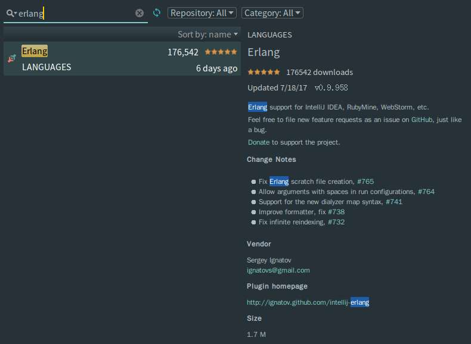

#### 配置rebar3

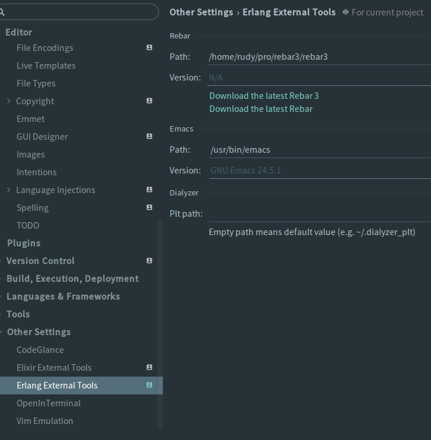

#### 配置编辑器

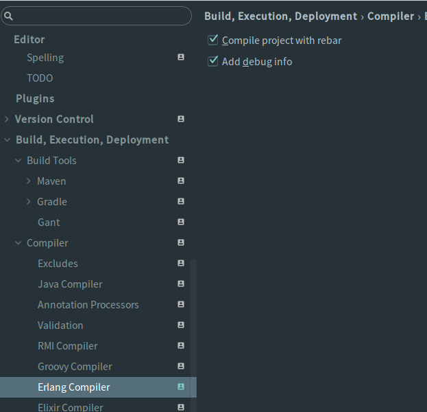

### 创建项目

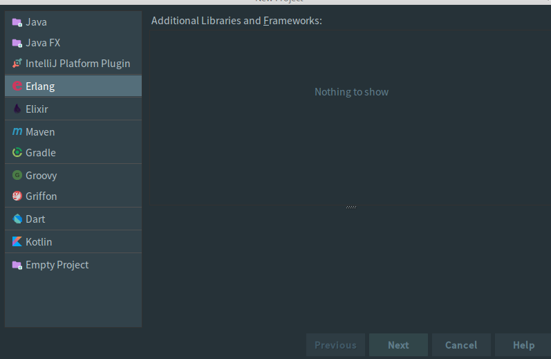
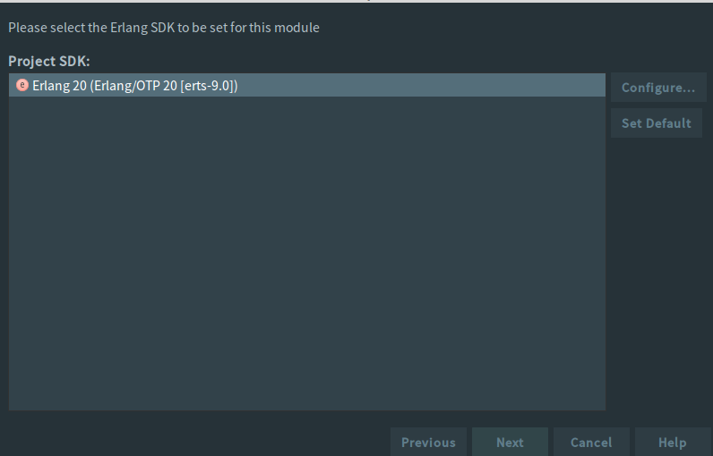

#### 项目名和模块名最好区分开

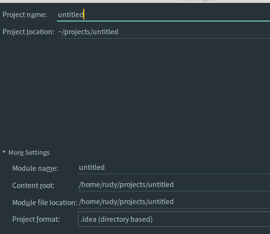

#### 创建编译配置文件

> 在src同级目录下创建rebar.config ,并输入下面内容

    {erl_opts, [
      debug_info,
      {
        src_dirs,
        [
          "src"
        ]
      }
    ]}.

> 在src目录下创建一个app目录，在app目录下放置源码文件
> 在src目录下，与app同级创建一个<模块名>.app.src文件如下内容,learn.app.src

    {application, learn,
      [{description, "Erlang basic learn application"},
        {vsn, "0.1.0"},
        {registered, []},
        {mod, {learn, []}},
        {applications,
          [kernel,
            stdlib
          ]},
        {env,[]},
        {modules, []},

        {maintainers, []},
        {licenses, ["Apache 2.0"]},
        {links, []}
    ]}.

> 在src/app目录下编一个测试文件 test.erl 编写一个函数

    -module(test).
   
    -export([hello/0]).

    hello() ->
      io:format("hello world").

> 然后到命令行的终端里,同时在模块目录内，执行rebar3 compile

    rudy@rudy ~/projects/erlang/learn $ rebar3 compile
    ===> Verifying dependencies...
    ===> Compiling learn

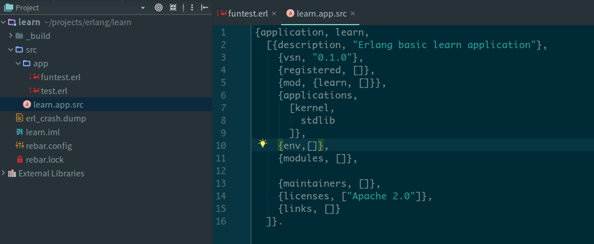

> 如上图所示就出现了_build目录

> 配置erlang运行

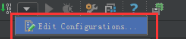
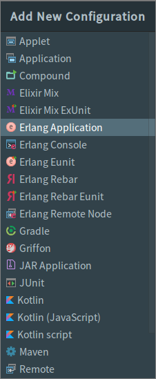
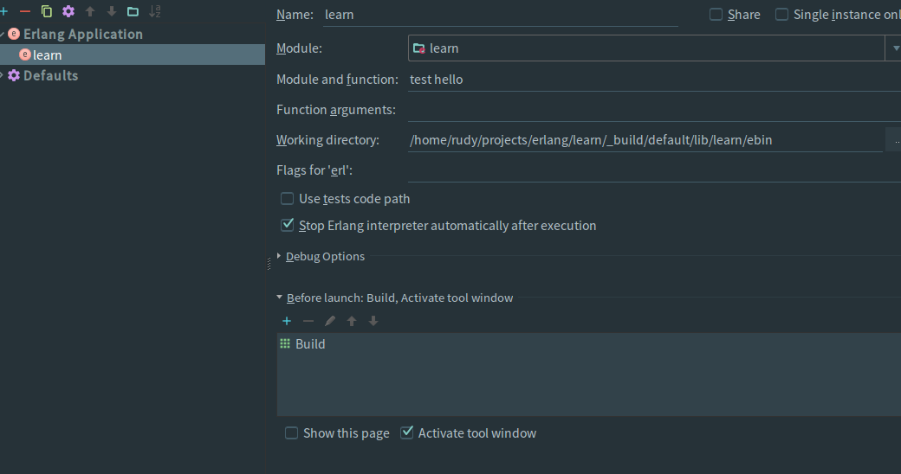

* 上图中 Name 你自己填写随意，
* Module 填写这个项目下运行的模块名我这里就是learn
* module and function 填写我们新建的那个test.erl里的模块test和hello函数，类似入main函数
* Working director： 目录天下_build下面的 ebin目录

> 配置好后，点击工具栏上的learn

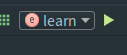
