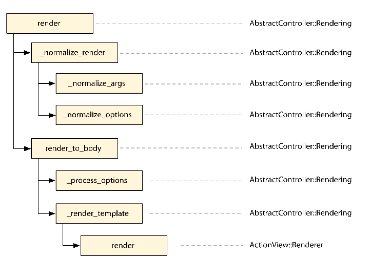
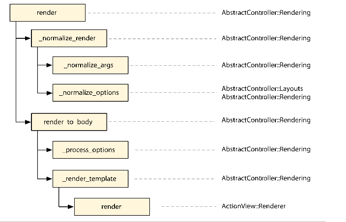
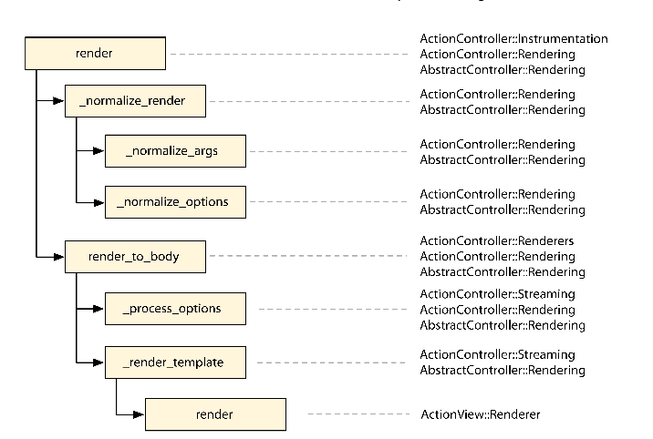

#### Create Our Own Render

> 像大多数web框架一样,rails使用model-view-controller(mvc)结构模式来组织我们的代码,controller通常负责采集来自我们model的信息，然后将数据发送给view来渲染,在其他场合,model负责展示自己,view并不会参与到请求中,这通常发生在json请求中, 下面的index action描述了这两个场景

    class PostsController < ApplicationController
      def index
        if client_authenticated?
          render json: Post.all
        else
          render template: "shared/not_authenticated", status: 401
        end
      end
    end

> render()方法是渲染model或者template的通用方法，除了知道如何渲染一个:template或者一个:file，
> rails也能够渲染：text和其他格式,例如 :xml,:json和:js.虽然默认的rails选项足够我们启动我们的程序,我们有时
>也需要加入新的选项例如 :pdf or :csv 传递给render()方法

> 为了实现这一点, rails提供了一个程序接口，让我们可以创建自己的渲染器，我们通过修改render方法接收:pdf选项 并且使用prawn创建返回一个Pdf来了解这个api ,prawn是一个轻巧，方便的[pdf库](https://github.com/prawnpdf/prawn)

>在这本书的大部分章节里，我们将使用 rails plugin生成器创建一个插件来扩展rails，让我们开始

##### 1.1 Creating Your First Rails Plug-in

> 如果你已经安装了rails，我们开始制作第一个插件, 叫做pdf_render

    $ rails plugin new pdf_renderer

      create  
      create  README.md
      create  Rakefile
      create  pdf_renderer.gemspec
      create  MIT-LICENSE
      create  .gitignore
      create  Gemfile
      create  lib/pdf_renderer.rb
      create  lib/tasks/pdf_renderer_tasks.rake
      create  lib/pdf_renderer/version.rb
      create  bin/test
      create  test/test_helper.rb
      create  test/pdf_renderer_test.rb
      append  Rakefile
      vendor_app  test/dummy
      run  bundle install

> 这个命令创建了基本的插件结构, 包含了一个pdf_render.gemspec文件，一个rakefile,一个Gemfile和lib和test目录。
> 倒数第二行很有趣，它生成了一个完整的rails程序在test/dummy目录里，允许我们在一个rails程序上下文中运行测试

> 生成器运行bundle install后结束, 使用bundler安装所有的依赖，并设置好，让我们看一下生成的文件

###### pdf_renderer.gemspec

> pdf_renderer.gemspec提供了一个基本的gem说明, 说明描述了gem的作者，版本，依赖，源文件,和其他.这使得我们很容易将我们插件打包成一个ruby gem.也更容易在不同的rails程序中分享我们的代码

> 注意在lib目录里有一个与gem同名的文件pdf_render.根据约定,不论何时,你在rails application的gemfile中声明使用了这个gem，这个lib/pdf_render.rb文件都会自动required， 目前，这个文件仅仅定义了一个PdfRenderer模块

> 最后，注意我们的gemspec没有直接定义项目版本，这个版本号定义在lib/pdf_renderer/version.rb ，在gemspec中使用
> PdfRenderer::VERSION引用这个版本号, 这是ruby gem的通用方法

###### Gemfile

> 在rails程序中, Gemfile用来罗列所有依赖，不管是 开发，测试，还是生产依赖，然而，我们的插件已经有一个gemspec用来
>存放依赖， Gemfile复用这个gemspec依赖， Gemfile或许最后包含开发中使用的额外依赖，例如debugger或者pry

> 我们使用Bundler管理我们的plugin插件， Bundler锁定我们的环境仅仅使用在pdf_renderer.gemspec和gemfile列出的gem。 我们可以在插件根目录里，使用bundle install 或者bundle update加入新的依赖和更新已存在的依赖.

##### Rakefile

> Rakefile 提供了基本的任务用来运行测试套件,生成文档,发布我们的插件，我们可以通过执行
> rake -T 来得到完整任务列表

    rake build            # Build pdf_renderer-0.1.0.gem into the pkg directory
    rake clean            # Remove any temporary products
    rake clobber          # Remove any generated files
    rake clobber_rdoc     # Remove RDoc HTML files
    rake install          # Build and install pdf_renderer-0.1.0.gem into system gems
    rake install:local    # Build and install pdf_renderer-0.1.0.gem into system gems without network access
    rake rdoc             # Build RDoc HTML files
    rake release[remote]  # Create tag v0.1.0 and build and push pdf_renderer-0.1.0.gem to Rubygems
    rake rerdoc           # Rebuild RDoc HTML files
    rake test             # Run tests

##### Booting the Dummy Application

> rails plugin创建了一个虚拟的applictaion在test目录里，这个程序启动过程和使用普通的rails命令创建的一样。

> config/boot文件唯一的责任:配置我们的application的加载路径，config/application.rb文件加载所有需要的依赖和配置application，这个文件在config/enviroment.rb中初始化

> rails plugin生成了一个boot文件,位置是test/dummy/config/boot.rb,和rails appliction生成的的类似，第一个不同是，他需要指向pdf_renderer插件根目录的gemfile，他还明确加入插件的lib目录到ruby的load path，确保我们的插件在虚拟application中有效：

    # Set up gems listed in the Gemfile.
    ENV['BUNDLE_GEMFILE'] ||= File.expand_path('../../../Gemfile', __dir__)

    require 'bundler/setup' if File.exist?(ENV['BUNDLE_GEMFILE'])
    $LOAD_PATH.unshift File.expand_path('../../../lib', __dir__)

> boot文件委托Bundler负责设置依赖和他们的加载路径。test/dummy/config/application.rb只是
> rails appliction程序中config/application.rb的精简版

    require_relative 'boot'

    require 'rails/all'

    Bundler.require(*Rails.groups)
    require "pdf_renderer"

    module Dummy
      class Application < Rails::Application
        # Initialize configuration defaults for originally generated Rails version.
        config.load_defaults 5.1

        # Settings in config/environments/* take precedence over those specified here.
        # Application configuration should go into files in config/initializers
        # -- all .rb files in that directory are automatically loaded.
      end
    end

> config/enviroment.rb和你在普通的rails程序中遇到的一样

    # Load the Rails application.
    require_relative 'application'

    # Initialize the Rails application.
    Rails.application.initialize!

###### Running Tests

> 默认情况,rails plugin为我们的插件生成一个完成的测试，让我们运行一下看看

    raket test

    Run options: --seed 7555

    # Running:

    .

    Finished in 0.002406s, 415.6896 runs/s, 415.6896 assertions/s.
    1 runs, 1 assertions, 0 failures, 0 errors, 0 skips

> 这个测试,定义在test/pdf_renderer_test.rb中，断言我们的插件定义了一个叫做PdfRenderer模块

    require 'test_helper'

    class PdfRenderer::Test < ActiveSupport::TestCase
      test "truth" do
        assert_kind_of Module, PdfRenderer
      end
    end

> 最后，注意到我们的测试文件引入了test/test_helper.rb，这个文件负责读取我们的application和配置测试环境, 使用我们创建的插件骨架,和一个绿色的测试套件。我们开始编写我们的自定义渲染器

##### 1.2 Writing the Renderer

> 在本章开头，我们简单的讨论了render()方法和它接受的选项，但是我们没有正式讲解renderer渲染器是什么

> 一个renderer只不过是一个钩子，通过render()方法来自定义它的行为。加入我们自己的renderer到rails里很简单，让我们看一下:json renderer的源码

    add :json do |json, options|
      json = json.to_json(options) unless json.kind_of?(String)
        if options[:callback].present?
           self.content_type ||= Mime::JS
           "#{options[:callback]}(#{json})"
        else
          self.content_type ||= Mime::JSON
          json
      end
    end

> 所以，无论何时，当我们调用 下面的方法在我们的appliction里

    render json: @post

> 它会调用定义的block作为：json renderer， block中的本地变量json指向@post， 并且其他传递给render方法的选项存储在opstions变量里,在这个例子里，因为方法被调用时，没有传递任何附加options，所以他是一个空的hash

> 下面章节,我们想加入一个:pdf renderer，使用给定的模板创建pdf文档，发送给客户端并添加适当的header信息, 传递给:pdf 的option的值应该作为文件名字被发送出去

> 下面是我们想提供api的例子

    render pdf: 'contents', template: 'path/to/template'

> 即使rails知道如何渲染模板并且发送文件给客户端,但是它不知道怎样处理pdf文件，对于这点
> 我们使用Prwan

###### Playing with Prawn

> Prawn是一个pdf生成库，因为它将会成为我们插件的一个依赖，所以我们需要加入它到我们的pdf_renderer.gemspec里面

    s.add_dependency "prawn","0.12.0"

> 下一步，我们告诉bundler去安装我们的新的依赖，并且通过ruby交互来测试

    $ bundle install
    $ irb

> 使用irb，我们创建一个简单的Pdf

    require "prawn"
    pdf = Prawn::Document.new
    pdf.text("A PDF in four lines of code")
    pdf.render_file("sample.pdf")

> 退出irb，你能在启动irb的目录下看到一个pdf文件, prawn提供了创建pdf的语法，虽然这给了我们一个
> 灵活的api，但是缺点就是不能创建来自html的pdf

#####　Code in Action

> 在我们深入代码之前，我们先写一个测试，因为我们有一个虚拟的application.我们可以在一个真实的rails程序中创建控制器,使用它测试完整的request请求栈,让我们命名这个控制器叫做HomeController并且加入下面这些内容
    pdf_renderer/test/dummy/app/controllers/home_controller.rb
    class HomeController < ApplicationController
      def index
        respond_to do |format|
          format.html
          format.pdf { render pdf: "contents" }
        end
      end
    end

> 然后创建这个pdf 视图,
    pdf_renderer/1_prawn/test/dummy/app/views/home/index.pdf.erb
    This template is rendered with Prawn.

> 添加路由

    Dummy::Application.routes.draw do
      get "/home", to: "home#index", as: :home
    end

> 然后我们编写一个集成测试验证访问/home.pdf的返回结果

    pdf_renderer/test/integration/pdf_delivery_test.rb

    require "test_helper"
      class PdfDeliveryTest < ActionDispatch::IntegrationTest
        test "pdf request sends a pdf as file" do
          get home_path(format: :pdf)
          assert_match "PDF", response.body
          assert_equal "binary", headers["Content-Transfer-Encoding"]
          assert_equal "attachment; filename=\"contents.pdf\"",
          headers["Content-Disposition"]
          assert_equal "application/pdf", headers["Content-Type"]
        end
      end
  
>  这个测试使用了response headers去断言，这个编码pdf文件作为一个附件发送,包括预期的文件名。
> 即使我们不能断言太多pdf本身内容，因为他被编译,我们能够至少断言pdf包含的字符串,使用prawn加入pdf体
> 让我们运行这个测试,　观察失败信息

    1) Failure:
    test_pdf_request_sends_a_pdf_as_file(PdfDeliveryTest):
    Expected /PDF/ to match "This template is rendered with Prawn.\n".

> 这个失败和预期的一样，因为我们没有告诉rails怎样在render()中处理:pdf选项，它简单的渲染这个
> 模板并没有包装成一个pdf文件，　我们可以通过实现我们的渲染器，在lib/pdf_renderer.rb中添加一些代码

    pdf_renderer/lib/pdf_renderer.rb

    require "prawn"
    ActionController::Renderers.add :pdf do |filename, options|
      pdf = Prawn::Document.new
      pdf.text render_to_string(options)
      send_data(pdf.render, filename: "#{filename}.pdf",
      disposition: "attachment")
    end

> 在这个代码块中,我们创建了一个pdf文档,加入一些文本,使用send_data()方法，以附件的形式发送这个pdf，我们运行这个测试观察结果，最后通过,我也可以到虚拟application里，启动服务器rails server
> 使用http://localhost:3000/home.pdf测试

> 即使我们,测试通过了,仍然有一些需要解释,首先，注意到，我们没做的事情，没有设置Content-Type为appplication/pdf, rails怎么知道那个content type应该设置在我们的response里？

> content type被正确设置，因为rails分享了一组已经注册的格式和Mime types:

    rails/actionpack/lib/action_dispatch/http/mime_types.rb

    Mime::Type.register "text/html", :html, %w( application/xhtml+xml ), %w( xhtml )
    Mime::Type.register "text/plain", :text, [], %w(txt)
    Mime::Type.register "text/javascript", :js,
    %w(application/javascript application/x-javascript)
    Mime::Type.register "text/css", :css
    Mime::Type.register "text/calendar", :ics
    Mime::Type.register "text/csv", :csv
    Mime::Type.register
    Mime::Type.register
    Mime::Type.register
    Mime::Type.register
    Mime::Type.register
    Download from Wow! eBook <www.wowebook.com>
    "image/png", :png, [], %w(png)
    "image/jpeg", :jpeg, [], %w(jpg jpeg jpe pjpeg)
    "image/gif", :gif, [], %w(gif)
    "image/bmp", :bmp, [], %w(bmp)
    "image/tiff", :tiff, [], %w(tif tiff)

    Mime::Type.register "video/mpeg", :mpeg, [], %w(mpg mpeg mpe)
    Mime::Type.register
    Mime::Type.register
    Mime::Type.register
    Mime::Type.register
    "application/xml", :xml, %w(text/xml application/x-xml)
    "application/rss+xml", :rss
    "application/atom+xml", :atom
    "application/x-yaml", :yaml, %w( text/yaml )
    Mime::Type.register "multipart/form-data", :multipart_form
    Mime::Type.register "application/x-www-form-urlencoded", :url_encoded_form
    Mime::Type.register "application/json", :json,
    %w(text/x-json application/jsonrequest)
    Mime::Type.register "application/pdf", :pdf, [], %w(pdf)
    Mime::Type.register "application/zip", :zip, [], %w(zip)

> 注意pdf格式如何被定义成相应的内容类型，当我们请求这个/home.pdf url时， rails从url中得到
> pdf格式，并且查找匹配HomeController#index中format.pdf代码块，然后处理设置内容类型在调用
> block之前,然后调用render

> 回到我们的渲染实现,虽然send_data()是一个rails公开方法,已经在第一个rails版本就出现了,
> 你或许没有听说过render_to_string(),为了更好的理解这个，我们来看一下rails 渲染处理整个流程

#### 1.3 Understanding the Rails Rendering Stack

> Action Mailer和Action Controller有几个通用的特性，例如模板渲染, 帮助方法和布局，为了
> 防止代码重复，这些共享的责任集中在Abstract Controller里，Action Mailer和Actin Controller使用它作为基础，同时，一些特性仅仅被引入两个库中的一个所需要，鉴于这些需求，Abstract Controller按照开发者他们想要的方式设计。例如，如果你想一个对象有渲染能力，可以简单的渲染一个模板,但是不包含布局, 我们就引入AbstractController::Rendering模块到你的对象，丢弃AbstractController::Layouts

> 当我们引入了AbstractController::Rendering在一个对象中，在你每次调用render方法时，这个渲染栈处理如下图

> 上图中，每个矩形块，表示一个方法，由后面的类或者模块中的实现，
> 箭头表示方法调用, 例如 render()调用了_normalize_render()
> 然后调用render_to_body()， 这个调用栈的确认可以通过查看
> rails中AbstractController::Rendering实现查看

    rails/actionpack/lib/abstract_controller/rendering.rb

    def render(*args, &block)
      options = _normalize_render(*args, &block)
      self.response_body = render_to_body(options)
    end
    def _normalize_render(*args, &block)
      options = _normalize_args(*args, &block)
      _normalize_options(options)
      options
    end
    def render_to_body(options = {})
      _process_options(options)
      _render_template(options)
    end

> Abstract Controller的渲染栈负责格式化你提供的参数和选项，转换为actionView::Renderer#render()可以接受的一个hash，然后最后渲染模板，堆栈中的每个方法在整个过程中起着自己的作用。这些方法是
> private(有下划线)或者部分是public

> 首先栈中第一个相关方法就是_normalize_args()，被_normalize_render()调用，将用户提供的
> 参数转换为一个hash, render方法以render(:new)方式被调用，_normalize_args()转换成
> render(action: "new"),_normalize_args返回这个hash然后被_normalize_options格式化
> 在AbstractController::Rendering#_normalize_options()中没有太多的格式化, 因为他是
> 基础模块，但是它转换render(partial:true)为 render(partial: action_name),所以
> 无论何时在show()aciton中你给定 partial:true,它都变成partial：“show”。

> 在格式化后，render_to_body()被调用，实际上渲染从这才开始, 第一步处理所有选项，对视图没啥意义，使用_process_options()方法，虽然AbstractController::Rendering#_process_options()
> 是一个空方法, 我们可以用几个例子观察ActionController::Rendering#_process_options()到底做了什么， 例如 在控制器中，我们允许下面这样调用

    render template: "shared/not_authenticated", status: 401

> 这个:status选项对视图没有意义，因为status是指http响应状态，所以ActionController::Rendering#_process_options() 负责处理这个选项和其他

> 在选项处理后，_render_template()被调用，并且不同的对象开始合作，实际上，ActionView::Renderer实例，由调用view_renderer来创建，然后在这个实例上调用render()方法,并传递两个参数
> 这两个参数是view_context和格式化后的里面是options的hash

    rails/actionpack/lib/abstract_controller/rendering.rb
    view_renderer.render(view_context, options)

> view context是 ActionView::Base的实例， 这是我们模板被赋值的地方，当我们在模板里调用link_to()，它之所以会工作，是因为一个方法在ActionView::Base内部是有效的，当实例化时，view
>context接收view_assigns()返回值作为参数，assigns引用了控制器的一组变量，这些变量在视图中可以访问。这就意味着无论生么时候，你设置一个实例变量在控制器里例如 @posts = Post.all，@post被标记成 assign ，可以在视图中使用

> 此时，重要的关系翻转发生在rails 2.3和rails3.0, 在前者中，视图负责从控制器检索分配变量，而后者控制器告诉试图使用哪些变量

> 假设，我们想让一个控制器不发送任何实例变量给试图, 在rails 2.3中因为试图自动从控制器中拉取所有实例，为了实现我们的目的，我们要么阻止使用实例变量，要在渲染模板之前,么移除控制器中所有实例变量。在rails 3和以后，这个由控制器处理，我们仅仅需要重写view_assigns()方法，返回一个空
>hash

    class UsersController < ApplicationController
      protected
      def view_assigns
        {}
      end
    end

> 通过返回一个空的hash， 我们确保没有任何一个action传值给试图

> 使用view context和格式化的参数hash，我们的ActionView::Renderer实例拥有的所有东西
> 它需要找到一个模板，基于选项，最后在view context里渲染

> 模块化的栈设计，允许任何回调加入到渲染处理过程中,加入自己的特性,当我们在AbstractController::Render顶部引入AbstractController::Layouts，这个渲染栈，被扩展成
>如下图所示

> AbstractController::Layouts简单的覆盖了_normalize_options(),支持了:layout选项
> 如果调用render()时没有:layout被设置， 可以根据开发人员在控制器类级别配置的值自动设置。
> Action Controller进一步扩展Abstract Controller渲染栈，添加和处理选项，仅仅在控制器域中起作用

> 这些扩展分为四个主要模块

* ActionController::Rendering : 覆盖render()检查是否被调用两次，如果调用两次，就抛出DoubleRenderError，也覆盖_process_options() 处理的选项 例如 :location , :status , and :content_type

* ActionController::Renderers :加入我们这章使用的api，允许当给定一个特殊的key时，触发特殊行为支持。如(such as :pdf)

* ActionController::Instrumentation :重载render()方法，可以测量花了多少时间在渲染栈上

* ctionController::Streaming :重载 _process_options() 方法处理http header中的:stream选项，_render_template()方法允许模板作为一个流

> 下图展示了最终栈结构,使用了Abstract Controller 和 Action Controller rendering模块

> 现在我们知道了render如何工作，我们准备去理解render_to_string()如何工作，让我们看一下它的定义

    rails/actionpack/lib/abstract_controller/rendering.rb
    def render_to_string(*args, &block)
      options = _normalize_render(*args, &block)
      render_to_body(options)
    end

> 首先 render_to_string()看起来与render()方法类似， 仅有一点不同，render_to_string()没有存储被渲染的模板作为response body， 然而当我们分析整个渲染栈的时候，我们看到一些Action Controller 模块重载了，render()，添加行为，没有对render_to_string()进行重写

> 例如, 使用render_to_string()在我们的渲染器中，我们确保instrumentation事件不会被触发两次，并且不会抛出重复渲染错误， 因为这些功能仅仅被加入到render方法中。

> 在一些其他例子中，render_to_string()或许被重载,当我们使用Action Controller时，当模板被流处理时,response body可以作为另一个对象，不是字符串，基于这个原因，ActionController::Rendering 覆盖render_to_string()总是返回字符串如他的名字所示

###### 1.4 Taking It to the Next Level

> 回到我们渲染器的实现, 我们现在理解了，当我们在控制器里使用下面这行代码意味着什么

    format.pdf { render pdf: "contents" }

> 在我们的渲染器中，变成下面

    pdf = Prawn::Document.new
    pdf.text render_to_string({})
    send_data(pdf.render, filename: "contents.pdf",disposition: "attachment")

> 当我们使用一个空的hash调用render_to_string(),这个_normalize_options() 方法在渲染栈中删除这个空的hash，
> 然后使用当前action名字一样的模板进行渲染，最后，render_to_string()传递template: "#{controller_name}/#{action_name}"给view-renderer对象

>事实上,我们的渲染器基于render_to_string(),允许我们使用下面的选项

    render pdf: "contents", template: "path/to/templat

> 内部处理代码，变成下面样子

    pdf = Prawn::Document.new
    pdf.text render_to_string(template: "path/to/template")
    send_data(pdf.render, filename: "contents.pdf",disposition: "attachment")
  
  > 这次rednder_to_string()接收一个明确的模板来渲染，最后为了完成我们的渲染器，我们加一个测试确认可以选择模板来渲染
  > 我们测试调用一个新的action在HomeController，使用:pdf和:template调用

      pdf_renderer/test/dummy/app/controllers/home_controller.rb
      def another
      render pdf: "contents", template: "home/index"
      end
  
  > 然后加入一个路由，为新的action

      get "/another", to: "home#another", as: :another
  
  > 然后访问/another.pdf 确认一个pdf被返回

      test "pdf renderer uses the specified template" do
      get another_path(format: :pdf)
      assert_match "PDF", response.body
      assert_equal "binary", headers["Content-Transfer-Encoding"]
      assert_equal "attachment; filename=\"contents.pdf\"",
      headers["Content-Disposition"]
      assert_equal "application/pdf", headers["Content-Type"]
      end

##### 1.5 略