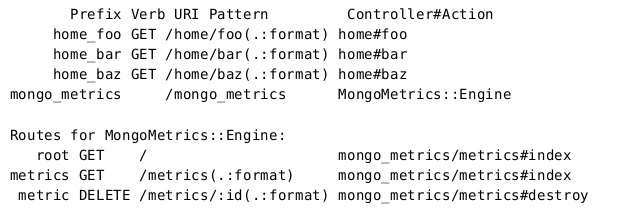

### Managing Application Events with Mountable Engines

> 从rails初期开始,人们就想知道他们的application发生了什么,一个请求中多少查询被执行了,一个请求花了多长时间.

> 为了解决这个都关注的问题，一些开源项目和服务,例如footnotes和bullet，Scout和New Relic's RPM,被创建.因为所有这些不同的工具都需要从rails中提取信息,rails不断进化提供一个统一的方式发布定于application里发生的事件,这就是ActiveSupport::Notifications  api

> 在这章里,我们使用这个api订阅所有通过我们application执行的actions，存储他们到mongodb里,然后我们使用rails engine创建一组路由,控制器,视图,浏览这些存储的数据, 这个engine可以在rails application之间分享，并且挂载到指定的终端

###### 7.1 Mountable and Isolated Engines

> 在前面，我们创建了一个rails engine用来发送流数据到我们的程序，除了提供了一个控制器，这个engine还添加了路由到我们的application里，像live_assets那样的帮助方法,某种程度上,这个engine可以用来直接扩展rails application使用它自己的组件，然而，这种行为不一定可取

> 拿我们将要在这章创建的插件举例,它将提供它自己的模型,控制器,和视图, 插件代码不断增加,路由数量开始增加,帮助方法也不断增加,如果我们的插件实现了一个show_paginated_results()帮助方法,rails使用了我们的插件，我们不想我们的帮助方法在rails程序里被使用, 因为帮助方法是我们插件内部方法,更糟的是,如果application有自己的show_paginated_results()帮助方法, 它将会被我们的插件的同名帮助方法覆盖,导致错误发生

> rails解决了这些问题, 提供了可挂载的和独立的engines，一个可挂载的engine使用他自己的路由替代直接添加路由到我们的application 路由里, 一个隔离的 engine 构建他自己的命名空间，使用它自己的模型，控制器，试图，资源，和帮助方法, 我们使用rails plugin 命令,传递--mountable选项 生成我们的可挂载engine

    $ rails plugin new mongo_metrics --mountable

> 使用--mountable选项生成了一个可挂载的独立的engine，我们可以通过检查几个不同的文件来观察到这一点。我们打开插件的config/routes.rb 文件:

    mongo_metrics/config/routes.rb
    MongoMetrics::Engine.routes.draw do
    end

> 注意路由是如何通过引擎产生的，比较前面extend rails with　Engine那节，直接在application里放置路由

    live_assets/config/routes.rb
    Rails.application.routes.draw do
      get "/live_assets/:action", to: "live_assets"
    end

> 因为路由不再被直接添加到application里，这个engine需要被直接挂载到application路由中， 通过插件命令已经被自动挂载到test/dummy里了

    mongo_metrics/test/dummy/config/routes.rb
    Rails.application.routes.draw do
     mount MongoMetrics::Engine => "/mongo_metrics"
    end

> 这就是挂载我们引擎需要的全部，为了使用一个独立的engine，我们需要直接声明它作为独立的，并且选择一个命名空间, --mountable选项自动生成引擎使用MongoMetrics作为作为独立命名空间

    mongo_metrics/lib/mongo_metrics/engine.rb
    module MongoMetrics
      class Engine < ::Rails::Engine
        isolate_namespace MongoMetrics
      end
    end

> 因为我们声明了一个独立的命名空间,我们的控制器模型和帮助方法都应该定义在这个命名空间里, 确保从application里隔离出来，现在定义在engine里的帮助文件不会自动被引入application里，反之亦然，application里的也不会影响插件里的，它还设置了许多便利措施， 如果我们使用 Active Record 他将在所有模型表前缀使用mongo_metrics_ 并且确保rails生成的models, controllers, 和 helpers也在命名空间下

>除了这些改变, rails plugin命令使用--mountable选项也成成了一组额外文件，像资源清单文件和一个MongoMetrics::ApplicationController位于app/controllers/mongo_metrics/application_controller.rb
> 使我们的engine更接近一个全新的Rails应用程序

> 我们的插件已经设置好了,我们下一步开始探 ActiveSupport::Notifications API并且存储这些通知到数据库

#### 7.2 Storing Notifications in the Database

> 在我们实现存储通知逻辑到数据库之前，我们先看一下Notifications api

###### The Notifications API

> Notifications api包含两个方法，instrument() 和 subscribe() .前者当我们提交和发布一个事件时调用,例如action controller处理 如下

    ActiveSupport::Notifications.instrument("process_action.action_controller",
        format: :html, path: "/", action: "index") do
      process_action("index")
    end

> 第一个参数是被发布事件名称, 在这里我们叫做process_action.action_controller,第二个参数是一个hash，包含了关于这个事件的信息,叫做payload ,为了订阅这些通知，我们仅仅需要传递这个事件名字和代码块给subscribe() 如下

    event = "process_action.action_controller"
    ActiveSupport::Notifications.subscribe(event) do |*args|
      # do something
    end

> args是一个数组有五项

* name: 事件名称字符串形式
* started_at: 事件开始时的Time对象
* ended_at: 事件结束时的Time对象 
* instrumenter_id: 包含提交事件的唯一id
* payload: 提交事件时作为payload的信息，是一个hash形式

> 这就是我们需要知道的全部，下一步，我们看一下我们要存储通知的数据库

###### Using MongoDB

> MongoDB是一个快速的完整的文档型数据库,适合存储notifications,因为notifications是数量多,价值低数据,你可以在他的官网读取更多有关他的信息, 包括安装在不同系统上的信息.

> 目前,有好几个mongodb对象关系映射工具,我们将使用Mongoid在这个项目里, 我们不会介绍如何安装mongodb，如果你还没有安装，马上安上它, 安装后，我们添加mondoid作为一个我们插件的依赖

    mongo_metrics/mongo_metrics.gemspec
    s.add_dependency "mongoid", "~> 4.0.0"

> 让我们在test/dummy application中生成mongoid的配置信息

    $ rails g mongoid:config

> 加载我们的插件时也要同时引入mongoid

    mongo_metrics/1_engine/lib/mongo_metrics.rb
    require "mongoid"
    require "mongo_metrics/engine"

    module MongoMetrics
    end

>有了mongoid配置文件, 我们创建第一个Model,app/models/mongo_metrics/metric.rb 

    mongo_metrics/app/models/mongo_metrics/metric.rb
    module MongoMetrics
      class Metric
        include Mongoid::Document
      end
    end

> 在编写任何存储文档到mongodb之前，我们写一个测试在test/mongo_metrics_test.rb里，这个测试提交发布了一个名为process_action.action_controller事件,使用相关属性，断言一个metric被存储到Mongodb中，

    mongo_metrics/test/mongo_metrics_test.rb
    require "test_helper"

    class MongoMetricsTest < ActiveSupport::TestCase
      setup { MongoMetrics::Metric.delete_all }
      test "process_action notification is saved in the mongo database" do
        event = "process_action.action_controller"
        payload = { "path" => "/" }

        ActiveSupport::Notifications.instrument event, payload do
          sleep(0.001) # simulate work
        end
        metric = MongoMetrics::Metric.first

        assert_equal 1, MongoMetrics::Metric.count
        assert_equal event, metric.name
        assert_equal "/", metric.payload["path"]

        assert metric.duration
        assert metric.instrumenter_id
        assert metric.started_at
        assert metric.created_at
      end
    end

> 当我们运行测试，因为我们没有存储任何东西，失败了

    1) Failure:
    test_process_action_notification_is_saved_in_the_mongo_database(MongoMetricsTest)
    Expected: 1
    Actual: 0

> 为了确保测试通过,我们让我们订阅这个ActiveSupport::Notifications在lib/mongo_metrics.rb中

    mongo_metrics/2_metrics/lib/mongo_metrics.rb
    require "active_support/notifications"
    module MongoMetrics
      EVENT = "process_action.action_controller"

      ActiveSupport::Notifications.subscribe EVENT do |*args|
        MongoMetrics::Metric.store!(args)
      end
    end

> 在我们的MongoMetrics::Metric中，我们的通知钩子简单的调用了store!()方法，这几个方法负责解析参数创建记录.

    module MongoMetrics
      class Metric
        include Mongoid::Document

        field :name, type: String
        field :duration, type: Integer
        field :instrumenter_id, type: String
        field :payload, type: Hash
        field :started_at, type: DateTime
        field :created_at, type: DateTime

        def self.store!(args)
          metric = new
          metric.parse(args)
          metric.save!
        end

        def parse(args)
          self.name            = args[0]
          self.started_at      = args[1]
          self.duration        = (args[2] - args[1]) * 1000000
          self.instrumenter_id = args[3]
          self.payload         = args[4]
          self.created_at      = Time.now.utc
        end
      end
    end

> 添加这些修改后，我们的测试通过了, 为了查看我们的插件在测试环境以外是如何工作的，我们在test/dummy中创建一个HomeController ,
> 里面有三个actions,然后启动dummy application

  $ rails g controller Home foo bar baz
  $ rails s

> 发送请求可以通过 /home/foo , /home/bar , 和 /home/baz生成数据,当你请求后，可以打开一个rails console，命令行键入MongoMetrics::Metric.all.to_a，查看notifications被创建情况,

> 虽然我们的订阅工作和期望的那样，但是使用一个页面替代使用rails console查看notifications不是更好?
> 让我们再一次利用Rails engine 提供的动力！

###### The Notifications Page

> 创建Notifications页面，我们创建一个控制器,一个试图，路由在engine里, 我们从控制器开始

    mongo_metrics/app/controllers/mongo_metrics/metrics_controller.rb
    module MongoMetrics
      class MetricsController < ApplicationController
      respond_to :html, :json
        def index
          @metrics = Metric.all
          respond_with(@metrics)
        end
        def destroy
          @metric = Metric.find(params[:id])
          @metric.destroy
          respond_with(@metric)
        end
      end
    end

> 我们的控制器有两个actions，index()和destroy()，对于第一个，我们需要一创建一个视图

    mongo_metrics/2_metrics/app/views/mongo_metrics/metrics/index.html.erb
    <h1>Listing Metrics</h1>
    <table>
      <tr>
        <th>Name</th>
        <th>Duration</th>
        <th>Started at</th>
        <th>Payload</th>
        <th></th>
      </tr>
      <%= content_tag_for :tr, @metrics do |metric| %>
      <td><%= metric.name %></td>
      <td><%= metric.duration / 1000 %>ms</td>
      <td><%= time_ago_in_words metric.started_at %> ago</td>
      <td>
        <ul>
          <% metric.payload.each do |k, v| %>
                <li><%= k.humanize %>: <%= v %></li>
          <% end %>
        </ul>
      </td>
      <td><%= link_to 'Destroy', metric_path(metric),
        method: :delete, data: { confirm: 'Are you sure?' } %>
        </td>
      <% end %>
    </table>  

> 对于页面上的Destroy链接，我们需要引入jqueyr-rails gem添加到依赖里

    mongo_metrics/mongo_metrics.gemspec
    s.add_dependency "jquery-rails", "~> 3.0.1"

> 然后需要在lib/mongo_metrics.rb顶部引入这个依赖,如下

    mongo_metrics/lib/mongo_metrics.rb
    require "jquery-rails"

> 需要在javascript清单文件中引入jquery和jquery_ujs

    mongo_metrics/app/assets/javascripts/mongo_metrics/application.js
    //= require jquery
    //= require jquery_ujs
    //= require_tree .

> 最后我们添加路由

    mongo_metrics/config/routes.rb
    MongoMetrics::Engine.routes.draw do
      root to: "metrics#index"
      resources :metrics, only: [:index, :destroy]
    end

> 注意我们声明路由时不需要担心命名空间,我们的engine是可挂载的而且是独立的。rails在每个路由上制定了命名空间帮我们解决了这个问题,此外, 在视图中,我们简单的调用metric_path()方法，rails自动的去engine中查找路由,而不是在application中查找路由,即使application有一个路由叫做metric_path()，这两个路由也不会冲突

> 然而，有一个问题,假如我们想从engine路由中访问application的路由，或者从application路由中访问engine路由呢？

> 为了阐述这个问题,我们写了一个集成测试，我们测试需要访问一组dummy application中的页面然后检查我们的插件页面,确保这些notifications被适当的显示

    mongo_metrics/2_metrics/test/integration/navigation_test.rb
    require "test_helper"

    class NavigationTest < ActionDispatch::IntegrationTest
        setup { MongoMetrics::Metric.delete_all }

        test "can visualize notifications" do

          get main_app.home_foo_path
          get main_app.home_bar_path
          get main_app.home_baz_path
          get mongo_metrics.root_path

          assert_match "Path: /home/foo", response.body
          assert_match "Path: /home/bar", response.body
          assert_match "Path: /home/baz", response.body
        end

        test "can destroy notifications" do
            get main_app.home_foo_path
            metric = MongoMetrics::Metric.first
            delete mongo_metrics.metric_path(metric)
            assert_empty MongoMetrics::Metric.where(id: metric.id)
        end
    end

>我们的测试立刻通过了，注意，每次我们想访问一个application页面时我们都是用main_app()zuo作为代理,访问挂载的engine中的页面使用mongo_metrics()作为代理,engine代理的名字可以在dummy application里使用rake routes命令查看

> 代理的名字在Prefix那列,rake routes也同样展示了挂在的engine的路由，如果你想的话，可以启动dummy app 然后使用你的浏览器访问notifications页面

> 现在我们适当的存储和显示来自Mongodb信息,我们可以看到我们每次访问我们engine页面，也会存储数据到mongodb里，如果每次访问插件本身时关闭metrics存储，那也是不切实际的。
> 为了解决这个问题,让我们提供一个方案在某些地方静音notifications,为了做到这一点。我们需要理解rails是如何集成Rack的

### 7.3 Rails and Rack

> 引用[rake文档](http://rack.rubyforge.org/doc/)

  Rack使用ruby提供了一个微型,模块化,适用性强的web开发接口,最简单的方式包装了http请求和响应,它统一提取api,使web服务器,web框架和软件之间可以通过一个单独方法调用

> rails application 需要一个web服务器与http协议交互,从早年起,rail社区有大量的web服务器可以用来部署applications

> 在初期,rails负责提供支持每个web服务器的适配器,一个是Mongrel 另一个是WEBrick,还有一个 Thin,等等。类似，其他web框架对于同样的web服务器不得不提供不同的适配器，因为他们与rails的api不同

> 这很快的变成了一种重复性工作,在2007年初,racke以统一web服务器和框架api的目标而发布,通过racke api， 一个web框架可以使用racke web服务器适配器替代它自己的适配器,移除了这些ruby社区里的重复工作

> 虽然rails 2.2已经提供了,一个简单的racke 接口，rails更密切的拥抱rack和他的2.3版本api
> racke的重大变革发生在rails 3中，rails中的几个部分变成了 rack endpoints，你可以简单的
> 挂载不同的rack application按照同样的方式,例如我们可以挂载Sinatra application到rails router里，类似我们这章挂载一个engine到dummy appliation里

##### Hello, Rack!

> Rack规范清晰的描述了rack application如何与一个web server之间通讯的api

      一个Rack application可以是任何能够响应call方法的对象, 明确接收一个environment参数，必须返回一个包含三个元素的数组 三个元素值是 status,headers 和body
  
> rake的最小限度的api允许我们编写一个web程序只用几行代码

    require 'rack'
    class HelloRack
        def call(env)
          [200, { 'Content-Type' => 'text/html' }, ['Hello Rack!']]
        end
    end
    run HelloRack.new

> 通过在目录里先创建config.ru文件， 在同一目录的命令行上调用rackup命令，rack 启动了一个web服务器，每个请求都调用我们的HelloRack application。 当你打开一个浏览器输入
> http://localhost:9292/时，你会看到hello rack 在响应体中返回

    Invoked like so:

    $ rackup config.ru

> 所有的rails application都带有一个config.ru文件，和我们在dummy application目录test/dummy下看到的一样 如下内容

    # This file is used by Rack-based servers to start the application.
    require ::File.expand_path('../config/environment', __FILE__)
    run Rails.application

> 每个rails application也是一个rack application，它实现了call方法，接收系统环境参数，返回包含三个值的数组，默认情况,它发送请求到 application 路由，(默认是定义在config/routes.rb),如果匹配然后分发请求到另一个rack application

###### Understanding the Rails Router

> rails router可以分发给任何Rack application

    Rails.application.routes.draw do
    match "/hello", to:
      lambda { |env| [200, { "Content-Type" => "text/plain" }, ["World"]] }
    end

> 当我们添加这个路由到任何Rails application中，打开浏览器地址栏键入 /hello
> 我们从server得到“world”, 事实上我们有一个路由是这样

    Rails.application.routes.draw do
      match "/hello", to: "posts#index"
    end

> rails在请求之前，自动转换controller#action为一个rack application， 按照下面方式
> 你可以从控制器得到任何action作为一个rack application

    PostsController.action(:index)
    PostsController.action(:index).responds_to?(:call) # => true

> 无论何时当你使用router dsl 调用get(),put(),post(),delete(),resources()，或者resource()方法,这些方法都会调用match()方法，唯一有不同语义的方法就是mount()，这个方法用在dummy application中挂在我们的engine

> match()方法匹配完整的路径,如果我们以正则表达式方式思考, 当我们讲到match "/mongo_metrics"，它仅仅以%r"\A/mongo_metrics\z"方式匹配路径(查询字符串不会被考虑匹配),然而，当我们挂载一个engine或者任何其他的racke application是，我们不仅要匹配/mongo_metrics，还要匹配/mongo_metrics/metrics , /mongo_metrics/other 等等，所以等价的正则表达式应该是%r"\A/mongo_metrics"，没有后面末尾\z

> 你可能注意到不止于此,为了访问被挂在的引擎,我们发出请求mongo_metrics/metrics，但是engine router仅匹配/metrics,而忽略了/mongo_metrics前缀, 为什么？

> 无论何时一个请求到达一个Rack server， 这个server得到了这个请求路径，在environment hash中作为env["PATH_INFO"]的值来存储,同时将它传递给下面的Rack application.分发给一个被挂在的engine,rails移除/mongo_metrics从env["PATH_INFO"]中，所以engine仅仅看到/metrics(就如同浏览器在引擎里直接访问/metrics)

>这个工作方式不仅仅适用于engines,也适用于任何rack application 因为这是racke本身规范中规定的.规范中也要求rails应该在调用被挂在engine之前设置env["SCRIPT_NAME"] = "/mongo_metrics",这告诉engine被挂在到指定点，允许engine生成完整urls

> 总而言之,我们有一个rails application， 也是一个rack application,调用另一个rack application的 router， 最后分发给控制器和action，一个engine，甚至是一个sinatra application.这就是rack application的全部，更有趣的是，rack提供了中间件的概念，允许我们添加自定义代码在rack application中间，给了我们更大灵活性，我们下节学习