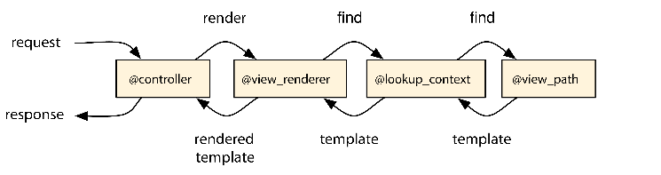
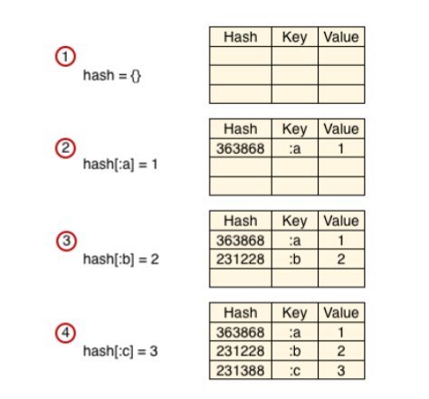
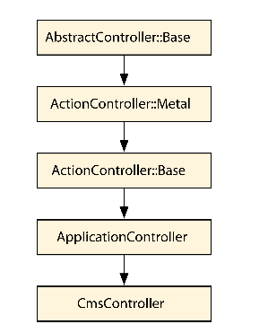

#### Retrieving View Templates from Custom Stores

> 当rails 渲染一个template时，他需要从某个地方得到这个模板，默认情况，rails从文件系统得到模板，但是不受此限制， rails提供了钩子接口，允许我们从任何我们想要的地方得到模板， 只要我们实现了需要的api,让我们探究一下构建机制，从数据库得到模板，模板可以被创建更新，删除，这些都通过web接口， 但是首先，我们要深入学习一下rails的渲染栈

###### 3.1 Revisiting the Rendering Stack

> 前面章节，我们看到rails控制器渲染栈主要职责是格式化选项，将他们发送给ActionView::Render的一个实例,当被调用时候，render接收到一个ActionView::Base实例，叫做view context，和一个hash,里面是options，用来查找编译渲染指定的模板

    view_renderer.render(view_context, options)

> 当我们渲染一个模板时，源码必须编译成可执行代码， 每次一些ruby代码被执行，都需要在给定的上下文中执行， 和在一个rails程序中， 视图在视图上下文对象中执行， 所有帮助方法在我们模板中都可用，例如 form_for()和link_to(),只要定义这些方法的模块被包含在view context(视图上下文中)

> 除了view context，view render需要访问一个ActionView::LookupContext实例，通常这个实例被叫做lookup_context， 这个lookup context在controllers和views间被共享，存储需要找到模板的所有信息，例如，当一个json请求过来，这个请求格式存储在lookup_context对象里，所以rails仅仅查找json格式模板

> 这个lookup context也负责存储所有视图路径，一个视图路径(view path)是一个对象集合，根据条件查找模板，所有在rails 程序中的控制器都有个默认试图路径，指向文件系统上的的app/views路径， 这些给定的条件，例如名称，位置，格式，在app/views下的查找指定模板，例如当你有一个HTML请求UserController控制器的index action，默认的试图路径将会尝试读取在app/views/users/index.html.*这个模板，如果这个模板被找到后，然后编译渲染 如下图所示

> 在前面我们修改我们mailForm::Notifier对象的视图路径 ，引入了另一个模板查找路径

    module MailForm
      class Notifier < ActionMailer::Base
       append_view_path File.expand_path("../../views", __FILE__)
      end
    end

> 上面代码表示，如果在app/views目录下没有找到模板，就去lib/views目录下查找

>虽然我们设置路径是字符串形式，来表示文件系统路径，rails提供了一个定义良好的api 可以用任何对象作为路径， 这意味着我们不必要强制在文件系统上存储模板，我们可以存储模板在任何位置，根据我们提供的对象，找到模板，虽然外表上这些对象被称为视图的路径，在Rails内部称之为模板解析器template resolvers，他们必须兼容解析器API。

> rails提供了一个抽象的 解析器实现，叫做 ActionView::Resolver 
> 在这章，我们将使用它创建一个解析器，使用数据库作为存储模板，所以我们可以通过数据库存储页面，通过web api和我们喜欢的模板处理器(liquid erb haml)编辑模板.下面我们来实现

#### 3.2 Setting Up a SqlResolver

> 这次，开发一个模板管理系统，开发一个rail application代替使用rails plugin插件方式开发， 这个程序叫做template,我们使用下面这行命令

    $ rails new templater

> 接下来，我们定义一个model,用来在数据库里存放模板，我们使用rails scaffold 生成器

    $ rails generate scaffold SqlTemplate body:text path:string \
    format:string locale:string handler:string partial:boolean

> body属性是一个text字段，用来存储整个模板，path存储类似文件系统路径。(例如 UserController控制下下的index()方法，users/index作为path)，format和local存储请求格式和本地变量， handler存储模板处理器(erb,haml),最后整个partial告诉我们整个模板是否是一个局部模板

> 在执行migration之前，我们做一个改变，设置partial默认值是false

    t.boolean :partial, default: false

> 然后运行整个migrations

    $ bundle exec rake db:migrate

>目前，没有异常，下一步我们创建一个模板解析器，使用sqlTemplate模型，将模板从数据读取和展示，通过resolver api

###### The Resolver API

> resolver api只由一个单独方法组成，叫做find_all(), 返回模板数组，下面是方法签名

    def find_all(name, prefix, partial, details, cache_key, locals)

> 对于一个html请求 UsersController的index方法， 参数应该如下方式展示

    find_all("index", "users", false, { formats: [:html],
      locale: [:en, :en], handlers: [:erb, :builder, :rjs] }, nil, [])

> 对于这个简单的请求，我们可以看到 name对应控制器里的action，prefix对应了控制器名字，partial是一个布尔值，告诉我们这个模板是否作为一个局部模板被渲染， details是一个hash，包含用于查找的额外信息， 例如，请求格式，国际化本地设置，然后就是模板解析器，最后两个参数就是cache_key和locals,locals这是个空数组，用于渲染局部模板时使用

> rails提供了一个抽象的解析实现，叫做ActionView::Resolver，我们使用这个作为我们的解析基础，部分源码如下，重点关注find_all和find_templates()方法

    rails/actionpack/lib/action_view/template/resolver.rb
      module ActionView
        class Resolver
          cattr_accessor :caching
          self.caching = true
           def initialize
             @cache = Cache.new
            end
            def clear_cache
             @cache.clear
            end
            def find_all(name, prefix=nil, partial=false, details={}, key=nil,locals=[])
            cached(key, [name, prefix, partial], details, locals) do
              find_templates(name, prefix, partial, details)
            end
          end

        private
          def find_templates(name, prefix, partial, details)
             raise NotImplementedError
            end
          end
      end

> find_all实现了一个基本的缓存策略，如果缓存中没有缓存，代码块传递给cached并执行产生结果。当一个代码块被调用，它调用find_templates()方法， 跑出一个异常，表示这个方法需要被它的子类实现， 注意，cache_key和locals仅仅被缓存使用，他们不会被向下传递用于查找模板

> 我们继承ActionView::Resolver并且实现find_templates()方法，使用sqlTemplate model从数据库得到模板，组成模板查找，如下图所示

!()[05.png]

###### Writing the Code

> 我们声明解析器为SqlTemplate::Resolver 并且采用三步实现它
> 首先接收name, prefix partial 和details作为参数并且格式化他们，然后我们根据格式化的参数，创建一个sql语句，查询数据库，最后一步，将数据库得到的记录转换成 ActionView::Template实例返回

> 我们首先编写一个测试

    templater/test/models/sql_template_test.rb
    require 'test_helper'
      class SqlTemplateTest < ActiveSupport::TestCase
        test "resolver returns a template with the saved body" do
          resolver = SqlTemplate::Resolver.new
          details = { formats: [:html], locale: [:en], handlers: [:erb] }

          # 1) Assert our resolver cannot find any template as the database is empty
          # find_all(name, prefix, partial, details)

          assert resolver.find_all("index", "posts", false, details).empty?
        
          # 2) Create a template in the database
        
        SqlTemplate.create!(
          body: "<%= 'Hi from SqlTemplate!' %>",
          path: "posts/index",
          format: "html",locale: "en",handler: "erb", partial: false)

          # 3) Assert that a template can now be found
          template = resolver.find_all("index", "posts", false, details).first
          assert_kind_of ActionView::Template, template

          # 4) Assert specific information about the found template
          assert_equal "<%= 'Hi from SqlTemplate!' %>", template.source
          assert_kind_of ActionView::Template::Handlers::ERB, template.handler
          assert_equal [:html], template.formats
          assert_equal "posts/index", template.virtual_path
          assert_match %r[SqlTemplate - \d+ - "posts/index"], template.identifier
        end
      end

> 解析器中的find_all()方法应该返回一个ActionView::Template实例，这个模板实例按照下面方式初始化

    ActionView::Template.new(source, identifier, handler, details)

> source是模板主体被存储在数据库中，identifier是一个代表模板的唯一字符串，我们通过加入template id到数据库确保它的唯一性

> handler这个对象负责编译模板，handler不是字符串，而是一个对象，使用ActionView::Template的registered_template_handler()方法得到

    ActionView::Template.registered_template_handler("erb") =>#<ActionView::Template::Handlers::ERB:0x007fc722516490>

> 最后一个初始化模板的参数是一个hash有三个key，:format用来找到模板，：updated_at模板最后更新时间，和一个代表模板的:virtual_path

> 因为，模板不在需要一个文件系统，不是必需要一个path路径，这打破了rails需要依赖文件系统的概念，例如模板中的i18n缩写t(".messge")，它使用模板路径进行查找翻译，所以，无论何时，你在模板app/views/users/index里面，那么这个简写形式将去找到"users.index.message"对应翻译

> 为了解决这个需求，rails需要模板提供一个：virtual_path，你可以存储模板在任何位置，但是你需要提供一个:virtual_path，如果模板存储在文件系统可以作为路径存储位置，这就允许t("message")通过虚拟路径来实现

> 编写测试，理解模板是如何初始化的，我们通过继承ActionView::Reslover来实现find_templates()

> 在我们的解析器中，考虑details里内容的顺序是很重要的。换句话说，如果这个locale 数组包含[:es, :en],一个模板使用西班牙语言优先级高于英语，一个解决方案就是为每个detail生成一个顺序，将结果存储到数据库，另一个选项是排序返回的模板，然而，为了简单起见，替代传递所有locales并且格式化sql语句，我就会用数组的第一个来使用

    templater/1_resolver/app/models/sql_template.rb
      class SqlTemplate < ActiveRecord::Base
      validates :body, :path, presence: true
      validates :format, inclusion: Mime::SET.symbols.map(&:to_s)
      validates :locale, inclusion: I18n.available_locales.map(&:to_s)
      validates :handler, inclusion:
        ActionView::Template::Handlers.extensions.map(&:to_s)

      class Resolver < ActionView::Resolver
        protected
        
        def find_templates(name, prefix, partial, details)
          conditions = {
            path: normalize_path(name, prefix),
            locale: normalize_array(details[:locale]).first,
            format: normalize_array(details[:formats]).first,
            handler: normalize_array(details[:handlers]),
            partial: partial || false
          }

        ::SqlTemplate.where(conditions).map do |record|
              initialize_template(record)
        end
      end

      # Normalize name and prefix, so the tuple ["index", "users"] becomes
      # "users/index" and the tuple ["template", nil] becomes "template".
      
        def normalize_path(name, prefix)
            prefix.present? ? "#{prefix}/#{name}" : name
        end
      
      # Normalize arrays by converting all symbols to strings.
        def normalize_array(array)
          array.map(&:to_s)
        end

      # Initialize an ActionView::Template object based on the record found.
        def initialize_template(record)
          source = record.body
          identifier = "SqlTemplate - #{record.id} - #{record.path.inspect}"
          handler = ActionView::Template.registered_template_handler(record.handler)
          details = {
            format: Mime[record.format],
            updated_at: record.updated_at,
            virtual_path: virtual_path(record.path, record.partial)
          }
          ActionView::Template.new(source, identifier, handler, details)
        end

        # Make paths as "users/user" become "users/_user" for partials.
        def virtual_path(path, partial)
          return path unless partial
          if index = path.rindex("/")
            path.insert(index + 1, "_")
          else
            "_#{path}"
          end
        end
        end
      end

> 我们实现了格式化给定的参数，查询数据库，从结果集创建模板对象，我们也添加了对我们model的验证，确保body和path值不为空，确保是一个有效的格式,locale 和 handler也被支持

> 由于添加了一些验证规则到我们的model里，一些测试会失败，因为我们的fixtures包含了无效的数据，为了使测试可以通过，我们修改fixture test/fixtures/sql_templates.yml，将数据修改为有效数据

    one:
      id: 1
      path: "some/path"
      format: "html"
      locale: "en"
      handler: "erb"
      partial: false
      body: "Body"

> 现在我们的解析器已经实现完，并且测试全都通过， 我们开始创建一个新的脚手架，并且让他使用数据库的模板代替文件系统的。 我们使用下面命令创建一个用户

    rails generate scaffold User name:string

> 运行迁移文件

    bundle exec rake db:migrate

> 我们启动服务器，访问/users,像往常一样执行全部的创建读取更新，删除操作

> 下一步我们访问 /sql_templates路径，创建一个模板，使用app/views/users/index.html.erb内容填充模板主体，设置路径为users/index,设置format, locale和处理器依次为,html,en,和erb，不勾选partial选项框

> 保存这个新的模板，回到/users路径页面，现在删除这文件系统里的视图 app/views/users/index.html.erb。然后重新刷新页面,你应该得到一个错误信息，Template is missing,不要担心，这是我们预料之中，模板存储在数据库中，但是我们仍然没有告诉UsersController去使用新的解析器得到它

> 我们通过添加下面代码到控制器

        templater/1_resolver/app/controllers/users_controller.rb
          class UsersController < ApplicationController
          append_view_path SqlTemplate::Resolver.new

> 当我们在/users路径下刷新页面，我们看到整个页面再一次回来了，这次页面来自数据库， 虽然模板在数据库，整个布局文件让然来自文件系统，换句话说，一个请求过来，我们可以从不同的解析器得到模板

> 随时回到/sql_templates页面，操纵存储模板的主体，并且通知 UsersController里的index()将会做出相应改变，我们可以通过ActionView::Resolver的抽象能力添加一些代码做到这一点

> 进行下一步之前。我们运行测试套件，结果失败信息

    1) Error:
      test_should_get_index(UsersControllerTest)
      ActionView::MissingTemplate: Missing template users/index,
      application/index with {:locale=>[:en], :formats=>[:html],
      :handlers=>[:erb, :builder, :raw, :ruby, :jbuilder, :coffee]}. Searched in:
      * "templater/app/views"
      * "#<SqlTemplate::Resolver:0x007f9774fbc0d0>"

> 发生这个原因，我们删除文件系统的文件，虽然添加模板到开发数据库，但是我们的测试数据库没有模板，所以跑出MissingTemplate错误，在测试环境下，为了解决这个，我们修改sql_templates firture

      templater/1_resolver/test/fixtures/sql_templates.yml
        users_index:
        id: 2
        path: "users/index"
        format: "html"
        locale: "en"
        handler: "erb"
        partial: false
        body: "<h1>Listing users</h1>
        <table>
        <tr>
        <th>Name</th>
        <th></th>
        <th></th>
        <th></th>
        </tr>
        <%% @users.each do |user| %>
        <tr>
        <td><%%= user.name %></td>
        <td><%%= link_to 'Show', user %></td>
        <td><%%= link_to 'Edit', edit_user_path(user) %></td>
        <td><%%= link_to 'Destroy', user,
        data: { confirm: 'Are you sure?' }, method: :delete %></td>
        </tr>
        <%% end %>
        </table>
         
        <%%= link_to 'New user', new_user_path %>"

#### 3.3 Configuring Our Resolver for Production

> 在生产环境中，为了确保模板可以快速的被找到，rails提供了一些方便的缓存，让我们了解一些缓存方式，以便让我们了解如何缓存模板，当我们保存模板时让缓存过期,如前面说的，rails给我们提供了一个cache_key通过find_all()方法，我们的第一站是了解Rails为什么创建这个缓存键以及我们的解析器如何使用它。

###### The Resolvers Cache

> 在前面我们看到ActionView::Resolve的find_all方法自动缓存模板，使用cached()方法。缓存是在初始化创建被实例变量@cached引用，解析器缓存模板时仅在Rails.application.config.cache_classes返回true时，此外clear_cache()方法用来清空缓存

> 每个模板缓存在函数的5个值中(5个值代表了这个函数)， cache_key,prefix name partial,还有 locals, 给定这5个key，我们可以存储这个模板在缓存中以3种方式。

    # Nested hash
    @cached[key][prefix][name][partial][locals]
    # Simple hash with array as key
    @cached[[key, prefix, name, partial, locals]]
    # Simple hash with hash as key
    @cached[key: key, prefix: prefix, name: name, partial: partial, locals: locals]

> 所有三个缓存实现都给了我们想要的行为。然而，他们中不同的就是性能，我们需要了解ruby如何在hash中查找。来理解一点。

##### Ruby Hash Lookup

> 无论什么时候，我们存储一个值作为Hash对象的key，ruby要存储三样东西，给定的key,给定的值，key对应的hash值

>这个hash值是作为给定的key，在key上调用Object#ahsh()方法的结果，这有一个简单的方法证明是基于Object#hash()方法，我们打开一个irb sessin,然后输入下面

  class NoHash
    undef_method :hash
  end

  hash = Hash.new
  hash[NoHash.new] = 1
  # => NoMethodError: undefined method `hash' for #<NoHash:0x101643820>

> 如果我们取消我们对象中定义的hash方法，就不能在hash中存储它，添加一个元素到hash中类似创建一个新项在表格中，如下图

> 当我们尝试在hash对象中，获取key对应的值的时候，例如hash[:b],ruby使用给定的key和Object#hash()方法计算他的值，然后查找时候有一项或多项在hash中只有一样的hash值
> 例如，:b.hash返回231228,然后看到一项或多项都包含231228,ruby检查任意一个key时候等价于给定的key值，使用equality操作符 eql?() 因为:b.eql?(:b)返回true,所以我们例子中返回2

> 为了证明ruby使用Object#hash()本地化所有项，我们打开另一个irb 输入下面代码

    hash= {}
    object = Object.new
    hash[object] = 1
    hash[object] # => 1
    def object.hash; 123; end
    hash[object] # => nil
    hash
    # => {#<Object:0x1016e3de8>=>1}

> 这次我们使用任意一个ruby对象作为hash的key，我们可以成功设置和检索到值，然而
> 在我们修改了hash方法的返回值之后，我们就不能得到一样的值了。

> ruby存储使用Object#hash方法存储key可以得到快速的查找， 比较hash值比比较对象快

> 这种实现方式意味着找到一个值，性能损失在eql?方法上，也涉及object#hash方法上，记住
> 我们可以实现我们的解析器缓存使用一个nested hash 或者一个简单的使用数组作为key的hash，或者使用hash作为key，我们应该选择第一个，因为在nested-hash例子中，这个hash的key是字符串或者布尔值，ruby知道如何计算Object#hash()值，另一方面，Object#hash的计算对于array和hash更废资源

> 我们在新的irb session中展示

    require "benchmark"

    foo = "foo"
    bar = "bar"
    array = [foo, bar]
    hash  = {a: foo, b: bar}

    nested_hash = Hash.new { |h,k| h[k] = {} }
    nested_hash[foo][bar] = true
    array_hash = { array => true }
    hash_hash = { hash => true }
    
    Benchmark.realtime { 1000.times { nested_hash[foo][bar] } } 
    # => 0.000342
    Benchmark.realtime { 1000.times { array_hash[array] } }
    # => 0.000779
    Benchmark.realtime { 1000.times { hash_hash[hash] } }
    # => 0.001645

> nested-hash实现结果更好，虽然选择nested-hash表面上没有看出有多大价值，我们了解了ruby hash查找的功能有助于理解下一节

###### The Cache Key

> 我们已经知道，我们的解析器需要内建一个缓存，我们也知道我们的解析器使用nested hash存储模板，缓存依赖于五个值，@cached[key][prefix][name][partial][locals]> 然而，find_all签名需要6个参数

    def find_all(name, prefix=nil, partial=false, details={}, key=nil, locals=[])

> details是一个hash，包含了format,locale和其他信息用来查找模板，lookup context存储了这个信息，从文件系统中检索正确的模板是非常必要的。那么为什么缓存不使用这些细节呢？

> 还记得我们确定，当比较较简单结构时，使用Object#hash()计算hash是十分耗费资源
>，比如字符串？如果我们使用details作为key，在缓存hash中，会非常慢，因为details是一个数组组成的hash

    details # => {
      formats: [:html],
      locale: [:en, :en],
      handlers: [:erb, :builder, :rjs]
      }
      # Slow because details is a hash of arrays
      @cached[details][prefix][name][partial][locals]

  
> 相反，lookup context 为每个details hash生成一个简单的ruby对象，将他作为cache_key给解析器，整个过程类似下面代码

    # Generate an object for the details hash
    @details_key ||= {}
    key = @details_key[details] ||= Object.new
    # And send it to each resolver
    resolver.find_all(name, prefix, partial, details, key)
    # Inside the resolver, the details value is not used in the cache
    # Instead we use the key, which is a simple object and fast
    @cached[key][prefix][name][partial][locals]

> 换句话说，details没有在cache中被直接使用，而是通过cache_key， 这一点很重要，
> 因为在一个请求期间，details很少改变， format和locale通常在渲染模板前就被设置
> 因为，不管多少模板被渲染，解析器都在一个请求中被调用，cache_key仅仅被计算一次，如果details改变，例如请求format， 一个新的cache_key就会生成

>让我们通过irb再试一次， 我们使用benchmark展示使用一个简单对象访问一个hash，例如cache_key,与使用数组hash作为key来比较 想details hash

    require "benchmark"
    cache_key = Object.new
    details = {
        formats: [:html, :xml, :json],
        locale:[:en],
        handlers: [:erb, :builder, :rjs]
    }

    hash_1 = { cache_key => 10 }
    hash_2 = { details => 10 }
    Benchmark.realtime { 1000.times { hash_1[cache_key] } } # => 0.000202
    Benchmark.realtime { 1000.times { hash_2[details] } } # => 0.003937

> 慢20倍，相当大差距，对于需要高性能的程序

######　Expiring the Cache

> 因为rails会自动操作解析器中的缓存，我们仅仅需要担心使用Resolver#clear_cache()方法让缓存过期，缓存被存储在解析器实例中，所以要使缓存过期，我们需要跟踪所有的SqlTemplate:Resolver实例，并且在更新数据库模板的时候调用实例的clear_cache()方法

>然而，创建各自单独的SqlTemplate::Resolver实例的意义是什么？因为缓存在实例中，创建各自的实例,将会创造各自的缓存，减少了缓存的有效性，因此，我们不想穿件多个解析器实例，我们仅仅想在整个application分享同一个实例。

>我们需要一个单例类，幸运的是，ruby有一个Singleton模块在标准库中,已经做了所有困难的部分。引入整个模块在SqlTemplate::Resolver中，使得SqlTemplate::Resolver.new()方法变成私有，暴露了一个SqlTemplate::Resolver.instance()方法作为替代，整个方法总是返回同一个对象。

>让我们开始这个改变，首先需要引入单例模块

    templater/app/models/sql_template.rb
    require "singleton"
    include Singleton

> 做完这个简单的改变之后，我们需要更新app/controllers/users_controller.rb 个test/models/sql_template_test.rb来调用SqlTemplate::Resolver.instance()方法替代
> SqlTemplate::Resolver.new()

    templater/app/controllers/users_controller.rb
      append_view_path SqlTemplate::Resolver.instance

    templater/test/models/sql_template_test.rb
      resolver = SqlTemplate::Resolver.instance

> 在这些地方使用单例解析器，我们编写一个测试在est/models/sql_template_test.rb文件里
> 然后判断我们的缓存在适当的时候过期，这个新的测试应该更新来自fixture的SqlTemplate，并且判断应该返回更新后的模板

      templater/2_improving/test/models/sql_template_test.rb
      test 'sql_template expires the cache on update' do
        cache_key = Object.new
        resolver = SqlTemplate::Resolver.instance
        details = { formats: [:html], locale: [:en], handlers: [:erb] }
        t = resolver.find_all('index', 'users', false, details, cache_key).first
        assert_match 'Listing users', t.source
        sql_template = sql_templates(:users_index)
        sql_template.update_attributes(body: 'New body for template')
        t = resolver.find_all('index', 'users', false, details, cache_key).first
        assert_equal 'New body for template', t.source
      end

> 注意我们生成一个伪装cache_key，将Object.new传递给find_all()方法，只有一个缓存key被提供，缓存才有效

> 最后,为了使我们的测试通过，我们添加一个after_save回调到SqlTemplate里面，

    templater/app/models/sql_template.rb
      after_save do
        SqlTemplate::Resolver.instance.clear_cache
      end

> 现在，每次模板被创建或者更新,缓存都会过期，允许修改选择的模板并且重新编译，不幸的是，
> 这个方案有一个严重的限制， 它只适用于单个实例部署。，例如，如果你底层包含多个服务器或者你使用Passenger 或 Unicorn有一个实例池，一个请求将会得到一个指定实例，仅有它自己的缓存被清理，换句话说，在机器之间，缓存不是同步的

> 幸运的是我们可以解决这个问题:

* 一个选项是从新实现缓存，使用memcached或者redis在机器之间分享，使用适当的缓存机制

* 另一个选项是通知每个实例，每当缓存过期时，例如，一个队列，在这种模式下,after_save()将会加单的Push一个消息，给队列，然后发送一个通知告诉所有订阅实例

* 我们也可以通过设置config.action_view.cache_template_loading为false在生产环境，前面我提到过，解析器缓存只有在config.cache_classes为true时才激活

#### 3.4 Serving Templates with Metal

> 现在，我们能够创建和编辑模板从ui界面，用我们的自己的解析器提供解析， 我们准备好谈论下一话题， 让我们使用我们的模板工具作为一个简单的内容管理系统

###### Creating the CmsController

> 我们能够create update和删除模板，通过访问路径/sql_templates 现在我们需要暴露他们基于可访问的url

> 为了实现这一点，我们将所有请求映射到/cms/*下，对应一个控制器，将使用我们的解析器找到来自数据库的模板， 渲染他们返回给客户端， 一个/cms/about请求应该返回一个存储在数据库里的SqlTemplate，path对应about

> 我们用几行代码来实现这个功能， 我们使用capybara编写一个集成测试， 设置capybara

    templater/test/test_helper.rb
    require "capybara"
    require "capybara/rails"

    # Define a bare test case to use with Capybara
      class ActiveSupport::IntegrationCase < ActiveSupport::TestCase
        include Capybara::DSL
        include Rails.application.routes.url_helpers
      end

> 添加依赖到Gemfile里

    group :test do
      gem 'capybara', '~> 2.0.0'
    end

> 最后编写测试创建他然后渲染他

    templater/test/integration/cms_test.rb
    require 'test_helper'

    class CmsTest < ActiveSupport::IntegrationCase
      test "can access any page in SqlTemplate" do
        visit "/sql_templates"
        click_link "New Sql Template"

        fill_in "Body",    with: "My first CMS template"
        fill_in "Path",    with: "about"
        fill_in "Format",  with: "html"
        fill_in "Locale",  with: "en"
        fill_in "Handler", with: "erb"

        click_button "Create Sql template"
        assert_match "Sql template was successfully created.", page.body

        visit "/cms/about"
        assert_match "My first CMS template", page.body
      end
    end

> 编写路由

    templater/config/routes.rb
    get "cms/*page", to: "cms#respond"

> 将路由全部映射到/cms/*对应的respond()方法 我们需要按照下面实现

    templater/app/controllers/cms_controller.rb
      class CmsController < ApplicationController
        prepend_view_path SqlTemplate::Resolver.instance
          def respond
             render template: params[:page]
          end
      end

> 我们将给定的路由作为模板的名字，转发给我们的SqlTemplate::Resolver，用来查找模板

> 如果你想测试我们的cms以手动形式，启动服务器，访问sql_templates，创建一个新的模板，path值是about，添加一些内容，访问/cms/about 你会看到新页面

###### Playing with Metal

> 我们的cmsController继承自ApplicationController,而它继承自ActionCon-troller::Base，因此，它附带了常规Rails控制器中可用的所有功能。
> 包含了所有帮助方法，跨域请求保护，允许我们使用hide_action隐藏actions，添加flash messges支持，添加respond_to()方法，和许多方法，超过我们仅仅需要处理一个get请求所需要的
> 如果我们能有一个更简单的控制器，只需要我们所需要的行为，那不是很好吗？

> 我们已经讨论有关抽象控制器和它怎样提供基础结构在Action Mailer 和 Action Controller
> 中被分享，然而AbstractController::Base不知道任何有关http,换句话说，ActionController::Base就是一个单独整体，中间难道没有其他么？

> 的确有，叫做ActionController::Meta，ActionController::Metal继承AbstractController::Base，实现了最基本的使我们的控制器成为一个有效程序栈的处理http的功能，继承图如下

> 通过快速查看，ActionController::Base 源码，我们注意到它继承自Metal并且加入了一些行为

    /actionpack/lib/action_controller/base.rb
      module ActionController
      class Base < Metal
      abstract!

      include AbstractController::Layouts
      include  AbstractController::Translation
      include AbstractController::AssetPaths
      include Helpers
      include  HideActions
      include UrlFor
      include  Redirecting
      include Rendering
      include Renderers::All
      include ConditionalGet
      include RackDelegation
      include Caching
      include MimeResponds
      include ImplicitRender
      include StrongParameters
      ...

> 让我们重新实现 CmsController,但是这次我们继承 ActionController::Metal，并且仅仅引入我们需要的木块，减少一个请求的开销

    templaterapp/controllers/cms_controller.rb
      class CmsController < ActionController::Metal
        include ActionController::Rendering
        include AbstractController::Helpers

        prepend_view_path ::SqlTemplate::Resolver.instance
        helper CmsHelper
          
          def respond
            render template: params[:page]
          end
      end
        
      module CmsHelper
      end
  
> 如果我们需要更多功能，我们就required模块，例如，我们想要添加布局，就include  AbstractController::Layouts模块，创建一个布局文件在数据库中， path为layouts/cms 
>并且在控制器中指定 layout "cms"