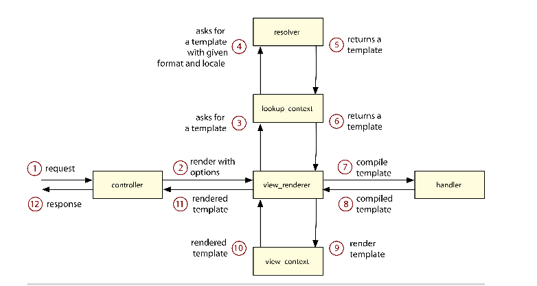
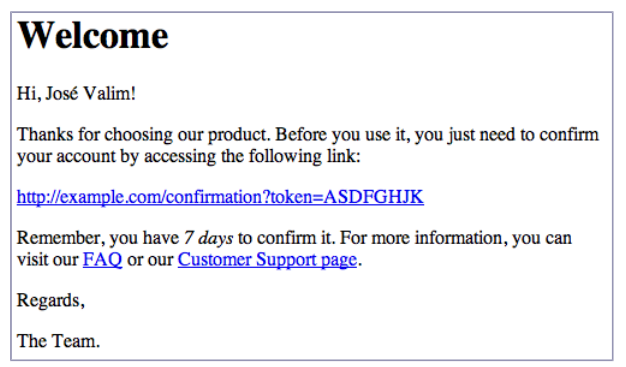
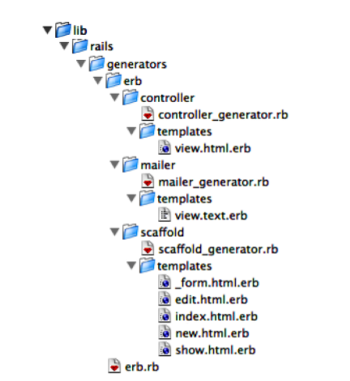

### Sending Multipart Emails Using Template Handlers

> 完成了我们的rails render stack之旅,让我们看一下rails如何编译渲染模板，目前,我们已经看到,一个控制器负责格式化渲染参数，并且发送他们给view render，根据这些选项,view render告诉lookup context到解析器中去寻找指定的模板,并且考虑lookup context存储的Locale和foramt.

> 我们由上一节write the code知晓,解析器返回ActionView::Template的实例，同时这些实例被初始化好,我们需要传递一个叫做handler的参数，每个扩展例如.erb或者.html都有自己的模板处理器(handler)

    ActionView::Template.registered_template_handler("erb")
    #=> #<ActionView::Template::Handlers::ERB:0x007fc722516490>

> 模板处理器负责编译一个模板到ruby源码,这些源码在view context中执行，必须将渲染的模板作为字符串返回。如下图

> 为了知道一个模板处理器如何工作,我们构建一个模板处理器解决这个实际问题,即使今天的email基于是1970年创建的，html 4.0版本在1997年制定,我们仍然不能依赖html发送邮件给每个人，因为邮件客户端不能适当渲染这些属性。

> 这就意味着无论什么时候配置一个程序发送html邮件，我们都应该发送一个同样内容的，文本格式的，创建一个多版本的邮件， 如果邮件接收者不能读取html邮件，它将回头接收文本形式邮件

> Action Mailer创建多版本邮件很容易，但是这样的方案导致我们不得不管理两个版本邮件，而且内容一样,如果我们同样内容被渲染成html和普通文本格式不是更好？

> markdown是一个轻量级的标记语言,由John Gruber和Aaron Swartz创造,目的是有利于简单的读写, markdown的语法完全由标点符号组成,允许你嵌入到html里，下面是一个简单的markdown文本

    Welcome
    =======
    Hi, José Valim!
    Thanks for choosing our product. Before you use it, you just need
    to confirm your account by accessing the following link:

    http://example.com/confirmation?token=ASDFGHJK

    Remember, you have *7 days* to confirm it. For more information,
    you can visit our [FAQ][1] or our [Customer Support page][2].
    Regards,
    The Team.
    [1]: http://example.com/faq
    [2]: http://example.com/customer

> 可读性非常高，最大好处是可以被转换成html，被渲染成下图这样

> 我们的处理器将使用markdown的铁性生成text和htmls试图，仅仅使用一个模板， 这唯一的问题是
> markdown不能解释ruby代码，为了绕过这个，我们必须使用erb编译我们的模板， 然后使用markdown编译器传唤他们。

> 本章最后我们将配置rails生成器使用新的模板处理器作为默认。

#### 4.1 Playing with the Template-Handler API

> 一个对象兼容 handler api，它需要响应call()方法，这个方法接收一个ActionView::Template实例作为参数,ActionView::Template是我们在writing the code那节引入的，call方法返回一个字符串包含了有效的ruby code，处理器返回的ruby代码被编译成一个方法，渲染一个模板和调用一个方法一样

> 在开始我们的Markdown+ERB处理器之前，我们创建一个模板处理器认识一下这个api

##### Ruby Template Handler

> 我们第一个模板处理器允许任意的ruby代码作为一个模板，这意思是下面的模板是有效的
 
    body = ""
    body << "This is my first "
    body << content_tag(:b, "template handler")
    body << "!"
    body

> 为了实现这个，我们创建一个叫做handlers的rails插件

    $ rails plug-in new handlers

> 下一步我们编写一个集成测试，测试我们的模板处理器，我们的目标是渲染test/dummy/app/views/handlers/rb_handler.html.rb

    handlers/test/dummy/app/views/handlers/rb_handler.html.rb
    body = ""
    body << "This is my first "
    body << content_tag(:b, "template handler")
    body << "!"
    body

> 我们的集成测试需要路由器和控制器服务于模板，让我们添加

    handlers/test/dummy/config/routes.rb
    Dummy::Application.routes.draw do
     get "/handlers/:action", to: "handlers"
    end

    handlers/test/dummy/app/controllers/handlers_controller.rb
      class HandlersController < ApplicationController
    end

> 我们的集成测试,应该发送一个请求根据路由/handlers/rb_handler 并且断言模板被渲染
    require "test_helper"
    class RenderingTest < ActionDispatch::IntegrationTest
      test ".rb template handler" do
        get "/handlers/rb_handler"
        expected = "This is my first <b>template handler</b>!"
        assert_match expected, response.body
      end
    end

> 当我们运行测试的时候，失败了，因为rails仍然无法识别.rb扩展模板，注册一个新的模板处理器，我们调用ActionView::Template.register_template_handler()，传递两个参数，模板扩展和处理器对象。
>处理器对象可以是任何只要可以响应call()方法和返回字符串， 我们可以使用lambda简单实现一个处理器

      handlers/1_first_handlers/lib/handlers.rb
      require "action_view/template"
        ActionView::Template.register_template_handler :rb,
          lambda { |template| template.source }

      module Handlers
      end
  
> 当我们运行这个测试时，我们刚刚写的测试现在通过了。我们的lambda表达式接收一个ActionView::Template实例作为桉树，因为我们的模板处理器返回一个String包含ruby代码，我们的模板使用ruby代码写的，我们仅仅需要返回template.source().

> ruby的symbols实现了一个to_proc方法并且:source.to_pro和lambda { |arg| arg.source }一样，所以我们可以将模板处理器写的更短

    ActionView::Template.register_template_handler :rb, :source.to_proc

###### String Template Handler

> 我们的.rb模板处理器十分简单，但是功能有限,rails views通常有和很多静态内容,使用ruby代码处理这些变得十分麻烦，我们来实现另一个模板处理器,更合适处理这些静态内容,但是仍然允许我们内嵌ruby代码,因为string在ruby中支持插值写法，我们的下一个模板将会基于ruby字符串，让我们添加一个模板到dummy app里，

    handlers/test/dummy/app/views/handlers/string_handler.html.string
    Congratulations! You just created another #{@what}!

> 我们的新模板使用字符串插值, 并且被插入的ruby代码引用一个实例变量叫做@what, 让我们定义一个新的action，并且包含这个实例变量在我们的HandlersController控制器里，作为一个fixture

    handlers/test/dummy/app/controllers/handlers_controller.rb
    class HandlersController < ApplicationController
      def string_handler
        @what = "template handler"
      end
    end

> 让我们编写一个简单的测试

    handlers/test/integration/rendering_test.rb
    test ".string template handler" do
      get "/handlers/string_handler"
        expected = "Congratulations! You just created another template handler!"
        assert_match expected, response.body
      end

> 为了使我们测试通过,我们实现这个模板处理器，在lib/handlers.rb中

    handlers/lib/handlers.rb
    ActionView::Template.register_template_handler :string,
    lambda { |template| "%Q{#{template.source}}" }

> 运行这个测试，通过了，我们的模板处理器返回了一个使用ruby短写%Q{}创建的字符串，rails将它编译成一个方法，当方法被调用时,ruby解释器执行这个字符串，返回插入的值的结果

> 模板的处理器对于简单例子工作很好,但是有两个缺点，加入“}”字符到模板会引起语法错误,除非字符被转义
>同时，代码块支持有限,因为需要被包装到整个插值语法里， 这意味这下面两个引起错误

    This } causes a syntax error
    #{2.times do}
    This does not work as in ERB and is invalid
    #{end}

> 是时候看一个更健壮的模板处理器了

#### 4.2 Building a Template Handler with Markdown + ERB

> 有几个gem可以将markdown语法编译成html.对于我们的模板处理器,我们使用RDiscount，一个ruby包装的快速的markdown编译库，叫做Discount,使用C语言编写

###### Markdown Template Handler

> 我们可以创建一个模板处理器来编译markdown，仅仅需要几行代码，我们加入一个测试

    handlers/test/integration/rendering_test.rb
    test ".md template handler" do
      get "/handlers/rdiscount"
      expected = "
RDiscount is <em>cool</em> and <strong>fast</strong>!
"
      assert_match expected, response.body
    end

> 然后我们编写我们的模板保存在文件系统上

    handlers/test/dummy/app/views/handlers/rdiscount.html.md
    RDiscount is *cool* and **fast**!

> 注意了。现在我们的模板是.md扩展名,我们注册一个处理器

    handlers/1_first_handlers/lib/handlers.rb
    require "rdiscount"
    ActionView::Template.register_template_handler :md,
    lambda { |template| "RDiscount.new(#{template.source.inspect}).to_html" }

> 因为我们的模板处理器依赖于RDiscount,让我们添加一个依赖到我们的插件中

    handlers/handlers.gemspec
    s.add_dependency "rdiscount", "~> 2.0.0"

> 当我们运行测试，通过了，我们的markdown模板处理器很奏效，但是它不允许我们内嵌ruby代码,所以使用上还是有一点限制,

>为了解决这个限制,我们可以使用在我们.string模板处理器使用的技术，但是也有限制，因此,我们使用erb嵌入ruby代码在我们的markdown模板里，我们创建一个新的handler处理器叫做merb.

#### MERB Template Handler

> 首先，我们添加一个新的模板处理器示例到我们的文件系统上，这个例子应该在我们的虚拟app里，我们在我们的test里使用它

    handlers/test/dummy/app/views/handlers/merb.html.merb
    MERB template handler is **<%= %w(cool fast).to_sentence %>**!

> 让我们编写一个测试，检查我们的输出

    handlers/test/integration/rendering_test.rb
    test ".merb template handler" do
      get "/handlers/merb"
      expected = "
MERB template handler is <strong>cool and fast</strong>!
"
      assert_match expected, response.body.strip
    end

> 这次实现我们的处理器没有使用lambda,作为替代，我们创建了一个模块，响应call()方法，允许将我们的实现分割成更小的方法，为了编译erb，我们简单的使用了erb处理器，我们可以通过ActionView::Tem
> plate.registered_template_handler()方法得到这个erb处理器

    handlers/1_first_handlers/lib/handlers.rb
    module Handlers
        module MERB
        def self.erb_handler
        @@erb_handler ||= ActionView::Template.registered_template_handler(:erb)
        end
        
        def self.call(template)
        compiled_source = erb_handler.call(template)
        "RDiscount.new(begin;#{compiled_source};end).to_html"
        end
      end
    end
    ActionView::Template.register_template_handler :merb, Handlers::MERB

> erb处理器编译这个模板，像其他模板处理器一样，这些有效的ruby，返回一个字符串，返回的结果是包含markdown的字符串，可以使用Rdiscount转换成html

> 最后，看一下我们怎样包装由erb返回的，在begin/end中内联的代码，我们不得不使用内联，否则它会搞乱回朔。 例如，下面模板

    <% nil.this_method_does_not_exist! %>

> 上面代码会跑出错误，在渲染的时候，然而，考虑到两种方式编译这个模板

    RDiscount.new(begin
      nil.this_method_does_not_exist!
    end).to_html
    RDiscount.new(begin;nil.this_method_does_not_exist!;end).to_html

> 第一个例子,因为我们在编译模板中引入了新行，异常回朔会提示说错误发生在第二行,这回让人迷惑，注意我们也需要使用begin / end包装代码，否则我们的处理器将会生成无效的ruby代码，如果包含多个ruby表达式的时候， 我们通过irb进行一下验证

    puts(a=1;b=a+1)# => raises syntax error
    puts(begin;a=1;b=a+1;end) # => prints 2 properly

#### Multipart Emails

> 我们将在 Action Mailer中使用多部分emails，来展示我们加入模板处理器的行为，让我们创建一个mailer在虚拟程序里，用于我们的测试使用

    handlers/2_final/test/dummy/app/mailers/notifier.rb
    class Notifier < ActionMailer::Base
      def contact(recipient)
        @recipient = recipient
        mail(to: @recipient, from: "john.doe@example.com") do |format|
          format.text
          format.html
        end
      end
    end

> 代码看起来很熟悉，就像控制器里的respond_to()，你可以传递一个代码块给mail，指定需要渲染的模板， 然而在控制器里，rails只选择一个模板进行渲染，然而在邮件代码块中，指定的几个模板用来创建一个多部分email

> 我们的email有两部分，一个分普通text，另一部分是html, 因为两部分使用同一个模板，让我们在虚拟app里创建一个模板，不向文件名添加格式

    handlers/test/dummy/app/views/notifier/contact.merb
    Dual templates **rock**!

> 编写一个测试

    handlers/test/integration/rendering_test.rb
    test "dual template with .merb" do
      email = Notifier.contact("you@example.com")

      assert_equal 2, email.parts.size
      assert_equal "multipart/alternative", email.mime_type
      assert_equal "text/plain", email.parts[0].mime_type
      assert_equal "Dual templates **rock**!",

      email.parts[0].body.encoded.strip
      assert_equal "text/html", email.parts[1].mime_type
      assert_equal "
Dual templates <strong>rock</strong>!
",
      email.parts[1].body.encoded.strip
    end

>测试断言分为两部分，因为文本部分是html部分的备用版本，所以email应该有一个MIME类型等于multipart/alternative,会被Action Mailer自动设置,测试通过检查MIME type和每个部分的body
> 这两部分的顺序也很重要，如果这两部分都被转化，大多数客户端会忽略html部分，选择展示text部分

> 当我们运行测试，失败了，因为我们的text/plain部分包含了html代码，不是只包含plain text，这是我们意料之中，因为我们的模板处理器总是返回html代码， 为了使测试通过，我们需要细微的改变Handlers::MERB.call()实现对模板格式的处理

    handlers/lib/handlers.rb
      def self.call(template)
        compiled_source = erb_handler.call(template)
        if template.formats.include?(:html)
          "RDiscount.new(begin;#{compiled_source};end).to_html"
        else
          compiled_source
      end
    end

> 我们检查template.formats和是否包含：html格式，如果包含。我们将模板作为html渲染，否则我们返回erb编译后的代码，结果是用markdown语法编写的text模板，这样就允许我们发送一个邮件使用text和html两部分，同时使用一个模板

> 随着最后的修改,偶们的模板处理器做到我们前面计划的那样，在我们为我们的模板创建生成器之前，我们讨论一下template.format的设置

###### Formats Lookup

> 在writting the code那节，我们讨论了解析器扶着传递：format选项给模板，解析器按照下面查找方式决定使用哪种格式

1. 如果模板被找到自身有一个有效格式就使用, 模板位于文件系统中，格式被指定名字一部分，例如index.html.erb

2. 如果木本被找到，但是没有指定一个格式，解析器询问模板处理器时候有一个默认格式

3. 如果模板处理器没有首选格式，则解析器应该返回查找中使用的格式相同。

> 因为我们的contact.merb模板没有指定一个格式，所有解析器尝试获取默认格式，从我们的Handlers::MERB模板处理器里，这个默认格式通过Handlers::MERB.default_format()方法得到
> 但是因为我们的模板处理器不能影响default_format()方法，所以第二步查找也跳过，解析器最后的选项是返回查找中使用的格式,作为们正使用format.text和format.html方法，他们自动被设置成查找的格式text和html.

> 例如，如果我们定义Handler::MERB.default_foramt()并且实现它，返回:text或者:html，我们的测试将会失败，我们的解析器永远不会达到第三步，在第二步的时候就会返回一个指定的格式.

#### 4.3 Customizing Rails Generators

> 使用我们手上的模板处理器，渲染多部分邮件，最后一个步骤是给插件创建一个生成器, 我们的生成器将会钩入rails的邮件生成器,配置它成成.merb替代erb模板。

> rails生成器提供了回调入口,允许其他生成器扩展和定制生成的代码,快速的看一下邮件生成器源码

    rails/railties/lib/rails/generators/rails/mailer/mailer_generator.rb
    module Rails
      module Generators
        class MailerGenerator < NamedBase
          source_root File.expand_path("../templates", __FILE__)

          argument :actions, type: :array,default: [], banner: "method method"

          check_class_collision

          def create_mailer_file
            template "mailer.rb",
            File.join("app/mailers", class_path, "#{file_name}.rb")
          end

          hook_for :template_engine, :test_framework
        end
      end
    end

> 虽然我们不能覆盖整个生成器api，我们看到他主要行为是拷贝一个邮件模板到app/mailers
> 实现方法在create_mailer_file()里，注意，这歌邮件生成器不会告诉任何关于模板引擎和测试框架，它仅仅提供了回调，这就允许了其他库，像haml和rspec会进入mailer 神撑起，定制生成过程。

###### A Generator’s Structure

> 了解生成器是如何工作的,我们深入看一下Rails::Generators::MailerGenerator源码。
> 这个生成器继承了Rails::Generators::NamedBase，所有的生成器继承它，并且期望一个参数叫做NAME，当生成器从命令行被调用的时候，我们可以验证参数和选项通过执行下面的命令

    $ rails g mailer --help
    Usage:
      rails generate mailer NAME [method method] [options]

    Options:
      -e, [--template-engine=NAME] # Template engine to be invoked
                                # Default: erb
      -t, [--test-framework=NAME]  # Test framework to be invoked
                                # Default: test_unit

>回到我们生成器代码,Rails::Generators::MailerGenerator类定义了:actions作为参数
>在第6行. 因为提供了一个默认值(空数组)，这些actions是可选的，方括号里的是帮助信息

> 下一步我们调用class_collisions_check()方法，验证给予生成的的NAME是不是已经存在我们的applicaitons里，如果我们已经定义了一个同名的mailer就会跑出一个错误

> 下一行我们定义了一个create_mailer_file()方法。

    def create_mailer_file
      template "mailer.rb",
      File.join("app/mailers", class_path, "#{file_name}.rb")
    end

> rails生成器，按照这些公共方法定义的顺序调用，这种结构很有趣，因为可以和继承很好的集合,如果你想继承了mailer生成器做了一些扩展，你仅仅需要继承它，定义一些public 方法，跳过任务是一些未定义的方法，无论何时你的新的生成器被调用,他都会执行继承的方法，然后执行你定义的新的public 方法，如同控制器，您可以通过声明一个公开的方法来使用

> create_mailer_file()方法会调用三个方法，template() , class_path()和file_name()，第一个方法是thor里的帮助方法，是生成器基础, 其他两个定义在Rails::Generators::NamedBase里

> thor有一个模块叫做Thor::Actions，包含一些方法可以在生成任务中使用,他们其中一个就是前面讨论的template()方法， 允许接收两个参数:源文件和目标位置

> template()方法从文件系统读取源文件,使用ERB执行内嵌的ruby代码,拷贝结果到给定的目标位置, 在Thor中所有的erb模板都会被执行，在生成器的上下文中,这就意味着在生成器中定义的实例变量可以在你的模板中使用, 如通在proteced/private方法里一样

> 通过class_path和file_name方法返回的值，受到NAME参数值影响, 查看素有定义的方法和他们的返回值，让我们看named_base_test.rb文件源码

    def test_named_generator_attributes
      
      g = generator ['admin/foo']
      assert_name g, 'admin/foo', :name
      assert_name g, %w(admin), :class_path
      assert_name g, 'admin/foo', :file_path
      assert_name g, 'foo', :file_name
      assert_name g, 'Foo', :human_name

      assert_name g, 'foo', :singular_name
      assert_name g, 'foos', :plural_name
      assert_name g, 'admin.foo', :i18n_scope
      assert_name g,  'admin_foos', :table_name
    end 

> 这个测试断言，当admin/foo作为NAME参数值， 例如 rails g mailer admin/foo 
> 我们可以访问这些方法，返回对应的值

> 最后,mailer生成器提供两个回调,一个是模板引擎,另一个是测试框架, 这些回调变成选项，可以通过命令行传递， 生成器允许接收一组参数和选项如下所示

    $ rails g mailer Notifier welcome contact --test-framework=rspec

  
#### Generators’ Hooks

> 我们已经知道了rails生成器提供回调，然而当我们要求ERB作为模板引擎使用的时候, 邮件生成器是什么知道它并且找到它并使用的呢？ 生成器的回调工作感谢约定配置，当你选择模板引擎叫做:erb时，Rails::Generators::MailerGenerator会尝试读取下面三种生成器的一个

      • Rails::Generators::ErbGenerator
      • Erb::Generators::MailerGenerator
      • ErbGenerator
  
> 所有的生成器都在$LOAD_PATH下，在rails/grenerators或者generators目录里，找到这些生成器最简单的方式就是require下面这些文件

      (rails/)generators/rails/erb/erb_generator
      (rails/)generators/rails/erb_generator
      (rails/)generators/erb/mailer/mailer_generator
      (rails/)generators/erb/mailer_generator
      (rails/)generators/erb/erb_generator
      (rails/)generators/erb_generator

> 如果这些生成器其中一个被找到,通过命令行传递给mailer generator的参数同样传递给这个生成器，在这个例子中生成器 Erb::Generators::MailerGenerator 我们下节讨论

###### Template-Engine Hooks

> rails为template engines暴露了三个回调，一个用于控制器，一个是用于mailer，一个是用于脚手架生成器,前两个生成文件只有一些actions通过命令行支持,例如rails g mailer Notifier welcome contact 或 rails g controller Info about contact，对于给定的每个action，模板引擎都会为它创建一个模板

> 换句话说,scaffold回调创建所有试图 index , edit , show , new , 和 the _form partial.

> Erb::Generators::ControllerGenerator 实现如下

    rails/railties/lib/rails/generators/erb/controller/controller_generator.rb
      require "rails/generators/erb"
      module Erb
        module Generators
          class ControllerGenerator < Base
            argument :actions, type: :array,default: [], banner: "action action"
            def copy_view_files
              base_path = File.join("app/views", class_path, file_name)
              empty_directory base_path
              actions.each do |action|
                @action = action
                @path = File.join(base_path, filename_with_extensions(action))
                template filename_with_extensions(:view), @path
              end
            end
          end
        end
      end

> 这个方法 filename_with_extensions() 我们没有讨论

    rails/railties/lib/rails/generators/erb.rb
    require "rails/generators/named_base"
    module Erb
      module Generators
        class Base < Rails::Generators::NamedBase
          protected
          def format
          :html
          end
          def handler
          :erb
          end
          def filename_with_extensions(name)
          [name, format, handler].compact.join(".")
          end
        end
      end
    end

> Erb:: Generators::ControllerGenerator在app/views创建视图文件，使用配置好的格式核处理器为每个给定的action, 用来创建试图的模板源码如下

    rails/railties/lib/rails/generators/erb/controller/templates/view.html.erb
    <h1><%= class_name %>#<%= @action %></h1>
    
Find me in <%= @path %>

> rails g controller admin/foo bar 输出文件app/views/admin/foo/bar.html.erb 

    <h1>Admin::Foo#bar</h1>
    
Find me in app/views/admin/foo/bar

> Erb::Generators::MailerGenerator类简单继承了controller生成器 修改了默认格式为text
> 重复利用其他逻辑

    rails/railties/lib/rails/generators/erb/mailer/mailer_generator.rb
    require "rails/generators/erb/controller/controller_generator"
      module Erb
        module Generators
        class MailerGenerator < ControllerGenerator
          protected
          def format
          :text
          end
        end
      end
    end

> mailer使用的模板如下

    rails/railties/lib/rails/generators/erb/mailer/templates/view.text.erb
    <%= class_name %>#<%= @action %>
    <%%= @greeting %>, find me in app/views/<%= @path %>

> 如果我们看一下ERB生成器目录结构 我们可以看到那些模板被使用

> 因此,如果我们想完整替换erb生成器,我们需要创建这些生成器和模板，因为rails生成器可以继承,我们可以继承各自的ERB生成器复写一些方法

######Creating Our First Generator
