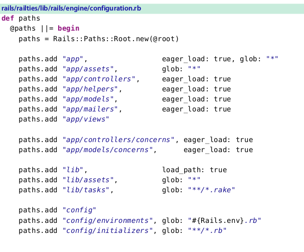
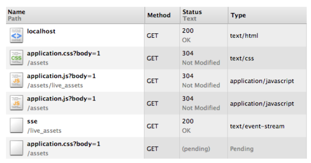
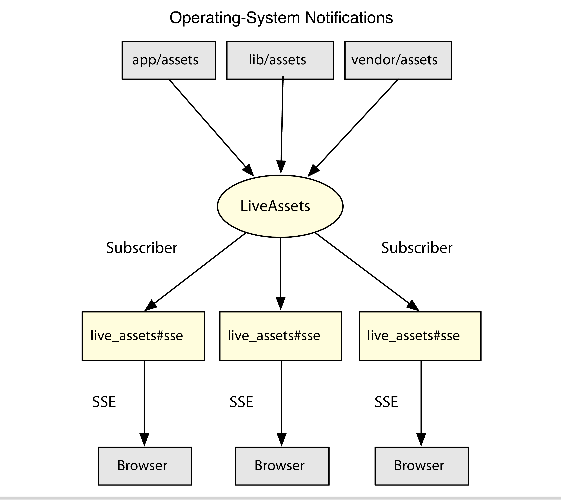

#### Streaming Server Events to Clients Asynchronously

> 前面章节，我们已经分析了rails render stack的里里外外，你已经了解到当一个请求到达控制器,控制器
> 收集请求信息给需要渲染的模板， 模板从解析器中得到，然后编译渲染，嵌入到布局文件中, 最后，你得到了ruby字符串形式的模板，这个字符串设置到http response中，返回给客户端

> 这种工作方式对大多数程序都还不错。然而，有一些情况,我们需要发送response以较小的字节片段方式，有时这些字节片段，可能是无限的不间断的，我们需要一直需要发送，直到服务端和客户端链接中断为止。

> 无论什么时候我们发送一个response以字节片段方式，我们都叫做服务端数据流到客户端，因为rails以更传统的请求响应场景构建，流服务的支持被添加并且不断被改良，这章我们来探究一下

> 为了探究streaming是如何工作的，我们编写一个rails plugin，当我们的css样式改变时，发送数据给浏览器端，浏览器将会使用这些信息重新加载当前页面的样式， 允许开发者看到当他们修改页面资源样式时，页面同时改变，不需要手动刷新页面。

> 因为这个插件有自己的控制器，asserts，routes和其他，我们将基于rails engines提供的强大能力，添加功能作为rails application一部分，另一方面打包成gem分享到其他项目

###### 5.1 Extending Rails with Engines

> rails 引擎允许我们的插件有自己的控制器，模型，帮助方法，试图，资源，和路由，就像一个符合规则的rails application.让我们生成一个叫做live_assets的插件,使用rails 插件生成器，但是这次 我们传递--full 标记，用于生成model 控制器和路由目录

    $ rails plugin new live_assets --full

> 除了生成器给我们创建的常规文件，--full标签也生成下面这些文件

* 一个app目录，里面有controller,models,和其他在一个rails application里能看到的目录

* 一个config/routes.rb文件用于路由

* 一个空的test/integration/navigation_test.rb文件，用于添加我们的测试

>最重要的文件是lib/live_assets/engine.rb.让我们仔细看一下这个文件。

    live_assets/lib/live_assets/engine.rb
      module LiveAssets
        class Engine < ::Rails::Engine
        end
      end

> 创建了一个engine类，我们需要继承Rails::Engine并且确保我们的新engine尽可能快的被加载， 这个生成器已经替我们做了在lib/live_assets.rb中添加

    live_assets/lib/live_assets.rb
    require "live_assets/engine"
    
    module LiveAssets
    end

> 创建一个Rails::Engine十分类似创建一个Rails::Railtie.因为Rails::Engine相比较Rails::Railtie只不过多了一些默认初始化设置，和paths程序接口 我们接下来看看

###### Paths

> 一个Rails::Engine没有硬编码路径，这意味着我们不需要将我们的models和controllers放在app/目录下，我们可以把他们放到任何位置。例如。我们配置我们的engine读取我们的控制器从lib/controllers目录，替代app/controllers，如下

      module LiveAssets
        class Engine < Rails::Engine
         paths["app/controllers"] = ["lib/controllers"]
        end
      end

> 我们也可以让rails读取我们的controllers从app/controllers和lib/controllers两个目录里读取

    module LiveAssets
      class Engine < Rails::Engine
        paths["app/controllers"] << "lib/controllers"
      end
    end

>这些路径和在rails application里的路径有一样的语义，如果你有一个控制器叫做LiveAssetsController在app/controllers/live_assets_controller.rb里，或者在lib/controllers/live_assets_controller.rb里，这个控制器都会被自动加载，当你需要这个控制器的时候， 不如要显示的required

> 现在，我们遵守约定的路径,粘贴我们的控制器到app/controllers,所以不需要使用前面的修改路径方法，通过查看rails源码，我们可以检查所有自定义路径

> 上面的代码片段展示了哪些指定的路径应该被热加载,哪个不被热加载，添加列表路径到
> locales,migrations等等，然而声明一个路径是不够的，还要用路径做些事情

######  Initializers

> 一个engine有几个初始化程序，负责启动engine， 这些初始化器相当底层，不会与你application的config/initializers下的任何一个混淆。 让我们看一个例子

    rails/railties/lib/rails/engine.rb
      initializer :add_view_paths do
        views = paths["app/views"].existent
        unless views.empty?
          ActiveSupport.on_load(:action_controller){ prepend_view_path(views) }
          ActiveSupport.on_load(:action_mailer){ prepend_view_path(views) }
        end
      end

> 初始化器负责添加我们的engine views,通常定义在app/views里，ActionController::Base 和 ActionMailer::Base一被加载 允许一个rails application使用engine中定义的模板， 可以看一下engine中的全部初始器，我们可以打开一个控制台，在test/dummy下，输入下面

    Rails::Engine.initializers.map(&:name) # =>
      [:set_load_path, :set_autoload_paths, :add_routing_paths,
      :add_locales, :add_view_paths, :load_environment_config,
      :append_assets_path, :prepend_helpers_path,
      :load_config_initializers, :engines_blank_point]

> 使用engine和使用rails application十分类似，我们都知道怎样构建实现我们的流插件

#### 5.2 Live Streaming

> 看一下streaming如何工作，让我们创建一个控制器叫做LiveAssetsController,文件位置app/controllers/live_assets_controller.rb，引入了ActionController::Live功能，发送hello world不间断。

    live_assets/1_live/app/controllers/live_assets_controller.rb
    class LiveAssetsController < ActionController::Base
      include ActionController::Live
      def hello
        while true
          response.stream.write "Hello World\n"
          sleep 1
        end
      rescue IOError
        response.stream.close
      end
    end

> 我们的控制器提供了一个action叫做hello(),每秒发送一个Hello world, 如果有任何原因，导致链接在server和client中断，response.stream.write会失败抛出IOError. 我们需要捕获它，关闭流

> 我们需要一个路由配置

    live_assets/1_live/config/routes.rb
      Rails.application.routes.draw do
      get "/live_assets/:action", to: "live_assets"
      end

> 我们准备尝试发送流到客户端,然而，因为rails engine不能运行自己，我们需要启动它在test/dummy中，此外流功能不会工作在webrick中，webrick是ruby和rails使用默认服务器，webrick将缓存我们发送到客户端响应,
> 所以我们不会看到任何东西，对于这个原因，我们使用puma，添加到我们的gemspec作为开发依赖

> 最后。我们进入test/dummy目录，执行rail s ,rails现在启动 替代了webrick

    Booting Puma
    Rails 4.0.0 application starting in development on http://0.0.0.0:3000
    Call with -d to detach
    Ctrl-C to shutdown server
    
>大多数浏览器会尝试缓存流相应，或者需要一段时间，他们决定是否要展示我们的内容， 所以测试我们的流发送到末端，我们使用curl 通过命令行

    $ curl -v localhost:3000/live_assets/hello
    > GET /live_assets/hello HTTP/1.1
    > User-Agent: curl/7.24.0 (x86_64-apple-darwin12.0)
    > Host: localhost:3000
    > Accept: */*
    >
    < HTTP/1.1 200 OK
    < X-Frame-Options: SAMEORIGIN
    < X-XSS-Protection: 1; mode=block
    < X-Content-Type-Options: nosniff
    < X-UA-Compatible: chrome=1
    < Cache-Control: no-cache
    < Content-Type: text/html; charset=utf-8
    < X-Request-Id: f21f8c0d-d496-4bfa-944c-cd01b44b87ee
    < X-Runtime: 0.003120
    < Transfer-Encoding: chunked
    <
    Hello World
    Hello World

> 每秒，你都会看到Hello world 出现在屏幕上，这意味着流推送正在工作， 按住CTRL+C中断传输，我们进一步学习一个更复杂的例子

###### Server-Sent Events

> 开发者总是需要在浏览器里收到服务端的更新，很长一段时间里，轮询是最通用的解决这个问题的技术方案。在轮询的时候，浏览器频繁发送请求到服务器端，询问是否有新数据,如果没有新数据，服务端返回一个空响应，浏览器再开始新的请求,根据频率，浏览器最终向服务器发送许多请求，产生大量开销。

>随着不断发展,长轮询技术出现,使用这个技术,浏览器定期的发送请求给服务端,如果没有更新服务器端在发送空响应之前，等待一段时间，虽然比传统的轮询执行的好一些，浏览器之间存在交叉兼容性问题。
> 此外,许多代理和服务端如果一段时间没有通讯就会发生链接丢失，这种方法就失效了

> 为了解决开发者的需求，html标准引入了两个api， Server Sent Events (SSE) 和 WebSockets，WebSockets允许客户端和服务器端交换信息在同一个连接上，但是因为是新协议，或许需要改变你的开发栈来支持，Server sent Event，是一个单向通讯通道。从服务端到客户端,可以使用任何web服务器，只要能够支持流响应(stream response),基于这些原因sse使我们这章节选择的方案。

> sse基础就是event stream format，下面是一个对http请求的事件流响应

    HTTP/1.1 200 OK
    Content-Type: text/event-stream

    event: some_channel
    data: {"hello":"world"}

    event: other_channel
    data: {"another":"message"}

> 数据的界定通过两个新行，每个信息有一个event和他关联的数据，在这个例子中, 数据是json格式，但它也可以是文本，当流推送的时候，我们需要从服务端返回一个格式, 让我们创建一个新的action叫做sse在我们的LiveAssetsController里，发送一个reloadcss事件，每秒钟发送一次

    live_assets/1_live/app/controllers/live_assets_controller.rb
    def sse
      response.headers["Cache-Control"] = "no-cache"
      response.headers["Content-Type"] = "text/event-stream"
      while true
        response.stream.write "event: reloadCSS\ndata: {}\n\n"
        sleep 1
      end
    
      rescue IOError
      response.stream.close
    end

> 类似我们第一个action,除了现在我们需要设置适当的响应内容类型，并且关闭缓存，服务端已经准备好。我们来写客户端，使用js:

    live_assets/1_live/app/assets/javascripts/live_assets/application.js
      window.onload = function() {

        // 1. Connect to our event-stream
        var source = new EventSource('/live_assets/sse');
        // 2. This callback will be triggered on every reloadCSS event
        source.addEventListener('reloadCSS', function(e) {
        // 3. Load all CSS entries
        var sheets = document.querySelectorAll("[rel=stylesheet]");
        var forEach = Array.prototype.forEach;
        // 4. For each entry, clone it, add it to the
        //document and remove the original after

        forEach.call(sheets, function(sheet){
            var clone = sheet.cloneNode();
            clone.addEventListener('load', function() {
            sheet.parentNode.removeChild(sheet);
        });

       document.head.appendChild(clone);
      });
    });
    };

> 我们的javascript文件链接我们的后端，监听每个reloadcss事件,在页面重新加载所有的样式，我们的资源文件定义在,app/assets/live_assets/application.js，这个文件被引入，因为rails仅仅预编译资源文件匹配application.*。因为他们是仅有的被预编译的文件，这样的文件通常被引入所有存在的文件里， 那就是为什么叫做manifests.

> 最后我们创建一个帮助方法，让application读取我们资源更方便

    live_assets/1_live/app/helpers/live_assets_helper.rb
    module LiveAssetsHelper
      def live_assets
        javascript_include_tag "live_assets/application"
      end
    end

> 使用我们的server sent events机制，我们到test/dummy创建一个控制器

    live_assets/1_live/test/dummy/app/controllers/home_controller.rb
    class HomeController < ApplicationController
    def index
    render text: "Hello", layout: true
    end
    end

    live_assets/1_live/test/dummy/config/routes.rb
    Dummy::Application.routes.draw do
    root to: "home#index"
    end

> 修改我们的布局引入engine资源 但是仅在开发模式

    live_assets/test/dummy/app/views/layouts/application.html.erb
    <!DOCTYPE html>
    <html>
    <head>
    <title>Dummy</title>
    <%= stylesheet_link_tag "application", media: "all" %>
    <%= javascript_include_tag "application" %>
    <%= live_assets if Rails.env.development? %>
    <%= csrf_meta_tags %>
    </head>
    <body>
    <%= yield %>
    </body>
    </html>

> 重启虚拟app(dummp目录下的app)，使用浏览器浏览localhost:3000,如果你的浏览器有网络面板,
> 可以看http请求，通过浏览器发送的，你或许期望每个样式表每秒钟都被重新加载,但是没有发生,在下图

> 即使puma是一个多线程服务器,rails允许仅有一个线程在一个时间点运行，我们需要改变虚拟程序允许并行计算

    live_assets/test/dummy/config/application.rb
    config.allow_concurrency = true

> 因为浏览器与web服务器链接，然后等待服务器相应请求，我们需要关闭浏览器之前重启web服务器,关闭浏览器，重新启动服务器，然后重新打开地址loalhost:3000;我们可以看到样式表没秒都在重新加载
>为了验证我们的样式表被重新加载,我们编辑test/dummy/app/assets/stylesheets/application.css文件，观察发生的改变，不需要刷新页面，尝试设置文本颜色如下

    body { color: red; }

> 如你所见，我们的server-sent events推送流工作了，然而，我们还是可以做一些改善，首先，我们想仅仅修改样式仅当文件系统上的文件内容发生改变时，而不是每秒都重新加载，观察这些变化应该是会提高效率的，如果我们有5个页面，我们不想为我们打开的所有页面都去查询文件系统，我们将有一个主文件系统侦听器实体，每个请求都可以订阅。

> 第二个问题是我们的代码目前没有任何测试，这种特性其实很难编写测试，因为流发送无限的数据，为了可以直接从控制器测试，我们需要将存在的组件变得更小，更可测试

> 最后，因为我们使用了config.allow_concurrency，我们需要理解这样的设置如何影响基于stremaing部署的applications，所以我们有很多工作要做

#### 5.3 Filesystem Notifications with Threads

> 一个rails程序默认产生三个资源目录,app/assets,lib/assets,和vendor/assets.我们的资源应该被分割到这些目录使用和我们分割代码一样的方式,app目录应该包含直接和我们程序相关的资源，lib目录包含独立js或者css组件，组件使用远超我们的application. vendor目录包含第三方文件

> 我们想监视这些目录上的文件的改变，一种选择是每秒或更少地手动检查每个目录中每个文件的修改时间。这就是文件系统轮询，轮询或许是个好的开始点，但是资源文件不断增长，会变得非常耗费CPU

> 幸运的是，大多数系统提供一个通知机制，为文件系统改变,我们简单传递操作系统所有我们想监视的目录，并且如果一个文件被添加，移除，修改，我们的代码将会被通知,这个listen gem提供了所有主流系统通知机制的api调用，考虑我们的需求有一个实体监视文件系统，我们的请求可以订阅，让我们在一个线程里包装所有监听功能,在请求时并发运行，打开lib/live_assets.rb实现它

    live_assets//lib/live_assets.rb
      require "live_assets/engine"
      require "thread"
      require "listen"
        
      module LiveAssets
        mattr_reader :subscribers
        @@subscribers = []
        
        # Subscribe to all published events.
        def self.subscribe(subscriber)
          subscribers << subscriber
        end
        # Unsubscribe an existing subscriber.
        def self.unsubscribe(subscriber)
          subscribers.delete(subscriber)
        end
        # Start a listener for the following directories.
        # Every time a change happens, publish the given
        # event to all subscribers available.
        def self.start_listener(event, directories)
          Thread.new do
            Listen.to(*directories, latency: 0.5) do |_modified, _added, _removed|
              subscribers.each { |s| s << event }
            end
          end
        end
      end

> 我们的代码原理是在一个线程里监听, 监听一组给定的目录，每次发生改变，推送注册的事件给每个订阅者， 因为我们使用listen gem,让我们添加到gemspec,

    live_assets/2_listener/live_assets.gemspec
    s.add_dependency "listen"

> 虽然我们不能编写集成测试给action因为流更新是无限的，我们监听功能从流系统剥离出来，允许我们独立测试，让我们编写一个测试，开启监听，然后验证一个事件推送给我们的订阅者，当test/tmp目录发生变化时。

    live_assets/2_listener/test/live_assets_test.rb
    require "test_helper"
    require "fileutils"
    class LiveAssetsTest < ActiveSupport::TestCase
      setup do
        FileUtils.mkdir_p "test/tmp"
      end
      teardown do
        FileUtils.rm_rf "test/tmp"
      end
      test "can subscribe to listener events" do
        # Create a listener
        l = LiveAssets.start_listener(:reload, ["test/tmp"])
        # Our subscriber is a simple array
        subscriber = []
        LiveAssets.subscribe(subscriber)
        begin
          while subscriber.empty?
            # Trigger changes in a file until we get an event
            File.write("test/tmp/sample", SecureRandom.hex(20))
          end
          # Assert we got the event
          assert_includes subscriber, :reload
        ensure
          # Clean up
            LiveAssets.unsubscribe(subscriber)
            l.kill
        end
      end
    end

> 不错，看起来我们的监听器工作如预期，当你运行测试的时候，你可能得到一些来自Listen gem的警告，因为它使用文件系统轮询，除非你安装了一个gem针对你的操作系统使用文件系统提醒。想更自由可以添加一个这样的gem到你的gemfile.不是gemspec,因为对于我们的插件listen这样的gem不是必须的依赖

> 最后我们需要确保监听我们的资源目录，当我们application启动就开始监视，然后推动一个:reloadcss时间，当发生改变的时候，让我们写一个测试

    live_assets/2_listener/test/live_assets_test.rb
    test "can subscribe to existing reloadCSS events" do
        subscriber = []
        LiveAssets.subscribe(subscriber)
      begin
        while subscriber.empty?
         FileUtils.touch("test/dummy/app/assets/stylesheets/application.css")
        end
          assert_includes subscriber, :reloadCSS
      ensure
          LiveAssets.unsubscribe(subscriber)
      end
    end

> 我们的测试假设监听已经可以使用，为了确保测试可以使用，我们定义一个初始化器在我们的engine里，类似我们前面章节看到的，启动监听，传递资源目录作为参数

    live_assets/2_listener/lib/live_assets/engine.rb
    module LiveAssets
      class Engine < ::Rails::Engine
        initializer "live_assets.start_listener" do |app|
          paths = app.paths["app/assets"].existent +
                  app.paths["lib/assets"].existent +
                  app.paths["vendor/assets"].existent

          paths = paths.select { |p| p =~ /stylesheets/ }

          if app.config.assets.compile
            LiveAssets.start_listener :reloadCSS, paths
          end
        end
      end
    end

> 注意我们开始监听只有在资源被动态编译时。这样防止在生产版本中也监听，在生产版本资源编译配置和与编译配置，通常设置为false。

> 现在我们的监听器已经启动，并且准备推送事件给订阅者，每次访问/live_assets/sse，我们需要创建一个新的订阅者，添加他到订阅列表，然后等一个新的事件推送我们的订阅者.一旦事件达到，我们就发送一个 server-sent evnet给浏览器，如下图所示

> 图中最棘手的部分就是等待： 我们想每个请求都是空闲状态，直到一个事件到达，在循环中检查新事件，和我们在测试中做的一样，这不是一个好的选择，因为会导致CPU使用率过高，我们通过休眠一定的时间来解决这个问题，例如半秒，然后检查事件，但是这样也效果一般，最完美的效果是，我们想让让他睡眠，当事件到达时自动醒来。

> ruby有一个完美的解决方案在标准库中，使用Queue类，让我们看一下

###### Threads and Queues

> 队列是先进先出的结构， 通过require thread，我们可以实现一个队列访问任何ruby代码,它提供了一个简单的api

      require "thread"
      q = Queue.new
      t = Thread.new do
              while last = q.pop
                sleep(1) # simulate cost
                puts last
              end
          end

      q << :foo
      sleep(1)
      $stdout.flush

> 上面代码，创建了队列Queue,和一个Thread， 在线程里是一个循环，调用Queue#pop()方法，如果队列里没有任何项，线程就会阻塞，直到新的项被添加到队列， 最后三行，我们将一个符号Push到队里了，将会唤醒线程，一秒后，我们flush ,写入$sdout,会看到foo

> 这意味着队列对于我们是完美的结构用来作为订阅者，直到请求事件到达,队列一直时空的并且是睡眠状态，然后我们推送这个新事件之后，然后进入睡眠，我们创建一个类叫做LiveAssets::SSESubscriber，用来接收这些时间，以server-sent stream format格式输出，如下测试

    live_assets/2_listener/test/live_assets/subscriber_test.rb
    require "test_helper"
    require "thread"
    class LiveAssets::SubscriberTest < ActiveSupport::TestCase
    test "yields server sent events from the queue" do
    # Let's start our queue with some events
    queue = Queue.new
    queue << :reloadCSS
    queue << :ping
    queue << nil
    # And create a subscriber on top of it
    subscriber = LiveAssets::SSESubscriber.new(queue)
    stream = []
    subscriber.each do |msg|
    stream << msg
    end
    assert_equal 2, stream.length
    assert_includes stream, "event: reloadCSS\ndata: {}\n\n"
    assert_includes stream, "event: ping\ndata: {}\n\n"
    end
    end

> 我们的测试创建了一个队列，将它传递给订阅者，然后通过消耗事件提醒订阅者，注意。当我们添加nil到队列中，表示我们没有产生事件和消耗事件， 让我们实现一个订阅者

      live_assets/2_listener/lib/live_assets/sse_subscriber.rb
      require "thread"
      module LiveAssets
      class SSESubscriber
      def initialize(queue = Queue.new)
      @queue = queue
      LiveAssets.subscribe(@queue)
      end
      def each
      while event = @queue.pop
      yield "event: #{event}\ndata: {}\n\n"
      end
      end
      def close
      LiveAssets.unsubscribe(@queue)
      end
      end
      end

> 然后自动加载他 

    autoload :SSESubscriber, "live_assets/sse_subscriber"

> 最后我们编写一个live_assets#sse的action 确保使用我们新的订阅者

    live_assets/2_listener/app/controllers/live_assets_controller.rb
    def sse
    response.headers["Cache-Control"] = "no-cache"
    response.headers["Content-Type"] = "text/event-stream"
    sse = LiveAssets::SSESubscriber.new
    sse.each { |msg| response.stream.write msg }
    rescue IOError
    sse.close
    response.stream.close
    end

> 再一次，我们在test/dummy里面，重启puma服务器，验证仅仅只有修改app/assets/stylesheets/application.css 才推送事件流，反映到页面的改变。这次我们修改字体

    body { font-size: 32px; }

> 我们基本上已经实现完成了，但是还有最后一个问题需要我们解决，当样式长时间没有改变。我们会有一段长时间没有推送任何事件给浏览器, 这或许会引起浏览器服务端或者和代理之间的链接关闭

######　Timer

> 为了确保连接不会再长时间空闲时被关闭，我们需要一个定时器，负责解决推送一个 ping时间给订阅者,10秒一次,让我们开始测试

    test "receives timer notifications" do
    # Create a timer
    l = LiveAssets.start_timer(:ping, 0.5)
    # Our subscriber is a simple array
    subscriber = []
    LiveAssets.subscribe(subscriber)
    begin
    # Wait until we get an event
    true while subscriber.empty?
    assert_includes subscriber, :ping
    ensure
    # Clean up
    LiveAssets.unsubscribe(subscriber)
    end
    end

> 我们的听时期将运行在自己的线程上,推送事件给订阅者　

    live_assets/3_final/lib/live_assets.rb
      def self.start_timer(event, time)
      Thread.new do
      while true
      subscribers.each { |s| s << event }
      sleep(time)
      end
      end
      end

> 上面的实现确保我们测试通过，最后添加到engine里面，另一个初始化器负责启动定时器

    live_assets/3_final/lib/live_assets/engine.rb
    initializer "live_assets.start_timer" do |app|
    if app.config.assets.compile
    LiveAssets.start_timer :ping, 10
    end
    end

> 重启puma web服务器，现在ping事件应该每10秒发送一次，我们没有注册任何回调函数在js那端。但是如果我们想也可以，js eventSource对象也有open 和close事件 ，当连接打开和关闭的时候。mozilla开发网有详细说明，你可以去[浏览](https://developer.mozilla.org/en-US/docs/Server-sent_events/Using_server-sent_events)

> 在整个实现过程中,细节中的一个两点就是需要设置config.allow_concurrency 为 true，现在远离live-assets的实现，我们有更好的机会去讨论他

#### 5.4 Code-Loading Techniques

> 为了理解为什么我们需要直接打开allow_concurrency选项，我们需要分析ruby和rails的代码加载机制

> 最常用的ruby的加载代码技术就是require()方法

    require "live_assets"

> 一些库简单的使用require就能工作的很好,但是随着他们不断增长，他们中的一些逐渐依赖于autoload技术避免一开始就读取全部文件,在rails plugin中autoload是一个很重要的技术，因为他能帮助application的启动时间低于在开发和测试环境，因为我们读取模块仅在我们第一次需要他们的时候。

###### Autoload techniques

> 我们在这章的LIveAssets::SSESubscribe中使用了autoload

    module LiveAssets
      autoload :SSESubscriber, "live_assets/sse_subscriber"
    end

> 现在，第一次 LiveAssets::SSESubscriber被访问，它会自动被读取，rails plugin和application还有另一个代码加载技术，就是rails的autoload，例如，我们的LiveAssetsController，当我们第一次使用它时被自动加载，但是这个不是由ruby处理的，而是通过rail自带的ActiveSupport::Dependencies

> ruby和rails在一开始的问题是加载代码不是原子性的， 它不是一个单独的步骤，例如，如果你有一个请求发生在A线程里,线程A启动读取LiveAssetsController，LiveAssetsController这个类在线程B中
>是可见的并且在Thread A完成加载app/controllers/live_assets_controller.rb文件之前，在线程B中已经被一个请求响应，这种情况下，线程B只会看到有一部分控制器的方法，例如，可能紧包含一个hello()方法，没有sse方法，就会导致失败。

> 尽管一些Ruby实现一直致力于实现Ruby的加载线程安全(前面描述场景并不会发生),rails的autoload并不是线程安全，为了解决这个实际问题，无论何时rails autoload需要加载代码，默认rali只允许一个线程运行，那就意味着在一个时间点，只有一个线程提供服务，那就是为什么我们不能在同一时间使用server-sent events 链接提供资源服务。为了解决这个问题。我们让config.allow_concurrency设置为true。

> 这对生产意味着什么？我们需要明确允许并发吗，我们部署这个应用程序的选项是什么？

###### Eager-Load Techniques

> 在生产版本中，rails热加载你的代码，所有模型，控制器，帮助方法，在启动时就加载， 因为所有rails代码在启动时被加载，没有代码被重新加载，自动加载是关闭的，当没有autoload时，在rails程序中使用config.allow_concurrency设置为true运行是安全的。这也是rails默认设置的

>然而，rails仅仅热加载定义在app目录下的代码。如果我们依赖于ruby autoload,我们需要自己热加载我们自己的代码，否则，我们可能要在一个请求中间加载代码，使用LiveAssets::SSESubscriber可能发生，假设这个场景:

> 第一个请求访问/live_assets/sse，ruby开始加载liveAssets::SSESubscriber.如果这时候许多请求在这个时间请求这个地址，第一个请求还没完成读取subscriber，导致下面的请求只能看到subscriber定义的部分方法,解决方法就是确保LiveAssets::SSESubscriber在rails程序启动时候被热加载, 因为这是rails 插件和rails自己本身的一个共同的需求，rails为我们提供了一些约定

> 第一个约定是config.eager_load_namespaces配置选项，在railtie或engine中是有效的，这个配置用来保证一个命名空间列表被热加载，让我们加入LiveAssets到这个列表，在我们的engine定义里

    live_assets/3_final/lib/live_assets/engine.rb
    config.eager_load_namespaces << LiveAssets

> 现在rails能够调用LiveAssets.eager_load!来直接热加载我们的代码在生产环境里，然而我们还没有实现这个eager_load!(),让我们在ActiveSuuport::Autoload帮助下定义它

    live_assets/3_final/lib/live_assets.rb
    module LiveAssets
     extend ActiveSupport::Autoload
      eager_autoload do
        autoload :SSESubscriber
      end
    end

> 通过使用ActiveSupport::Autoload扩展我们的模块,我们自动得到一个LiveAssets.eager_load!方法，需要热加载的代码都被定义在eager_autoload()代码块里,我们不再需要传递一个路径给autoload()放啊，Rails根据常量名称来猜测它。

> 这就是我们需要为rails热加载完成的其余代码,记住，我们每次使用这个技术在我们有代码没有被rails自动加载。通常通过ruby autoload来设置。我们可以在test/dummy目录打开一个控制台，检查rails热加载的所有命名空间

    Rails.application.config.eager_load_namespaces # =>
    [ ActiveSupport, ActionDispatch, ActiveModel, ActionView,
    ActionController, ActiveRecord, ActionMailer, LiveAssets::Engine,
    LiveAssets, Dummy::Application ]

> 记住这个热加载技术不仅仅对线程服务器puma有好处，也适用于[unicorn](http://unicorn.bogomips.org/). unicorn在启动后通过一个rails程序快照来操作。 通过热加载我们的代码，我们确保这个快照包含了我们所有提前启动的代码
>不需要浪费时间在每次请求时加载代码。

> 因此,决定哪个服务器用来推送是复杂的，对于长链接请求通常取决于你的WEB服务器处理并发链接的能力
> 例如,unicorn通过一个线程池，每个web服务器能紧能够在一个时间处理一个请求(单线程多处理模型),如果一个web服务器正在推送流数据，或者接收一个巨大文件上传。就不能处理其他请求你，即使数据仅仅每10秒发送一次。换句话说这章我们使用的puma web服务器能够处理其他请求即使当我们在推送流数据的时候

> 不幸的是，没有银弹，当涉及到部署时，最好的选择是对可用的不同Web服务器进行基准测试。像puma这种多线程服务器能都处理多请求，thin也可以作为事件服务器，然而，在1.5版本，thin让然不支持推送流， 像Passenger 和 Rainbows 允许你混入不同的并发风格，所以你有一个混合的多线程多任务处理部署选择。 对于混入更多选择，你或许得到最好的结果就是不熟在像jruby和rubinius这样的平台

> 不同的平台给予开发者不同的安全保证。例如，array操作在jruby中不是线程安全的。这就是一个我们插件中的问题，LiveAssets.subscribers是全局数据结构，可能发生两个请求尝试请求一个订阅事件，在同一时间。 破坏我们的数据结构，那就是说我们需要使用互斥结构包装我们的订阅者这操作,确保仅有一个线程执行一段特定的代码，在某一时刻

    live_assets/3_final/lib/live_assets.rb
    @@mutex = Mutex.new
      def self.subscribe(subscriber)
        @@mutex.synchronize do
          subscribers << subscriber
        end
      end
      def self.unsubscribe(subscriber)
          @@mutex.synchronize do
          subscribers.delete(subscriber)
      end
    end

    http://code.macournoyer.com/thin/
    https://www.phusionpassenger.com/
    http://rainbows.rubyforge.org
    http://jruby.org/
    http://rubini.us/

> 通过再次运行测试,我们的测试应该还是绿色，我们的代码现在是线程安全的在jruby上，记住这很重要:每次在请求中全局状态被改变，我们都要检查确保是线程安全的，对应相应的动作.只有写线程安全的代码我们才能有多种部署选择可能性