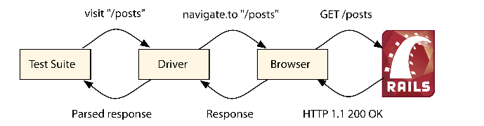

## Translating Applications Using Key-Value Back Ends

> 国际化框架(i18n)在rails 2.2版本被加入，在增加rails被世界各地广泛采用中扮演重要角色。虽然我们可以简单的创建采用不同语言的程序，但是最大问题就是维护这些翻译数据,一些公司利用翻译团队，其他的采用协作方式允许用户自行翻译程序，这两种情况下，开发一个Web接口来帮助翻译处理是很常见的。

> 默认I18n在YAML文件中存储在翻译数据。通过web接口管理这些数据很难，事实上,使用yaml需要一个机制，当yml文件更新了，需要告诉服务器同步重新加载yaml文件,你可以想象得到,这样的解决方案很快会变得很复杂

> 幸运的是,i8n框架带来了不同的后端支持，允许我们存储翻译数据在其他地方不仅仅是在yaml文件里， 这使得通过web接口更容易管理翻译数据，即时更新网站翻译。不需要同步yaml文件。缺点是，从数据库检索翻译数据替代内存hash，会影响性能

> 使用key-value存储方案，可以既简单又满足性能需求，在这章，我们存储翻译数据在redis中，使用key-value后端检索翻译数据。此外，我们将构建一个简单的sinatra application来管理这些翻译数据

> 和前面不一样，我们将开发一个完整的rails app替代开发插件， 在学习和分析了railties和engine之后，我们现在可以从不同的视角开发rail app

#####8.1 Revisiting Rails::Application

> 前面章节,我们讨论了Rails::Engine和展示了它类似一个rails application的行为， 当我们看rails source源码的时候,我们看到如下代码

    module Rails
      class Application < Engine
        # ...
      end
    end

> rails::Application类继承了rails::Engine, 这意味着一个application能做所有engine能做的事，附加了一些特殊行为

* application负责所有引导(例如读取active support ，设置加载路径,配置logger)

* application有自己的路由和中间件栈

* application 负责初始化所有插件

* 如果请求改变，application 负责重新加载代码和路由 

* application在适当时候加载任何和生成器

> 为了近距离了解这些功能，让我们开发一个翻译app

    $ rails new translator

> 我们讨论了onfig/boot.rb , config/application.rb ,和 config/environment.tb 的职责，实际上
> boot文件负责设置我们的加载路径，application文件负责定义我们的rails applciation,environment文件最终调用initialize!()方法初始化app.

    translator/1_app/config/environment.rb
    # Load the rails application.
    require File.expand_path('../application', __FILE__)
    # Initialize the rails application.
    Translator::Application.initialize!

> 在前面，Extending Rails with Engines 那节，我们已经展示engines提供的一组初始化程序，用来驱动engine启动，所以rails app提供这样的初始化程序也不奇怪

    module Translator
      class Application < Rails::Application
        initializer "translator.say_hello" do
          puts "hello on initialization"
        end
      end
    end

> 查看rails app中有效的初始化程序，在我们新生成的app里打开rails console 输入下面

  Rails.application.initializers.map(&:name)

> 这里不一样的地方是application不仅包含它自己的初始化程序，也包含定义在railties和engines的，rails app初始化就是一个一个的执行这些程序

> rails application其他所有都是围绕boot,application,environment构建，如果我们打开rakefile 我们看到下面代码

    translator/1_app/Rakefile
    require File.expand_path('../config/application', __FILE__)
    Translator::Application.load_tasks

> 首先,定义了rails application的application文件被引入,接下来，load_tasks()被调用,加载所有app提供的的rake 任务，插件，和rails自身， 注意我们此时没有引入environment文件,这让基本的rake命令快速运行，因为他们不用来初始化app，他们只是定义它。

> 然而许多任务需要app被初始化，例如rake db:migrate仅在database被配置后工作，这个任务引入config/environment.rb 初始化我们的app, 无论合适你需要在rake任务中访问数据库或者任何你的app的类，你都需要依赖:environment任务

> 最后，我们看一下我们app根目录下的config.ru文件，它require 这个environment文件，初始化app，运行当前app，作为一个rack application

    translator/1_app/config.ru
    # This file is used by Rack-based servers to start the application.
    require ::File.expand_path('../config/environment',
    run Rails.application

> app 初始化过程被分解到许多文件里，但是仅限于我们需要不同的钩入点,config.ru文件需要整个environment提前加载，但是rakefile加载则不需要，然而，没有什么能阻止我们将所有这些文件合并到单个文件Rails应用程序中！

#### The Single-File Rails Application

>构建一个rails app到一个单独文件，帮助我们理解如何设置和初始化rails， 让我们看一个但文件rails app范例并且讨论一下。创建一个空的目录，然后添加一个config.ru文件，输入下面内容

    translator/config.ru
    # We will simply use rubygems to set our load paths
    require "rubygems"
    # Require our dependencies
    require "rails"
    require "active_support/railtie"
    require "action_dispatch/railtie"
    require "action_controller/railtie"

    class SingleFile < Rails::Application
      # Set up production configuration
      config.eager_load = true
      config.cache_classes = true

      # A key base is required for our app to boot
      config.secret_key_base = "pa34u13hsleuowi1aisejkez12u39201pluaep2ejlkwhkj"
      # Define a basic route
      routes.append do
        root to: lambda { |env|
          [200, { "Content-Type" => "text/plain" }, ["Hello world"]]
        }
      end
    end
    SingleFile.initialize!
    run Rails.application

> 我们通过在config.ru目录下执行rackup命令初始化application. 打开你的浏览器，输入地址localhost:9292，你会看到"hello world"显示出来

> 一个单文件rails  app 与常规的rails app 没有太多不同,设置加载路径，这里我们使用rubyGems替代了bundler, 然后通过挨个读取依赖，替代了通常在config/application.rb中的require "rails/all"
> 最后定义初始化程序，运行app

> 注意rails 需要我们定义一些配置选项, 例如confsig.secret_key_base，这对于我们已经很熟悉，仅有的新方法就是routes.append

> 通常开发者访问路由的唯一方法是draw().可以在config/routes.rb中看到

    Translator::Application.routes.draw do
      # ...
    end

> draw()方法主要工作是代码重载，每次路由文件改变， 之前的路由都被清除，然后被重现加载config/routes.rb中的路由和插件。 然而，有一些情况, 一些路由可能定义在初始化阶段或者一个不会被重新加载的文件里， 对于这种情况，rails提供了 routes.prepend和routes.append方法定义这样的路由

> 例如 如果你使用routes.draw定义路由在config/application.rb里面，在开发阶段不会被重新加载，你在config/routes.rb的改变会立刻导致路由重新被加载，但是定义在application里的就会被遗忘

> 对于单个文件的rails app的请求和其他rails app请求一样, web服务器调用SingleFile#call()方法，穿过中间件栈到达路由，在我们的例子里，路由简单的匹配根action

> 我们现在理解了application的职责，并且知道如何构建railties和engines，现在是时候回头构建使用i18n api的翻译后端

#### 8.2 I18n Back Ends and Extensions

> 在我们的app里，无论何时，我们调用i18n.translate()或者i18n.localize()方法，他都委托这些方法给存储在i18n.backend()的i18n后端。 通过替换这个后端程序，你可以完全的修改i18n库怎样工作，i8n框架携带了三种不同后端

* I18n::Backend::Simple: 将yaml的翻译存储在内存中的hash里 默认的后端

* I18n::Backend::KeyValue: 使用任何key-value存储作为后端，只要它满足最小api

* I18n::Backend::Chain : 允许你组成后端链，换句话说，如果一个翻译在一个后端里没有找到，它会寻找链里的下一个后端

> rails依赖i18n提供的血多特性，例如，在我们的翻译app里，我们在config/environments/production.rb
> 看到下面这行

    config.i18n.fallbacks = true

> 每当这个配置选项设置为true， rails配置i18n框架在当前后端include 回退功能，允许如果翻译没有在当前区域找到，就回退去找默认翻译,如果你在rails app外面使用i18n， 你也可以使用回退功能，如下代码

    I18n.backend.class.send(:include, I18n::Backend::Fallbacks)

> 另一个i18n特性就是音译支持，允许你使用非重音字符替换重音拉丁字符

    I18n.transliterate("dzi ę kuj ę ") # => "dziekuje"

> 如果你需要翻译Hebraic, Cyrillic, Chinese，或者其他字符，你可以添加音译规则，记住音译和回退不是后端，而是这里列出的几个扩展中的一个 ，这些扩展由i18n库提供

* I18n::Backend::Cache : 使用一个缓存存储i18n.t对应翻译结果，例如 查找后的字符串，字符串插值，复数形式

* I18n::Backend::Cascade： Cascades查找，通过移除查找key的嵌套作用域，换句话说，如果foo.bar.baz没有找到，就自动查找foo.bar

* I18n::Backend::Fallbacks : 提供了区域回退功能, 如果一个翻译在当前语言环境没有找到，就会退到默认区域的翻译

* I18n::Backend::Gettext : gettex和.po文件支持

* I18n::Backend::InterpolationCompiler : 编译插值key，例如 %{model} 为对应数据，提高执行速度

* I18n::Backend::Memoize : 存储查找结果， 与I18n::Back-end::Cache区别是，如果你使用key-value后端，它使用内存hash存储，并且非常有用

* I18n::Backend::Metadata :添加元数据翻译结果，例如 复数化和字符串插值。 

* I18n::Backend::Pluralization :添加支持复数规则

* I18n::Backend::Transliterator : 添加音译规则

> i18n库提供了几个后端，扩展了不同地方，例如提高性能，添加对特殊语言的支持，例如自定义复数规则
> 在这张，我们将使用他们中的两个，18n::Backend::KeyValue 和 I18n::Backend::Memoize

>用于i8n的key-value后端可以接收任何对象存储,只要兼容下面api

* @store[]: 根据给定key返回对应值
* @store[]= 根据给定的可以设置对应值
* @store.keys: 返回所有存储的keys

> 因为要提供的兼容api很平常，几乎虽有的key-value存储系统都可以作为后端， 在这章，我们使用redis，因为它好用,使用广泛

> 安装redis之后，然后启动服务，我们通过使用redis gem来整合它到我们的app里,redis gem是一个纯ruby写的用于redis的客户端库，在我们gemfile里添加它

    translator/Gemfile
    gem 'redis', '~> 3.0.3'

> 然后安装这个gem

    bundle install

> 使用rails console命令打开rails控制台，检查redis的api和i8n提供的一致

    db = Redis.new
    db["foo"] = "bar"
    db["foo"] # => bar
    db.keys
    # => ["foo"]

> 回到我们i18b设置，我们创建一个文件叫做lib/translator.rb，负责设置一个redis实例指向一个适当的数据库(在redis中，数据库作为一个整数被引用)，让我们创建一个自定义的key-valu后端，引入I18n::Backend::Memoize陌路爱，缓存找到的数据，使用redis store初始化

    translator/1_app/lib/translator.rb
    module Translator
      DATABASES = {
        "development" => 0,
        "test" => 1,
        "production" => 2
      }
      def self.store
        @store ||= Redis.new(db: DATABASES[Rails.env.to_s])
      end
      class Backend < I18n::Backend::KeyValue
        include I18n::Backend::Memoize
        def initialize
          super(Translator.store)
        end
      end
    end

> 让我们在Translator::Application中配置i18n框架使用我们新的后端

    translator/config/application.rb
    module Translator
    class Application < Rails::Application
      # Set translator backend for I18n
      require "translator"
      config.i18n.backend = Translator::Backend.new

> 与默认的i18n后端对比，key-valu后端不需要在，每个请求之前从yaml文件加载翻译，而是即时，就是说存储所有默认翻译在我们的redis数据库里， 我们仅仅需要执行下面命令。

    rails runner "I18n.backend.load_translations"

> 当我们打开rails控制台，我们可以访问所有存储在redis数据库里的翻译

    db = Translator.store
    db.keys
    db["en.errors.messages.blank"] # => "can't be blank"
    db["en.number.precision"] # => "{\"format\":{\"delimiter\":\"\"}}"

> 注意key-valu数据库会自动转义值为json

#### 8.3 Rails and Sinatra

> 翻译已经被适当的存储，我们现在能够使用Sinatra编写翻译app，Sinatra是一个可以用ruby轻松地快速开发web app的dsl ，hello world仅需要一行代码

    # myapp.rb
    require 'sinatra'
      get '/' do
        'Hello world!'
      end

> 我们不能直接访问Sinatra app，但是我们将它整合进我们的rails app， 允许我们复用rails已经存在的生态系统，例如test,sessions,authentication,等等， 在我们开发Sinatra app之前，我们再次使用capybara编写一个集成测试，使用capybara确保我们的测试健壮可读，首先我们在test/test_helper.rb中定义ActiveSupport::IntegrationCase，引入Capybara的dsl

    translator/1_app/test/test_helper.rb
    require "capybara"
    require "capybara/rails"
    # Define a bare test case to use with Capybara
    
    class ActiveSupport::IntegrationCase < ActiveSupport::TestCase
      include Capybara::DSL
      include Rails.application.routes.url_helpers
    end

> 我们定义的和 前面2.2节一样，现在添加capybara到gemfile里。

    translator/1_app/Gemfile
    group :test do
      gem 'capybara', '~> 2.0.0'
    end

> 我们的测试企图使用波兰地区本地化一个日期，但是会失败，因为我们没有这个地区的任何翻译数据，下一步，我们访问翻译url /translator/en/pl , 目的是转换信息从英语到波兰语， 填充这些翻译属性，存储这些翻译
> 之后，我们断言我们翻译成功存储，我们可以本地化日期，下面是实现

    translator/test/integration/translator_app_test.rb
    require "test_helper"
      class TranslatorAppTest < ActiveSupport::IntegrationCase
        # Set up store and load default translations
        setup { Translator.reload! }
    
        test "can translate messages from a given locale to another" do
            assert_raise I18n::MissingTranslationData do
            I18n.l(Date.new(2010, 4, 17), locale: :pl)
        end
    
        visit "/translator/en/pl"
        fill_in "date.formats.default", with: %{"%d-%m-%Y"}
        click_button "Store translations"
  
        assert_match "Translations stored with success!", page.body
        assert_equal "17-04-2010", I18n.l(Date.new(2010, 4, 17), locale: :pl)
      end
    end

> 我们的设置调用一个叫做ranslator.reload!()方法，这个方法负责移除数据里所有的keys，重新加载翻译数据，让我们实现它

    translator/1_app/lib/translator.rb
    def self.reload!
      store.flushdb
      I18n.backend.load_translations
    end

> 我们的测试准备好执行rake test，　但是失败了。因为我们的Sinatra app没有构建好，所以我们添加sinatra和haml到我们的project gemfile ,使用bundle install安装这些依赖

    translator/Gemfile
    gem 'sinatra', '~> 1.4.2', require: 'sinatra/base'
    gem 'haml', '~> 4.0.2'

> 我们的sinatra app应该定义　/:from/:to这样的路由，当访问的时候，渲染一个模板，使用:from地区翻译数据翻译成:to区域，我们的第一次代码迭代

        module Translator
          class App < Sinatra::Base
            set :environment, Rails.env
            enable :inline_templates

            get "/:from/:to" do |from, to|
              exhibit_translations(from, to)
            end

            protected

            # Store from and to locales in variables and retrieve
            # all keys available for translation.
            def exhibit_translations(from, to)
              @from, @to, @keys = from, to, available_keys(from)
              haml :index
            end

            # Get all keys for a locale. Remove the locale from the key and sort them.
            # If a key is named "en.foo.bar", this method will return it as "foo.bar".
            def available_keys(locale)
              keys  = Translator.store.keys("#{locale}.*")
              range = Range.new(locale.size + 1, -1)
              keys.map { |k| k.slice(range) }.sort!
            end

            # Get the value in the translator store for a given locale. This method
            # decodes values and checks if they are a hash, as we don't want subtrees
            # available for translation since they are managed automatically by I18n.
            def locale_value(locale, key)
              value = Translator.store["#{locale}.#{key}"]
              value if value && !ActiveSupport::JSON.decode(value).is_a?(Hash)
            end
          end
        end
        __END__

        @@ index
        !!!
        %html
          %head
            %title
              Translator::App
          %body
            %h2= "From #{@from} to #{@to}"

            %p(style="color:green")= @message

            - if @keys.empty?
              No translations available for #{@from}
            - else
              %form(method="post" action="")
                - @keys.each do |key|
                  - from_value = locale_value(@from, key)
                  - next unless from_value
                  - to_value = locale_value(@to, key) || from_value
                  %p
                    %label(for=key)
                      %small= key
                      = from_value
                    %br
                    %input(id=key name=key type="text" value=to_value size="120")
                %p
                  %input(type="submit" value="Store translations")

> 关于这个实现，有一些东西需要讨论,首先我们直接将rails环境变量发送给sinatra app环境变量,然后我们定义路由/:from/:to响应get方法，如果路由匹配， sinatra将产生两个参数给代码块，然后代码块执行。　代码块简单的调用了exhibit_translations(),将参数赋值给实例变量，然后得到所有本地化的用于翻译和渲染模板的key

> 在这个例子中，我们选择haml作为模板妙计语言，这个模板仅仅是几行代码，通过Sinatra的内揽模板特性，被定义在作为 app的同一个文件里，在app文件的前面激活，然而，重要的是注意模板和app一样的上下文中执行，　这意味着任何定义在sinatra app里的方法也可以用在模板里，包括实例变量。　这种方案不同于rails中，因为rails的模板不会执行在与controllers相同上下文，而是一个指定的视图上下文，　所以rails需要暗地里拷贝全部实例变量从控制器到试图．１．３那节我们已经看到。控制器方法应该按照controller.method()形式调用

> 最后注意到我们的模板调用了locale_value()方法，这个方法接收一个local和一个 key ,返回存储在redis中的值，　这个方法可以处理hash，用来创建和存储i18n的默认设置，允许你接收来自后端的子节点

> 在i18n中，无论何时你存储了一个翻译{ "foo.bar" => "baz" }，它都会分解 foo.bar，存储{ "foo" => { "bar" => "baz"} }作为翻译，　这就允许你接收使用i18n.t("foo.bar")　#=“bar”或者子节点形式I18n.t("foo") #=> { "bar" => "baz" } .这就是说，如果我们展示hashes按照我们的sinatra接口，翻译会重复，因为可能出现使用foo key子节点hash，或者完整foo.bar key

> 在我们尝试我们的Sinatra app之前，我们autoload它

    translator/lib/translator.rb
    autoload :App, "translator/app"

> 最后我们在路由中挂在它

    translator/1_app/config/routes.rb
      Translator::Application.routes.draw do
      mount Translator::App, at: "/translator"
    end

> 让我们开启服务器rails server 验证我们的工作效果，浏览器访问/translator/en/pl，我们得到一个翻译页面如下

> 这个页面自动设置翻译信息从英文语到波兰语， 不要点击提交按钮,因为我们还没实现Post行为, 事实上,让我们运行测试时，失败也是基于这个原因， 在测试里点击提交按钮，会返回“No route matches"

    1) Error:
    test_can_translate_messages_from_a_given_locale_to_another(TranslatorAppTest)
    ActionController::RoutingError: No route matches [POST] "/translator/en/pl"

> 为了确保测试通过，让我们添加一个路由到sinatra用于post请求， 这个新路由应该在i8n后端存储翻译，传递目标区域和将翻译从json解码成ruby ，然后在redis数据库里调用save()，轻强制它存储到文件系统，然后再一次显示翻译页面

    translator/2_final/lib/translator/app.rb
    post "/:from/:to" do |from, to|
      I18n.backend.store_translations to, decoded_translations, escape: false
      Translator.store.save
      @message = "Translations stored with success!"
      exhibit_translations(from, to)
    end
    protected
    # Get all translations sent through the form and decode
    # their JSON values to check validity.
    def decoded_translations
      translations = params.except("from", "to")
      translations.each do |key, value|
          translations[key] = ActiveSupport::JSON.decode(value) rescue nil
       end
    end

> 注意当存储翻译时我们设置 :escape为false,所以i18n能适当的生成子节点，如果你指定翻译如{ "foo.bar" => "baz" }， i18n将会把它作为单独key， 编码为{ "foo\000.bar" => "baz" }，当按这种方式存储，我们不能接收他的子节点以i18n.t("foo")形式，如果我们将escaping 设置为false，i18n能够将Key分解，传唤它为{ "foo" => { "bar" => "baz" } },并且允许我们接收I18n.t("foo") 或 I18n.t("foo.bar")

> 可以自由的重启服务器，转换所有数据从一种语言到另一种，注意，我们选择json形式表现数据，因为我们可以简单的表达数组，字符串，数字，和布尔。

> 此时，我们的测试都通过了，我们的翻译 app基本准备好了， 是时候使用devise添加验证,使用capybara让我们的测试更健壮

#### 8.4 Taking It to the Next Level with Devise and Capybara

> 如果我们任何程序为翻译提供接口，我们应该确保这个接口被密码保护,同时适当测试它的功能，在这节，我们学习使用devise
> 基于rack的全栈式验证框架，深入学习使用capybarar测试rack app

###### Adding Cross-Application Authentication

> Devise是一个有趣的解决验证的方案，因为它提供短短几行代码，实现完整的验证，例如登录，注册 密码恢复等等。它使用warden将验证处理移动到到中间件栈。允许任何app,不管是sinatra还是rails controller 使用一样的验证规则

> 添加devise到我们的翻译app，我们首先需要添加它到我们的Gemfile里，并且运行bundle install 安装它

    translator/Gemfile
    gem 'devise', '~> 3.0.0'

> gem安装后，我们需要调用devise:install生成器

    $ rails g devise:install

> 生成器拷贝一个local文件和有几个配置选项的初始化器到我们的app，最后它打印出需要我们手动操作的步骤

> 首先，配置用于开发环境的Action Mailer

    translator/config/environments/development.rb
    config.action_mailer.default_url_options = { host: 'localhost:3000' }

> 添加flash message到布局文件

    translator/app/views/layouts/application.html.erb
    
<%= notice %>

    
<%= alert %>

> 添加根路由

    translator/config/routes.rb
    root to: "home#index"

> 因为我们的根路由指向HomeController,让我们实现这个控制器，现在 index action仅仅是指向被挂在的Sinatra app:

    translator/2_final/app/controllers/home_controller.rb
    class HomeController < ApplicationController
      def index
        render inline:
          "<%= link_to 'Translate from English to Polish', '/translator/en/pl' %>"
      end
    end

> 设置后，我们创建第一个Devise模型，叫做Admin

    $ rails g devise Admin

> 然后运行迁移文件:

  $ bundle exec rake db:migrate

> 此时，我们没有对我们的app做任何重要改变，但是我们运行测试，将会失败，因为用于admin的fixtures没有被适当的填写
> 然而我们现在不需要fixtures，让我们删除这个fixtures文件确保测试通过，位置是test/fixtures/admins.yml

> 想知道devise是如何工作的，可以随便启动一个新的服务器，访问/admins/sign_up，创建一个新的admin账户，然后登录，如果你想修改你的账户，可以访问/admins/edit。

> devise提供了几个帮助方法，可以约束访问控制器，因为我们创建了一个model叫做admin， 我们可以使用authenticate_admin()作为一个过滤器，请求只会在admin 模型被验证后才会被处理

    class PostsController < ApplicationController
      before_filter :authenticate_admin!
    end

> 然而，我们想添加验证到我们的Sinatra app，这里没有引入任何帮助方法，幸运的是，因为warden,这仍然可以使用devise轻松达到，无论何时我们在rails控制器中调用authenticate_admin!()，他都执行下面代码

    env["warden"].authenticate!(scope: "admin")

> env["warden"] 对象是　warden 中间件创建的代理，　并且 devise通过rails::Engine添加这个中间件到rails中间件栈,因为这个中间件在请求到达路由之前被执行，这个代理对象可以用在sinatra中，　我们可以简单的添加验证到translator:app的一个before callback中

    translator/lib/translator/app.rb
    before do
      env["warden"].authenticate!(scope: "admin")
    end

> 总的来看　，我们的请求穿过我们的app和中间件栈如下图所示

> 现在，当你请求sinatra app,而没有以admin身份登录，过滤器将抛出一个错误，warden中间件使用ruby的throw/catch捕捉到这个错误，允许warden重定向到devise的登录页面，一旦你登陆了， 前面代码会简单返回当前session中的admin，然后使用sinatra处理请求

>虽然这个方案允许我们使用一样的验证规则在不同的rack app中， 但是有一个问题，他需要我们修改sinatra app添加一个before filter，那就是说，如果我们使用一个第三方的sinatra app,像resque gem，我们就不能修改它

> 在这种情况，我们确保验证在路由那层，不需要修改sinatra app,如下

  authenticate "admin" do
    mount Translator::App, at: "/translator"
  end

> devise 添加前面使用的authenticate()方法到rails的路由中，使用router的api确保admin 角色被验证通过
>让我们检查一下devise中这个方法的源码实现

    def authenticate(scope)
      constraint = lambda do |request|
        request.env["warden"    					].authenticate!(:scope => scope)
      end
        constraints(constraint) do
        yield
      end
    end

> 不管我们选择before filter还是一个router约束，在我们的Sinatra app里都需要进行验证。 我们可以通过再次运行测试检查翻译后端现在是否安全，看到测试失败

    1) Error:
    test_can_translate_messages_from_a_given_locale_to_another(TranslatorAppTest)
    Capybara::ElementNotFound: Unable to find field "date.formats.default"

> 测试不能找到"date.formats.default"标志填充，因为显示/admin/sign_in页面替代了翻译页面，修正这个，让我们在集成测试中验证admin时使用一个steup hook

      translator/test/integration/translator_app_test.rb
      setup { sign_in(admin) }

        def admin
          @admin ||= Admin.create!(
             email: "admin_#{Admin.count}@example.org",
             password: "12345678"
          )
        end

        def sign_in(admin)
          visit "/admins/sign_in"
          fill_in "Email",
          with: admin.email
          fill_in "Password", with: admin.password
          click_button "Sign in"
        end

> 键入这些代码，让我恩再次运行测试，看到他通过了。注意，我们使用手动填写表单注册了一个admin，替代了直接修改session和cookie，事实上即使我们想修改cookie和session， capybara也不会允许我们这么做，原因看下节

#### Adding Cross-Browser Testing

> 每次我们使用Capybara时，我们创建自己的测试用例叫做ActiveSupport::IntegrationCase替代ActionController::IntegrationTest

    # Define a bare test case to use with Capybara
      class ActiveSupport::IntegrationCase < ActiveSupport::TestCase
        include Capybara
        include Rails.application.routes.url_helpers
      end

> 当我们使用ActionController::IntegrationTest编写rails集成测试，我们可以完整的访问request和response对象，允许我们检查和操纵cookies，sessions,headers,等等，capybara 另一种手段，有一个非常类似的api但是没有暴露这些，也就是说，如果我们简单的在ActionController::IntegrationTest引入capybara，我们将被引诱修改这些对象，导致概念和实践的问题

> 让我们套路弄一下概念上的问题，capybara是被用来设计让我们编写集成测试从用户角度，例如假设我们构建了一个电子商务网站，记住用户最终浏览的五个产品，如果我们简单的在session中存储这些产品Id,然后一个简单的集成测试简单的断言，之后，访问一个页面，产品id被添加到session中

> 这种测试的问题是电子商务网站用户不会担心那些东西存储在session中，用户仅仅想看到最后访问产品列表，然后能够点击它们，而不是我们在测试中断言。

>事实上，我们存储这些信息在session中是一个实现细节，如果一些情况，我们决定保存这些数据到cookie，我们天真的测试就会失败，但是因为我们的用户接口没有改变，这些测试应该通过，这是测试中常见的问题，过于耦合实现

>基于这个原因，capybara对你隐藏了这些内部东西，考虑到capybara的最重要特性就是它支持不同的驱动方式，capybara操作浏览器访问我们的app服务器，如下图

>一些驱动工具，例如selenium，使用常见的浏览器(firefox,internet explorer 和chrome)，与没有界面的浏览器交互像phantomjs

> 正如你预料的，每个浏览器模拟器都必须暴露一些api，或许暴露访问cookies的,其他的或许不暴露，一些无界面浏览器或许让你完整控制请求头，但是其他没有，为了能让你交换驱动和浏览器，不需要重写你的测试，capybara集中了他们大多数支持的功能

> 默认情况，capybara使用rack 测试驱动，通过传递整个浏览器，直接访问rack app，性能上来说非常方便，但是收到限制，例如，任何依赖js的特性，不能使用默认驱动测试， 幸运的是，我们可以简单的修改我们的app使用其他驱动，让我们添加下面代码在我们的test helper中试试selenium

    translator/2_final/test/test_helper.rb
    require "selenium-webdriver"

    # Can be :chrome, :firefox or :ie
    Selenium::WebDriver.for :firefox
    Capybara.default_driver = :selenium

    class ActiveSupport::TestCase
     # Disable transactional fixtures for integration testing
      self.use_transactional_fixtures = false
    end

> Selenium使用真正的浏览器测试我们的app，默认，它使用火狐，你需要在运行测试之前安装它，安装后运行我们的集成测试，注意selenium会自动启动火狐，驱动他访问我们的网站，最后我们的测试通过了。

> 因为Selenium需要一个web服务器来发送每个请求，Capybara自动启动一个，因为capybara会启动一个新的web服务器在一个新的线程里，测试中使用的数据库链接和服务器在每个请求中使用的不是同一个，就是说，如果我们使用transactional fixtures去包装每个测试为一个数据库事务，测试中创建的数据在服务器中不是有效的，因为实物数据不会在数据库连接中分享，直到它被提交，这也是为什么我们需要在test/test_helper.rb里关闭transactional fixtures，因为它会降低性能

> 另一个关闭transactional fixtures的结果是数据被存储在数据库上，测试期间不会被清楚，这肯定会妨碍我们为我们的套件添加新的测试。幸运的是还有其他解决方案，可以使用Database Cleaner，它支持不同的orm框架和数据库