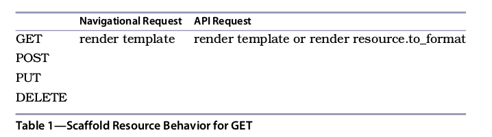
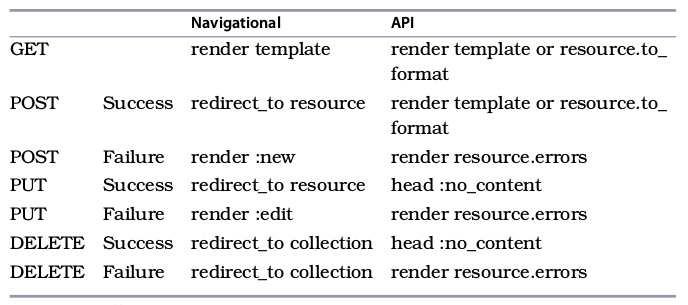
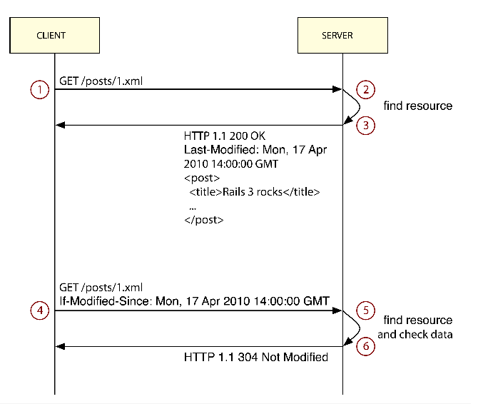
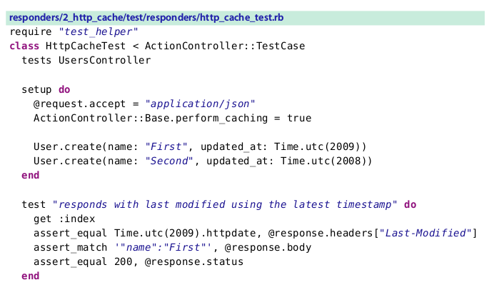
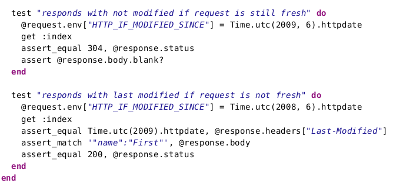

### Writing DRY Controllers with Responders

> rails脚手架生成器是一个非常好的工具，帮助我们生成一个application原型。
> 它十分灵活，让我们可以替换默认的模板引擎，测试框架,和orm框架，使用我们喜欢的。
> 确保我们的生产力，无论我们选择的工具，唯一问题是脚手架生成的控制器代码有一点冗余。
> 我们的最后响应代码在不同控制器里都有重复，例如， 当使用一个属性调用的时候，由脚手架生成的create()方法和destroy方法都很类似，

    class UsersController < ApplicationController
    def create
    @user = User.new(user_params)
    respond_to do |format|
    if @user.save
    format.html { redirect_to @user, notice: 'User was successfully created.' }
    format.json { render action: 'show', status: :created, location: @user }
    else
    format.html { render action: 'new' }
    format.json { render json: @user.errors, status: :unprocessable_entity }
    end
    end
    end
    def destroy
    @user = User.find(params[:id])
    @user.destroy
    respond_to do |format|
    format.html { redirect_to users_url }
    format.json { head :no_content }
    end
    end
    private
    def user_params
    params.require(:user).permit(:name)
    end
    end

> 从一个控制器到另一个，这些respond_to()响应块都很类似，为了解决这个问题,rails提供了一个方法叫做 respond_with(),使用ActionController::Responder重构我们控制器如何响应，
>使用这个新的api，这些actions可以复用

    class UsersController < ApplicationController
      respond_to :html, :json
      def create
      @user = User.new(user_params)
      flash[:notice] = 'User was successfully created.' if @user.save
      respond_with(@user)
      end
      def destroy
      @user = User.find(params[:id])
      @user.destroy
      respond_with(@user)
      end
      private
      def user_params
      params.require(:user).permit(:name)
      end
    end
  
> 上面代码最上面。我们声明了控制器响应的格式, 将所有工作都委派给respond_with()，使用这个干净的api，我们重写了我们的actions。

> 在这章，我们将学习responder的工作方式，定制他们自动处理http缓存和flash信息,最后定制脚手架生成器使用respond_with()作为默认,

##### 6.1 Understanding Responders

> 想要理解responder背后的概念。我们必须先理解影响我们控制器响应的三个因素,请求类型，http请求方式,和资源状态。

###### Navigational and API Requests

> 一个控制器脚手架生成器创建响应两种默认格式,html和json，脚手架生成器使用这两种格式，因为他们表现出两种请求类型navigational和api，前者通过浏览器处理，支持格式html和mobile，然而后者通常被机器和代表像XML和JSON格式。

    def index
      @users = User.all
      respond_to do |format|
      format.html # index.html.erb
      format.json { render json: @users }
      end
    end

> 让我们分析一下这个index action，许多Rails应用中常见的，html没接收代码块,所以它渲染一个模板,使用render json: @users表示资源使用json格式渲染

> 这表示控制器的行为依赖于请求类型,因此，抽象出控制器的行为，responder应该考虑请求类型

##### HTTP Verb

>show()和new()两个actions在rails控制器中响应类似index().通过渲染一个模板或者所请求对象表现,所有这些actions有什么共同之处吗？

> 其余的actions，例如create和destroy() 都是通过Post和delete动作触发，他们使用不同的响应风格, 重定向到不同的地方,返回各自的状态吗和http头信息， 换句话说, http的请求动作是另一个响应控制器影响的因素

> 给定一定数量请求可能的结果,让我们创建一个表格根据http动作和请求类，仔细看看rails控制器脚手架如何生成.

> 默认的所有get请求。通常由index()，show()这样actions处理，为导航请求new()渲染一个模板
> 如果我们有一个api请求，我们要么渲染一个模板像.jbuilder模板，或者渲染资源表现形式（例如to_json）

> 目前，我们知道一个脚手架控制器如何响应一个get请求，在两种这两种请求类型发生时如下图
> 现在，让我们通过http动作，填满整个表格

######Resource Status

> 如果我们分析create()action,代表了一个post请求，我们知道他有两个分支,一个是资源保存成功,另一个是失败，这些分支都使用了不同响应的方式.

    def create
    @user = User.new(user_params)
    respond_to do |format|
    if @user.save
    format.html { redirect_to @user, notice: 'User was successfully created.' }
    format.json { render action: 'show', status: :created, location: @user }
    else
    format.html { render action: "new" }
    format.json { render json: @user.errors, status: :unprocessable_entity }
    end
    end
    end

> 资源状态决定了脚手架生成的控制器如何响应,在上面例子中，如果资源保存成功我们重定向,但是如果保存失败就渲染一个错误页面,返回相应错误,我们在update()action中也看到这个模式，update是通过patch和put请求调用

> 虽然脚手架生成的destroy()action没有依赖资源状态,由于resource.destroy返回false，我们或许最后需要手动处理这种情况,例如,假设一个组设置有几个管理者，因为一个组需要至少一个管理者，我们实现一个before_destroy()回调，检查每次尝试删除管理者的操作，如果条件不存在，回调和destroy()方法都返回false. 这种新场景，我们需要手动在控制器里处理,通常是修改destroy()action来展示一个flash message,并且重定向到group页面， 换句话说,即使脚手架生成的destroy()action不需要依赖资源状态, delete请求或许需要。

> 也就是说控制器为了响应post,put和delete请求，需要知道资源状态.我们的表格描述了这些新场景
>填充了每个请求的类型,http请求类型，和资源状态

> 无论何时，你在控制器调用respond_with()方法，他都会调用ActionController::Responde类
>无非是用ruby代码编写整个表。 让我们看一下ActionController::Responder的实现和如何修改他的行为

######6.2　Exploring ActionController::Responder

> 通过call应对任何响应,允许接收三个参数,作为一个响应者,传递给call方法的三个参数是当前控制器,资源(一个嵌套资源或一个数组资源),和一个包含选项的hasｈ,　传递给respond_with()所有选项转发给responder作为第三个参数。

> 在 rails源码中，看到ActionController::Responder实现call()方法只有一行代码。

    rails/actionpack/lib/action_controller/metal/responder.rb
    def self.call(*args)
     new(*args).respond
    end

> call方法传递这三个参数给ActionController::Responder初始化，然后调用respond()

    rails/actionpack/lib/action_controller/metal/responder.rb
      # Main entry point for responder responsible
      # for dispatching to the proper format.

      def respond
        method = "to_#{format}"
        respond_to?(method) ? send(method) : to_format
      end

      # HTML format does not render the resource,
      # it always attempts to render a template.
      def to_html
        default_render
        rescue ActionView::MissingTemplate => e
        navigation_behavior(e)
      end
      # to_js simply tries to render a template.
      # If no template is found, raises the error.
      def to_js
        default_render
      end
      # All other formats follow the procedure below. First we
      # try to render a template. If the template is not available,
      # we verify if the resource responds to :to_format and display it.
      def to_format
        if get? || !has_errors? || response_overridden?
          default_render
        else
          display_errors
        end
        rescue ActionView::MissingTemplate => e
        api_behavior(e)
      end

> respond()方法检查当前responder是否可以处理当前请求格式，对于请求格式调用对应方法，否则调用to_format().因为ActionController::Responder仅仅定义了to_html()和to_js()方法，仅有html和js请求有自定义行为，其他都是调用to_foramt()

> 通过分析to_html和to_format()实现，我们看到前者使用navigational_behavior()响应后者使用api_behavior()响应，如果我们加入一个新的navigational格式到application里，例如MOBILE
> responder将把他才能工作一个api格式， 而不是navigational(导航)格式，幸运的是,因为知道responder如何工作,我们让MOBILE请求使用导航行为，在初始化里，通过简单的将:to_mobile设置为:to_html别名

>此外，注意，一个responder总是在回到api或者navigational之前在调用default_render()

    rails/actionpack/lib/action_controller/metal/responder.rb
      def to_html
        default_render
        rescue ActionView::MissingTemplate => e
        navigation_behavior(e)
      end

> default_render()简单的尝试渲染一个模板，没有被渲染出来performed?()返回false，或则模板没有找到，抛出ctionView::MissingTemplate，异常被捕获，允许responders介入

> 下面是rails如何实现navigational_behavior() and api_behavior()

    rails/actionpack/lib/action_controller/metal/responder.rb
      DEFAULT_ACTIONS_FOR_VERBS = {
        post: :new,
        patch: :edit,
        put: :edit
      }
      # This is the common behavior for formats associated
      # with browsing, like :html, :iphone and so forth.
      def navigation_behavior(error)
        if get?
          raise error
        elsif has_errors? && default_action
          render :action => default_action
        else
          redirect_to navigation_location
        end
      end
      # This is the common behavior for formats associated
      # with APIs, such as :xml and :json.
      def api_behavior(error)
          raise error unless resourceful?
          if get?
            display resource
          elsif post?
            display resource, :status => :created, :location => api_location
          else
            head :no_content
          end
      end
      def resourceful?
        resource.respond_to?("to_#{format}")
      end
      def has_errors?
        resource.respond_to?(:errors) && !resource.errors.empty?
      end

      def resource_location
        options[:location] || resources
      end
      alias :navigation_location :resource_location
      alias :api_location :resource_location
      # Display is just a shortcut to render a resource with the current format.
      #
      #display @user, status: :ok
      #
      # For XML requests it's equivalent to:
      #
      #render xml: @user, status: :ok
      #
      # Options sent by the user are also used:
      #
      #respond_with(@user, status: :created)
      #display(@user, status: :ok)
      #
      # Results in:
      #
      #render xml: @user, status: :created
      #
      def display(resource, given_options={})
        controller.render given_options.merge!(options).merge!(format => resource)
      end

> navigational_behavior()方法实现了上面的表格。对于一个get请求抛出一个missing-template错误，因为对于get请求的唯一选项是渲染一个模板，我们已经尝试渲染了，没有成功。

> 对于其他的http请求类型,navigational行为检查是否资源有错误，如果有错误，并且默认action给定，他渲染通过DEFAULT_ACTIONS_FOR_VERBS hash指定的默认action，最后如果资源没有错误，重定向到资源，就是我们希望的成功的分支

> api_behavior()实现方式不同，使用display()方法，合并传递给respond_with()方法，在调用render之前添加一个format。换句话说，我们调用respond_with()如下

    respond_with @user, status: :created

> 通过get请求，得到json格式，下面是控制器的响应

    render json: @user, status: :created

> 重要一点是rails的responders不会调用@user.to_json,他们简单的委派给render()方法，所以是:json渲染器，在writing the render那章节1.2小节讲到。这是重要的一点，因为人们可以添加渲染器，不用在工作的responder添加任何代码。

> 最后，在responders中最后的一个定制能够在我们自己的控制器里完成，假设我们有一个responder工作的很好，除了一个特殊的action和格式，我们想让它行为不同，我们定制这个responder为这种情况，使用和在respond_to里一样的块api

      def index
      @users = User.all
      respond_with(@users) do |format|
      format.json { render json: @users.to_json(some_specific_option: true) }
      end
      end

>这些可以工作，因为respond_with专递这个块给了format.json去响应，当请求格式是json时。
> 前面章节看到default_render()方法响应片段调用这个块，无论block是否有效。

>使用ActionController::Responder最大优点是,它集合了我们application应有每种行为。
> 就是说。我们想立刻改变控制器的行为，我们仅仅需要创建我们自己的responder和配置rails使用它，如下

    ApplicationController.responder = MyAppResponder

> 此外，我们可以自定义responder为我们程序里指定的控制器

    class UsersController < ApplicationController
      self.responder = MyCustomUsersResponder
    end

> 让我们创建一个responder扩展一些行为和配置rails使用它

######6.3　The Flash Responder

> 结构化的控制器在create()和update()两个actions里使用falsh message，这些信息在多个控制器里十分类似，如果我们设置这些flash messages成为responder里的默认设置不是更好？但是仍然要提供一个良好的api修改它们？

> 让我们使用国际化框架(i18n)实现这个特性,我们就可以简单的从yaml文件里查找flash message
> 配置默认值,让他将来翻译这些信息成为可能，让我们使用rails plugin常见一个新项目叫做responders

    $ rails plugin new responders

> 让我们开始写一些测试，访问create,update()和destroy() actions,确保一些flash messages信息使我们期望的

    responders/1_flash/test/responders/flash_test.rb
    require "test_helper"
    class FlashTest < ActionController::TestCase
    tests UsersController
    test "sets notice message on successful creation" do
    post :create, user: { name: "John Doe" }
    assert_equal "User was successfully created.", flash[:notice]
    end
    test "sets notice message on successful update" do
    user = User.create!(name: "John Doe")
    put :update, id: user.id, user: { name: "Another John Doe" }
    assert_equal "User was successfully updated.", flash[:notice]
    end
    test "sets notice message on successful destroy" do
    user = User.create!(name: "John Doe")
    delete :destroy, id: user.id
    assert_equal "User was successfully destroyed.", flash[:notice]
    end
    end

> 这个测试基于一个已经存在的UsersController，我们可以通过调用生成器脚手架在test/dummy的虚拟application里定义这个控制器，当调用生成控制器时，我们可以跳过测试文件，保证不会和我们测试文件冲突

    $ rails g scaffold User name:string --no-test-framework

> 下一步运行迁移文件，设置我们的测试数据库

    $ rake db:migrate db:test:clone

> 注意,无论如何，脚手架生成器不会使用respnder api。让我们修改生成的控制器，让它使用respond_with().然后移除所有的falsh messages. 我们的responder将会自动设置他们。 下面是我们控制器修改后的样子.

    responders/1_flash/test/dummy/app/controllers/users_controller.rb
    class UsersController < ApplicationController
      respond_to :html, :json
      before_action :set_user, only: [:show, :edit, :update, :destroy]

      def index
        @users = User.all
        respond_with(@users)
      end

      def show
        respond_with(@user)
      end
      def new
        @user = User.new
        respond_with(@user)
      end

      def edit
      end

      def create
        @user = User.new(user_params)
        @user.save
        respond_with(@user)
      end

      def update
        @user.update(user_params)
        respond_with(@user)
      end

      def destroy
        @user.destroy
        respond_with(@user)
      end

      private
      # Use callbacks to share common setup or constraints between actions.
      def set_user
        @user = User.find(params[:id])
      end

      # Only allow a trusted parameter "white list" through.
      def user_params
        params.require(:user).permit(:name)
      end
    end

> 控制器里的所有的actions都应该调用respond_with()方法，除了edit()action，这是因为edit()action仅被用来导航请求，主要负责显示修改资源的表单。

> 当运行这些测试，失败了。并且提示下面信息

    1) Failure:
    test_sets_notice_message_on_successful_creation(FlashTest):
    Expected: "User was successfuly created."
      Actual: nil

> 失败是意料之中，因为我们没有实现我们的responders,因为，因为这章我们要开发两个responders
> 扩展,每个扩展作为一个模块， 允许开发者根据需求引入任何位置，我们第一个模块叫做Responders::Flash，它通过i18n框架得到falsh message

> 假设一个请求携带有效参数到达控制器里的create()action，当respond_with()被调用并且没有flash message被设置。responder应该尝试寻找一个在控制器和action命名空间下的I18N message，例如 "flash.users.create.notice，如果一个i18n信息被找到，responder应该设置它为flash[:notice]的值，也会用在下次请求时显示

>此外，如果请求到达UsersController#create，但是没有携带有效参数，创建用户无效，responder应该寻找一个"flash.users.create.alert" 使用flash[:alert]设置

> 根据这些需求，我们编写responder::Falsh模块

    responders/1_flash/lib/responders/flash.rb
    module Responders
    module Flash
    def to_html
    set_flash_message! unless get?
    super
    end
    private
    def set_flash_message!
    status = has_errors? ? :alert : :notice
    return if controller.flash[status].present?
    message = i18n_lookup(status)
    controller.flash[status] = message if message.present?
    end
    def i18n_lookup(status)
    namespace = controller.controller_path.gsub("/", ".")
    action
    = controller.action_name
    lookup = [namespace,status].join(".").to_sym
    default = ["actions",action, status].join(".").to_sym
    I18n.t(lookup, scope: :flash, default: default,
          resource_name: resource.class.model_name.human)
    end
    end
    end

> 我们的模块重写了这个to_html行为，如果不是get请求我们就设置falsh message ，并且调用super,允许其他responder行为和其他扩展继续

> 除了设置flash message信息是基于控制器命名空间,我们通过一个actions命名空间作为一个:default 选项给I18N.t，这允许I18N回头寻找"flash.actions.create.notice"，在没有找到"flash.users.create.notice"时。

> 这种后退机制，让我们提供application范围内的默认信息，所以我们不需要在每个控制器里都重复我们自己，让我们看看默认的脚手架信息，在我们的插件里创建一个如下的yaml文件

    responders/1_flash/lib/responders/locales/en.yml
    en:
      flash:
        actions:
          create:
            notice: "%{resource_name} was successfully created."
            alert: ""
          update:
            notice: "%{resource_name} was successfully updated."
            alert: ""
          destroy:
            notice: "%{resource_name} was successfully destroyed."
            alert: "%{resource_name} could not be destroyed."

> 现在任何控制器都可以使用配置在YAML中的falsh信息,除非我们定义一个特殊key给控制器配置他自己的信息。 为了实现这个，我们使用I18N内插法，这允许我们使用 %{resource_name},在我们的消息里，当I18N调用时他可以通过传递给:resource_name的人类可读资源名替换

> 为了最终使得我们测试通过,我们需要激活我们的Responders::Flash，使用猴子补丁替换rails的默认responder.让我们继承它，添加我们自己的定制，我们设置我们的新responders作为默认的，添加我们的YAML文件到I18N读取路径

    responders/1_flash/lib/responders.rb
    require "action_controller"
    require "responders/flash"
      module Responders
        class AppResponder < ActionController::Responder
          include Flash
        end
      end
    
    ActionController::Base.responder = Responders::AppResponder
    require "active_support/i18n"
    I18n.load_path << File.expand_path("../responders/locales/en.yml", __FILE__)

> 运行测试套件，你会看到我们的responder正确的被激活并且使用了了yaml中的默认的falsh message，因为我们的测试仅仅断言了notice message，让我们编写一个额外的测试用来断言alert message，显示失败的情况

    responders/1_flash/test/responders/flash_test.rb
      test "sets alert messages from the controller scope" do
      begin
      I18n.backend.store_translations :en,
      flash: { users: { destroy: { alert: "Cannot destroy!" } } }
      user = User.create!(name: "Undestroyable")
      delete :destroy, id: user.id
      assert_equal "Cannot destroy!", flash[:alert]
      ensure
      I18n.reload!
      end
      end

> 这个测试创建了一个资源，然后尝试销毁他，但是失败了，显示提示信息，资源不能被删除，和我们在
> Aiming for an Active Model–Compliant API做的一样，我们使用了I18N api为失败场景即时存储翻译

> 为了确保测试通过，让我们添加一个before_destory回掉函数，添加错误信息到@user.errors里
> 并且返回false，当username是“Undestroyable”时。

> 我们需要添加错误信息到model里，提示responder有一些错误。伴随最后的修改，我们的测试通过了。这还有其他特性我们可以添加到flash responder里，但是让我们继续，将我们的responder变成更好的http公民

###### 6.4 HTTP Cache Responder

> rails自1.2版本就开始支持rest,从此以后开发api变得越来越简单， 然而，你的程序不断成长，你或许不得不实现更多的api，并且优化请求数量。

> 当你暴露一个api，通常客户端到服务器请求一个资源需要好几次，并且客户端总是得到一样的响应，因为请求的资源没有改变.这种情况，服务端浪费了时间去渲染一样的资源一遍又一遍。客户端解析一样的资源结果发现没有任何改变

>幸运的是,http1.1指定了一部分专门用于缓存。前面的问题被简单的解决了，服务端添加一个Last-Modified丢信息在响应中，使用一个时间戳代表了文件被修改的最后时间，客户端应该添加一个使用时间戳的If-Modified-Since头信息，如果资源没有改变，服务器返回一个304 Not modified状态，不需要渲染任何资源，接收到304状态，客户端知道什么都没改变
>如下图所示

> 照例,我们通过编写测试来实现，下面至少有三个场景需要重点考虑

* 当If-Modified-Since没有提供的时候，我们的控制器正常响应但是要添加一个last-modified头信息
* 当if-modified-Since提供了并且是最新的修改时间，我们的控制器返回一个状态码304，并且是一个空body

* 当If-Modified-Since提供并且不是最新修改时间，我们控制器正常响应，但是添加一个新的last-Modified时间戳头信息

> 编写这些测试，我们需要修改一些请求header和校验一些响应头信息被适当的设置了。让我们再一次使用UsersController，来支持我们的测试

> rails提供了几个https上的帮助方法，并且我们使用给他们常见一个新的模块叫做Responders::HttpCache，自动添加http缓存功能给所有get请求

    responders/2_http_cache/lib/responders/http_cache.rb
      module Responders
      module HttpCache
      delegate :response, to: :controller
      def to_format
      return if do_http_cache? && do_http_cache!
      super
      end
      private
      def do_http_cache!
      response.last_modified ||= max_timestamp if max_timestamp
      head :not_modified if fresh = request.fresh?(response)
      fresh
      end
      # Iterate through all resources and find the last updated.
      def max_timestamp
      @max_timestamp ||= resources.flatten.map do |resource|
      resource.updated_at.try(:utc) if resource.respond_to?(:updated_at)
      end.compact.max
      end
      # Just trigger the cache if it's a GET request and
      # perform caching is enabled.
      def do_http_cache?
      get? && ActionController::Base.perform_caching
      end
      end
      end

> 我们的实现主要通过循环遍历所有给定资源和取回最后修改的一个时间戳,我们然后更新响应对象，如果请求时最新时间(资源没有被修改)我们返回304状态，给客户端，不渲染任何资源，因为to_format调用super前已经返回

> 我们运行测试之前,我们需要require responders/http_cache并include Responders::HttpCache到我们的appResponder里，修改lib/responders.rb

    responders/2_http_cache/lib/responders.rb
    require "responders/flash"
    require "responders/http_cache"
    module Responders
    class AppResponder < ActionController::Responder
    include Flash
    include HttpCache
    end
    end

> 就这些了。我们的测试通过了，我们将flash和http缓存功能从控制器提取了出来，现在它可以自动处理我们的响应

#### More Ways to Customize Generators

> 现在我们理解了responders如何工作了并且根据我们的需求修改它们，我们能感觉到信心，更多的使用它们，在我们的控制器里，这唯一问题脚手架生成器默认使用respond_to,没有使用responde_with()

> 换句话说,in Generators' Hooks这章节,我们讨论如何定制生成器，对于定制控制器脚手架生成器他们必须作为一个回调,让我们看一下脚手架输出

    invoke active_record
    create db/migrate/20130415031520_create_users.rb
    create app/models/user.rb
    invoke resource_route
    。。。

> 每一个invoke输出，我们都可以重写， 这因为我们我们可以替换scaffold_controller生成器为另一个，根据我们的需求。

> 然而,这个不是我们解决问题方案，作为替代，我们使用另一个rails生成器特性来定支模板，而不使用生成器回调

###### Generators’ Source Path

> 考虑rails生成器中的下面代码

    copy_file "controller.rb", "app/controller/#{file_name}_controller.rb"

> 它简单拷贝了controller.rb文件从生成器源目标到目的地。对于UserController变成app/controllers/users_controller.rb .

> 然而一个生成器,不仅有一个源，在拷贝一个给定位置之前，生成器在几个地方搜索源文件，这个叫source paths,source_root(Creating Our First Generator)实际上是生成器查找模板的最后地方

> 这个行为由Thor构建,但是rails非常漂亮的包装了它，自动的添加lib/templates目录到您的application到所有的生成器路径，这意味着，Rails::Generators::ScaffoldControllerGenerator在使用rails提供的之前，使用脚手架时总是试图找到一个模板在lib/templates/rails/scaffold_controller

> 我们可以看到Rails::Generators::ScaffoldControllerGenerator的实现源码，可以简单看到这个逻辑，拷贝控制器模板。

    rails/railties/lib/rails/generators/rails/scaffold_controller/scaffold_controller_generator.rb
    module Rails
    module Generators
    class ScaffoldControllerGenerator < NamedBase
    def create_controller_files
    template "controller.rb", File.join("app/controllers", class_path,
    "#{controller_file_name}_controller.rb")
    end
    end
    end
    end

> 它使用叫做controller.rb的模板，位于railties/lib/rails/generators/rails/scaffold_controller/templates/controller.rb,根据这个源路径，如果我们在我们的application里放一个lib/templates/rails/scaffold_controller/controller.rb文件，rails将使用这个application文件替换那个rails提供的

> 你可以加单的创建一个rails程序，放一个空的文件lib/templates/rails/scaffold_controller/controller.rb到你的应用程序里，然后运行脚手架命令，你会发现控制器脚手架创建的是一个空的文件。

> 让我们使用这个特性去定制脚手架默认使用respond_with()。

###### Using respond_with by Default

> 在脚手架中使用respond_with()作为默认,让我们在程序Lib/templates放一个模板,为了避免每个新application都做这个操作，我们创建一个生成器,来拷贝这个文件到适当的位置.

> 我们调用这个Responders::Generators::InstallGenerator并且实现它

    responders/3_final/lib/generators/responders/install/install_generator.rb
    module Responders
    module Generators
    class InstallGenerator < Rails::Generators::Base
    source_root File.expand_path("../templates", __FILE__)
    def copy_template_file
    copy_file "controller.rb",
    "lib/templates/rails/scaffold_controller/controller.rb"
    end
    end
    end
    end

> 下面是我们生成器使用的模板

    responders/3_final/lib/generators/responders/install/templates/controller.rb
    <% module_namespacing do -%>
    class <%= controller_class_name %>Controller < ApplicationController
    before_action :set_<%= singular_table_name %>,
    only: [:show, :edit, :update, :destroy]
    # GET <%= route_url %>
    def index
    @<%= plural_table_name %> = <%= orm_class.all(class_name) %>
    respond_with(@<%= plural_table_name %>)
    end
    # GET <%= route_url %>/1
    def show
    respond_with(@<%= singular_table_name %>)
    end
    # GET <%= route_url %>/new
    def new
    @<%= singular_table_name %> = <%= orm_class.build(class_name) %>
    respond_with(@<%= singular_table_name %>)
    end
    # GET <%= route_url %>/1/edit
    def edit
    end
    # POST <%= route_url %>
    def create
    @<%= singular_table_name %> = <%= orm_class.build(class_name,
    "#{singular_table_name}_params") %>
    @<%= orm_instance.save %>
    respond_with(@<%= singular_table_name %>)
    end
    # PATCH/PUT <%= route_url %>/1
    def update
    @<%= orm_instance.update("#{singular_table_name}_params") %>
    respond_with(@<%= singular_table_name %>)
    end
    # DELETE <%= route_url %>/1
    def destroy
    @<%= orm_instance.destroy %>
    respond_with(@<%= singular_table_name %>)
    end
    private
    # Use callbacks to share common setup or constraints between actions.
    def set_<%= singular_table_name %>
    @<%= singular_table_name %> = <%= orm_class.find(class_name, "params[:id]") %>
    end
    # Only allow a trusted parameter "white list" through.
    def <%= "#{singular_table_name}_params" %>
    <%- if attributes_names.empty? -%>
    params[<%= ":#{singular_table_name}" %>]
    <%- else -%>
    params.require(<%= ":#{singular_table_name}" %>).
    permit(<%= attributes_names.map { |name| ":#{name}" }.join(', ') %>)
    <%- end -%>
    end
    end
    <% end -%>

> 上面的模板我们基于rails提供的模板修改,但是全部替换了respond_to来调用respond_with()。也使用了我们讨论的几个模板，除了orm_class()和orm_instance()方法，我们一会讲解

> 到我们的dummy application里尝试这个新生成器,调用方式如下

  rails g responders:install

> 现在当你生成任何新资源，都会使用我们刚刚安装的模板，这意味着rails脚手架灵活性不仅对于像haml和rspec这样rails扩展,也适用于application开发者，因为他们可以定制脚手架适应他们的工作流，app结构

###### Generators and ORM Agnosticism

> 我们已经讨论了Active model和他在orm中角色的不可知论。我们也讨论了生成器的钩子。提供给其他orm和钩入Model和脚手架的生成器,无论何时我们使用脚手架生成器，这两个角色互相交叉，rails提供了一个自定义api允许orm定义生成代码

> rails控制器负责模型交互和传递需要的对象给视图，换句话说，控制器应该配合当前orm，同时从他哪里得到需要的信息,脚手架生成的控制器要依据使用的orm进行改变。rails解决这个问题，通过创建一个对象负责告诉脚手架生成器如何与orm交互。 基本的实现已经在rails源码中，我们看一下

    rails/railties/lib/rails/generators/active_model.rb
      module Rails
      module Generators
      class ActiveModel
      attr_reader :name
      def initialize(name)
      @name = name
      end
      # GET index
      def self.all(klass)
      "#{klass}.all"
      end
      # GET show
      # GET edit
      # PATCH/PUT update
      # DELETE destroy
      def self.find(klass, params=nil)
      "#{klass}.find(#{params})"
      end
      # GET new
      # POST create
      def self.build(klass, params=nil)
      if params
      "#{klass}.new(#{params})"
      else
      "#{klass}.new"
      end
      end
      # POST create
      def save
      "#{name}.save"
      end
      # PATCH/PUT update
      def update(params=nil)
      "#{name}.update(#{params})"
      end
      # POST create
      # PATCH/PUT update
      def errors
      "#{name}.errors"
      end
      # DELETE destroy
      def destroy
      "#{name}.destroy"
      end
      end
      end
      end

> orm_class()指向了Rails::Generators::ActiveModel，并且orm_instance()指向了同样类的实例，所以
> 无论何时我们调用orm_class.all("User")在模板里，它调用Rails::Generators::ActiveModel.all("User")，并且返回User.all和常规的active record行为一样

> orm_instance()行为类类似，除了我们不需要传递资源名字作为参数，因为我们已经在初始化阶段做了，基于这个原因，orm_instance.save成功返回和user.save一样结果

> 控制器和orm框架之间的交互都是通过Rails::Generators::ActiveModel,不可之论来自任何orm框架可以提供自己对这个类的实现。我们要做的是在orm生成器命名空间下，定义一个active model类，

> 例如,dataMapper的find和update方法有不同的语法，所以我们需要继承Rails::Generators::ActiveModel
> 实现新的api：

    module DataMapper
      module Generators
        class ActiveModel < ::Rails::Generators::ActiveModel
          def self.find(klass, params=nil)
            "#{klass}.get(#{params})"
          end
        end
      end
    end