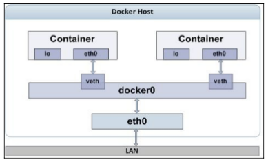

> 查看docker网络

    $ docker network ls 	

    NETWORK ID          NAME                DRIVER              SCOPE
    2230c28ee776        bridge              bridge              local
    5bff027f252f        host                host                local
    e8a66679e183        none                null                local

> 当docker构建一个容器，默认使用bridge网络，你也可以自己定义， host或none， 使用命令 docker run 后面使用--net选项
> 如果你使用host网络，容器得到一个host网络栈，共享宿主机的ip地址和端口， none网络创建一个网络栈，仅仅是loopback接口，
> none意味着与其他容器和外部世界隔离
> busybox是一个镜像

    $ docker run --rm --net=none busybox ip addr
    1: lo: <LOOPBACK,UP,LOWER_UP> mtu 65536 qdisc noqueue qlen 1000
        link/loopback 00:00:00:00:00:00 brd 00:00:00:00:00:00
        inet 127.0.0.1/8 scope host lo
          valid_lft forever preferred_lft forever

> 上面容器已经是一个Loopback接口，容器不能和外界通信

    $ docker network inspect bridge
      [
          {
              "Name": "bridge",
              "Id": "2230c28ee776f1cfb884e9ffc7bca663d2390301949504a3cf6cae63f9b016b3",
              "Created": "2018-05-18T19:24:53.050686991+08:00",
              "Scope": "local",
              "Driver": "bridge",
              "EnableIPv6": false,
              "IPAM": {
                  "Driver": "default",
                  "Options": null,
                  "Config": [
                      {
                          "Subnet": "172.17.0.0/16",
                          "Gateway": "172.17.0.1"
                      }
                  ]
              },
              "Internal": false,
              "Attachable": false,
              "Ingress": false,
              "ConfigFrom": {
                  "Network": ""
              },
              "ConfigOnly": false,
              "Containers": {},
              "Options": {
                  "com.docker.network.bridge.default_bridge": "true",
                  "com.docker.network.bridge.enable_icc": "true",
                  "com.docker.network.bridge.enable_ip_masquerade": "true",
                  "com.docker.network.bridge.host_binding_ipv4": "0.0.0.0",
                  "com.docker.network.bridge.name": "docker0",
                  "com.docker.network.driver.mtu": "1500"
              },
              "Labels": {}
          }
      ]

> docker0: docker创建以太桥接接口时，在docker宿主机使用的名字，这个接口用来和其他容器和外界传递数据
> Subnet： docker会选择一个私有ip，从172.17.0.0到172.17.255.255范围内，上面代码中，已经选择了"172.17.0.0/16",
> Gateway: docker0接口是桥接网络和docker的网关，从subnet范围内，分配一个地址给docker0， 上面

>可以通过 ip addr show查看docker接口地址

  $ ip addr show docker0
    3: docker0: <NO-CARRIER,BROADCAST,MULTICAST,UP> mtu 1500 qdisc noqueue state DOWN group default 
        link/ether 02:42:db:4f:d1:e1 brd ff:ff:ff:ff:ff:ff
        inet 172.17.0.1/16 brd 172.17.255.255 scope global docker0
          valid_lft forever preferred_lft forever

> 172.17.0.1/16是docker0地址，以太桥接接口可以使用docker network inspect bridge查看

> 在bridge网络模式，docker引擎在container启动时，创建了一个loopback接口网络栈和一个eth0接口网络栈，

    $ docker run --rm busybox ip addr //不以交互方式启动，ip addr是指在容器中执行的命令
    1: lo: <LOOPBACK,UP,LOWER_UP> mtu 65536 qdisc noqueue qlen 1000
        link/loopback 00:00:00:00:00:00 brd 00:00:00:00:00:00
        inet 127.0.0.1/8 scope host lo
          valid_lft forever preferred_lft forever
    4: eth0@if5: <BROADCAST,MULTICAST,UP,LOWER_UP,M-DOWN> mtu 1500 qdisc noqueue 
        link/ether 02:42:ac:11:00:02 brd ff:ff:ff:ff:ff:ff
        inet 172.17.0.2/16 brd 172.17.255.255 scope global eth0
          valid_lft forever preferred_lft forever

> lo： 是loopback接口，分配了127.0.0.1地址，用于和容器的本地通讯
> eth0： 分配172.17.0.2地址， 这个地址也是docker0以太桥接接口地址

> The	 ip	addr 	and/or	 ifconfig 	commands	are	not	supported	by	all
> Docker	images,	including	 ubuntu:14.04 	and	 ubuntu:16.04 .	The	 docker
> inspect 	subcommand	is	the	reliable	way	to	find	the	IP	address	of	the
> container.

>如上图，容器的eth0接口链接到docker0桥，使用veth ,eth0和veth都属于特殊的linux网络接口，叫做virtual ethernet 接口， 这个veth接口总是
> 成对出现，它们就像一个水管，其中从一个虚拟接口发出的数据将从另一个接口流出，docker引擎，分配一个veth给容器使用eth0这个名字，并且分配容器ip
> 给这个接口， 其他成对的veth接口也绑定在docker0桥接接口上，确保了，docker主机和容器通信

> docker分配了私有ip给容器，从docker宿主机外面无法访问到， 这个ip地址可以用来在debug，可以使用docker inspect 命令 查看容器

    $	sudo	docker	run	-itd	ubuntu:16.04	

> 我们得到容器id 	 4b0b567b6019

    $	sudo	docker	inspect	4b0b567b6019

> 我们看到一些信息

    "Networks":	{
            "bridge":	{
                    "IPAMConfig":	null,
                    "Links":	null,
                    "Aliases":	null,
                    "NetworkID":	"ID	removed	for	readability",
                    "EndpointID":	"ID	removed	for	readability",
                    "Gateway":	"172.17.0.1",
                    "IPAddress":	"172.17.0.3",
                    "IPPrefixLen":	16,
                    "IPv6Gateway":	"",
                    "GlobalIPv6Address":	"",
                    "GlobalIPv6PrefixLen":	0,
                    "MacAddress":	"02:42:ac:11:00:03"
            }
    }

> gatewary :  容器网关地址，也是bridge接口地址

> ipaddress: 容器ip地址

####  Publishing a container's	port – the -p option

> 可以使用docker run的 -p选项，在container中绑定对应host的端口，格式如下

    *  <hostPort>:<containerPort>
    *  <containerPort>
    *  <ip>:<hostPort>:<containerPort>
    *  <ip>::<containerPort>

> ip是docker所在主机地址， hostport是所在主机端口, containerPort是容器端口, 目前我们建议,使用
> hostPort:containerPost,例子如下

    docker run -d -p 80:80 apache2

> 后台模式启动apache2镜像作为容器镜像 

#### Binding a container to a specific IP address

> 上面方式绑定了host的全部ip，可以绑定不同的Ip地址，一个服务一个地址
> 使用ip:hostPort:containerPort

    docker run -d -p 198.51.100.73:80:80 apache2

> ip地址必须是host上有效的ip地址， 如果ip地址无效报如下错误

        Error response from daemon: Cannot start container	
        Error	starting	user	land	proxy:	listen	tcp	10.110.73.34:49153:	bind:cannot	assign	requeste

#### Autogenerating the Docker host port

> 我们使用docker run -p containerPort imagename，让docker host自己生成host对应的端口号

    $ docker run -d -p 80 apache2
    ccce3686b209c1d18522d5fb272cd3a1a9e12dacf72626083d53d94d1afff0cc

    $ docker ps
    CONTAINER ID        IMAGE               COMMAND                  CREATED             STATUS              PORTS                   NAMES
    ccce3686b209        apache2             "/usr/sbin/apache2ct…"   4 seconds ago       Up 2 seconds        0.0.0.0:32768->80/tcp   youthful_lewin

>如果你还想指定ip，使用如下

        docker run -d -p 198.51.100.73::80 apache2

#### Port binding using EXPOSE and -P option

> 我们可以使用dockerfile构建镜像，然后在文件中使用expose指令暴露端口，如下

    ###########################################	
    #	Dockerfile	to	build	an	apache2	image	
    ###########################################	
    #	Base	image	is	Ubuntu	
    FROM	ubuntu:16.04	
    #	Author:	Dr.	Peter	
    MAINTAINER	Dr.	Peter	<peterindia@gmail.com>	
    #	Install	apache2	package	
    RUN	apt-get	update	&&		
                        apt-get	install	-y	apache2	&&		
                        apt-get	clean	
    #	Set	the	log	directory	PATH	
    ENV	APACHE_LOG_DIR	/var/log/apache2	
    #	Expose	port	80	
    EXPOSE	80	
    #	Launch	apache2	server	in	the	foreground	
    ENTRYPOINT	["/usr/sbin/apache2ctl",	"-D",	"FOREGROUND"]	

> 可以使用docker inspect apache2来查看镜像暴露端口

        "ExposedPorts":	{
			"80/tcp":	{}
        },

> 但是启动的时候我们必须在 docker run 后面指定-P选项，这样才能打开端口

   docker	run	-d	-P	apache2

   	ea3e0d1b18cf apache2:latest "/usr/sbin/apache2ct5	minutes	ago	Up	5	minutes	0.0.0.0:49159->80/tcp	nostalgic_morse	