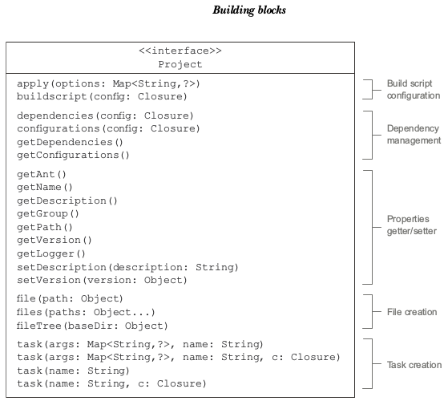
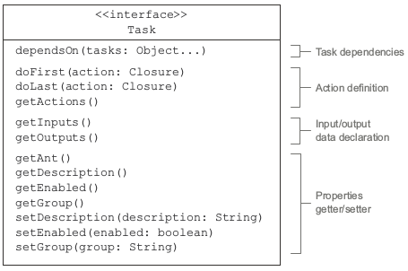
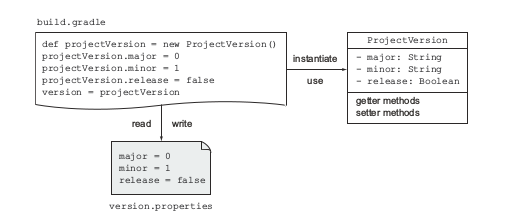
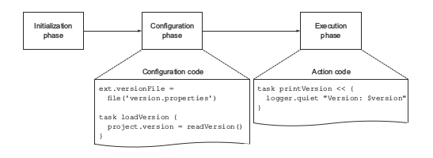
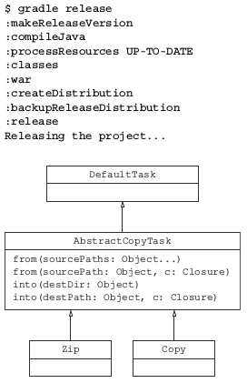
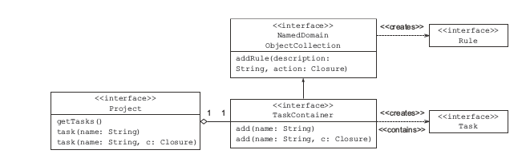

#### building blocks

>每个gradle构建有三部分组成:projects,tasks和properties,每个gralde构建至少有一个project,一个project包含一个
>或多个tasks,project和tasks提供properties,可以被用来控制构建

#### projects

>在gradle术语里,一个project代表你构建的组件,例如一个jar文件,或者一个全局目标,像开发一个
>应用程序,你可能是来自maven的使用者,听到我前面说的可能很熟悉,gradle的build.gradle文件等价于maven的pom文件
>每个gradle构建脚本至少定义构建一个project,Gradle实例化org.gradle.api.Project类,是基于你的在build.gradle的
>配置,并且通过project变量使他隐式可用

>一个project可以创建新任务,加入依赖和配置,添加插件和其他构建脚本,很多属性类似name,descrition可以通过
>get和set方法得到,你不需要直接调用project变量,例如下面代码

	setDescriptin("myProject")
	println "Description of project $name: "+project.description

#### Tasks

>一个action是task执行时的最小单元,有时一个task的输入基于另一个task的输出,例如再打包一个jar文件之前需要编译
>java源码,下面是 org.gradle.api.Task 的接口

#### Properties

> 每个project和task的实例提供的属性,可以使用getter和setter访问,一个property能够作为任务描述或者项目版本,
>你或许想声明一个变量引用一个文件,并且在构建脚本里使用,gradle允许你使用extra propertie.

##### EXTRA PROPERTIES

>许多gradle领域模型类支持特殊属性,属性被存储在一个键值对的hash里,加入属性需要使用ext命名空间,看下面例子

	project.ext.myProp = 'myValue'
	ext {
		someOtherProp = 123
	}
	assert myProp == 'myValue'
	println project.someOtherProp
	ext.someOtherProp = 567

##### GRADLE PROPERTIES

>在<USER_HOME>/.gradle目录下的gradle.properties文件中声明的变量可以直接在你的项目中使用,这些变量可以通过
>project实例访问这些属性,只能有一个gradle.properties文件,在<USER_HOME>/.gradle目录下,即使你有多个项目要处理
>看下面示例,我们假设下面的属性在properties中定义了

	exampleProp = myValue
	someOtherProp = 455
	
>你可以在项目中按照如下方式访问

	assert project.exampleProp == 'myValue'
	task printGradleProperty << {
		println "Second property: $someOtherProp"
	}
	

#### OTHER WAYS TO DECLARE PROPERTIES

>extra properties和gradle properties是你主要用来声明属性和值,gradle允许你许多其他方式提供属性用来构建

> Project property via the –P command-line option
> System property via the –D command-line option
> Environment property following the pattern
> ORG_GRADLE_PROJECT_propertyName=someValue

#### Working with tasks

>新定义的任务是org.gradle.api.DefaultTask类型.实现了org.gradle.api.Task接口,DefaultTask的所有属性都是私有
>只能使用public的setter和getter方法来访问,幸好groovy的语法糖可以使用属性名称访问

#### Managing the project version

>如上图所示,project的版本在构建期间从一个属性文件中读取,这个ProjectVersion数据类被初始化,版本的每一个分类被
>传递给数据类的属性,ProjectVersion类实例被分配给Project的version属性

>能够编程的方式控制版本结构,对于更多的自动化你的项目构建很重要.例如一个例子,你已经通过所有功能测试,准备发送代码,当前版本
>是1.2-SNAPSHOT. 在构建最终的war文件之前,你想变成release version 1.2,并且自动部署到生产服务器. 
>这个过程中可以通过创建一个任务:修改项目版本号和部署war文件

#### Declaring task actions

> task里的action就是存放构建逻辑最适合的地方， Task接口提供2个合适的方法来定义一个task的action，doFirst(闭包)
>和doLast(闭包),当一个task执行的时候，定义的action逻辑作为一个闭包,像参数那样被轮流执行
>可以定义一个简单的task叫做printVersion。这个task的目的打印当前project版本。 定义逻辑作为task的最后action，代码
>如下

	version = '0.1-SNAPSHOT'
	task printVersion {
		doLast {
			println "Version: $version"
		}
	}
	
>通过使用doFirst可以达成同样目的

	task printVersion {
		doFirst {
			println "Version: $version"
		}
	}
	
#### ADDING ACTIONS TO EXISTING TASKS
	
>前面，你仅仅是加入一个单独的action到task里面，要么是frist要么是last，但是你不会被限制于每个task只有一个action，
>你可以加入许多actions到已经建立的task里面，每个task都有一组actions，运行时，按顺序执行，看下面的版本

	task printVersion {
		doFirst {
			println "Before reading the project version"
		}
		doLast {
			println "Version: $version"
		}
		}
	printVersion.doFirst { println "First action" }
	printVersion << { println "Last action" } // <<符号doLast别名

> 上面的例子所示，你可以添加actions到task里，这十分有用。例如你想执行一个自定义逻辑
>但是这个task里没有你自定义的action,例如你想添加一个doFirst action到编译java的插件task里，来检查至少有一个java
>源文件存在

#### Accessing DefaultTask properties

>下一步我们改进输出本版号方式，gradle提供了logger的实现基于SLF4J,除了常用的日志级别(DEBUG,ERROR,TRACE,INFO,WARN)之外，还加入了一些扩展级别， logger实例可以直接通过task的一个方法访问，下面是打印版本号使用log level QUIET:

	task printVersion << {
		logger.quiet "Version: $version"
	}
	
> 还有2个属性，group和description.，都可以作为task的文档，
> description属性表示一个task的目的的简短描述,group定义task的逻辑分组，设置这两个属性作为task的参数

	task printVersion(group: 'versioning',description: 'Prints project version.') << {
		logger.quiet "Version: $version"
	}

>也可以调用set方法设置
	
	task printVersion {
		group = 'versioning'
		description = 'Prints project version.'
		doLast {
			logger.quiet "Version: $version"
		}
	}

> 定义任务时传递任务类型参数

	task hello(type: test) {
		println(major) //这里直接访问test类里定义的major
	}
	
	class test extends DefaultTask {
		Integer major = 123
	}
	

#### Defining task dependencies

> dependsOn允许你声明基于一个或多个任务的依赖

	task first << { println "first" }
	task second << { println "second" }
	task printVersion(dependsOn: [second, first]) << {
		logger.quiet "Version: $version"
	}

    task third << { println "third" }
	third.dependsOn('printVersion')
	

#### Finalizer tasks

>实践过程中，你或许发现需要一个可靠的方案去清理一个任务，在它执行完之后，典型的场景就是web容器需要部署程序之前
>运行集成测试， gradle给这种场景一个finalizer task，即使这个finalizer task运行失败，gradle也会定时调用，下面就是一个例子

	task first << { println "first" }
	task second << { println "second" }
	first.finalizedBy second

> 你会发现first执行完，自动触发second任务

#### Adding arbitrary code

>现在回到我们说的gradle有能力定义各种groovy代码在build script里面,在实践中，你能够编写类和方法和你编写groovy脚本里一样，
> 这节，你创建一个版本类，在java中 ，按照bean规范约定的类叫做Pojo，默认通过getter和setter方法访问属性，但是手动编写这些
>方法很麻烦， groovy里的pogo等价于java的pojo,但是仅仅需要声明属性，不需要声明访问方法， getter和setter方法会在运行时添加进去
> 如下代码

	version = new ProjectVersion(0, 1)
	
	class ProjectVersion {
		Integer major
		Integer minor
		Boolean release

	    ProjectVersion(Integer major, Integer minor) {
			this.major = major
			this.minor = minor
			this.release = Boolean.FALSE
		}

	   ProjectVersion(Integer major, Integer minor, Boolean release) {
		   this(major, minor)
		   this.release = release
       }

	   @Override
       String toString() {
          "$major.$minor${release ? '' : '-SNAPSHOT'}"
      }
     }

	task printVersion  {
		doLast {
			logger.quiet "Version: $version"
		}
    }

> 当运行上面代码，你会看到task printVersion 输出前面一样的结果，不幸的是，你仍然不得不手动修改构建版本号

#### Understanding task configuration

>在你编写代码之前，你需要创建一个properties文件叫做versin.properties在build scipt旁边，对于每种版本号，提供初始值
>按照 key-value键值对形式 如下
	
	major = 0
	minor = 1
	release = false

##### ADDING A TASK CONFIGURATION BLOCK

> 下面代码 声明一个task叫做loadVersion ，用来读取类版本号，从properties文件里并且分配一个新的ProjectVersion实例给project
> version 属性， 表面看，这个task和前面定义的差不多，但是你仔细看，你会发现你没有定义一个action或者使用左位移操作符(<<) 
> gradle叫这种代码为 task configuration block

    ext.versionFile = file('version.properties')

	task loadVersion {
		project.version = readVersion()
	}

	ProjectVersion readVersion() {
		logger.quiet 'Reading the version file.'

	    if (!versionFile.exists()) {
			throw new GradleException("Required version file does not exist: $versionFile.canonicalPath") }

	    Properties versionProps = new Properties()

	    versionFile.withInputStream { stream ->
                versionProps.load(stream)
	    }

     new ProjectVersion(versionProps.major.toInteger(), versionProps.minor.toInteger(), versionProps.release.toBoolean())
    }

> 运行代码你会看到loadVersion先被执行，但是任务名没有打印出来， task 配置总是在 task action前执行，关键是理解
> 整个 gradle构建生命周期， 如下图

###### GRADLE ’ S BUILD LIFECYCLE PHASES

> 当你执行一个gradle构建的时候，有三个重要阶段， initialization ,configuration,和execution.如上图
> 在初始化阶段，gradle创建一个project 实例，给定的build script仅仅是一个单独的project， 在多Project上下文里， 构建阶段就
> 十分重要，依据你正在执行哪个项目构建，gradle找出项目构建过程中实际的依赖，在初始化阶段你的build script代码不会执行 

> 构建阶段下一个阶段是配置阶段，gradle构建一个model参与任务构建，此阶段非常适合设置您的项目或特定任务所需的配置。

>下一个阶段是执行阶段，按照依赖顺序执行，如果任务被认为没有修改过，将被跳过

#### Declaring task inputs and outputs

> gralde确定一个任务是up to date，通过比较任务在两次编译时输入和输出的快照
> 当最后一个任务执行完，任务的输入和输出没有改变，这个任务被认为up to date。
> 仅仅当输入和输入有变化时，才会运行，否则就跳过
> 输入可以是一个目录或，一个或多个文件，或者任意属性，输出可以是一个目录或者文件,输入和输出可以作为DefaultTask类的属性， 有明确的类关系
> 假设你想创建一个任务，将你的项目发布成release版本， 你想改变项目版本从 snapshot到release, 下面的实例定义了一个新的任务分配boolean值
> true给版本属性release， 任务也将版本属性改变值写入到属性文件里

	task makeReleaseVersion(group:'versioning',
		description: 'Makes project a release version') {
		version.release = true
        ant.propertyfile(file: destFile) {
            entry(key: 'release', type: 'string', operation: '=', value: 'true')
        }
	}

>运行上面的任务，会修改版本好。并且将版本号写入文件里。
> makeReleaseVersion可以作为一个任务生命周期里的一部分，在部署一个war文件到生产服务器时，你或许需要面对
> 部署可能出错，网络故障，然后当你解决后故障后，你想再次运行部署任务，因为makeReleaseVersion被声明作为一个依赖,对于你的
> 部署任务，makeReleaseVersin再次自动运行，等等，你刚才不是已经标记你的产品版本为projducttion-ready了，不是吗？不幸的是,gradle任务不知道
> 为了让gradle task 认识到这一点，你需要按照下面设置

	task makeReleaseVersion(group:'versioning',
		description: 'Makes project a release version') {

		inputs.property('release', version.release)
		outputs.file versionFile

	     doLast {
	          project.version.release = true
	          ant.propertyfile(file: destFile) {
              entry(key: 'release', type: 'string', operation: '=', value: 'true')
        }
	}
	
> 你移动代码到一个 doLast action 闭包里，并且清晰的分割了配置代码和action代码
> 现在，如果你执行2次这个任务，gradle知道这个project version已经被设置为release了，就跳过这个 task 

#### Task inputs/outputs evaluation

> 记住，任务的input和outpus 是在配置阶段执行，链接任务依赖，这就是为什么要配置在configure block里，为了防止出错，确保赋值
> 给input和outpus的值，在配置阶段就可读，
>如果你需要实现一段逻辑输出， 这个upToDateWhen(Closure)方法，在对比input和output时，这个方法被运行如果闭包返回true， 这个任务被认为up to date

#### Writing and using a custom task

> makeReleaseVersion任务里的结构很简单，代码维护不会有问题，但是当你工作一段时间以后，简单的任务的代码可能会增长，你或许会加入更多逻辑，此时就需要重构
> 你的代码到类和方法里，你可以按照你常规的产品代码那样来重构，gradle不建议用一种特殊方式来编写你的任务，你可以自己控制你代码风格，甚至是编程语言的选择，
> 自定义任务有2部分组成，
> 1 自定义任务类，封装了你的逻辑行为，继承了DefaultTask类,也被成为task type， 
> 2 真实任务类提供了属性值，通过task类暴露的属性，用来配置逻辑行为， gradle叫这样的类为enhanced tasks
> 可维护性仅仅是编写自定义类的优势之一，因为你正在处理一个真实类,任何方法通过完整的单元测试。enhanced tasks好处对于简单类，就是它的可重用性，自定义类
> 暴露的属性可以单独设置

#### WRITING THE CUSTOM TASK CLASS

> 前面提到的，在你的构建脚本里gradle为每个简单任务创建一个DefaultTask类型的实例,当你创建一个自定义任务时，你需要做的是创建了一个继承DefaultTask的
> 类， 实例如下

	class ReleaseVersionTask extends DefaultTask {
		//使用注解声明任务的输入输出
		@Input 
		Boolean release
		@OutputFile 
		File destFile

	    //构造方法里声明任务组和描述
		ReleaseVersionTask() {
			group = 'versioning'
			description = 'Makes project a release version.'
		}
		//注解声明方法被执行
		@TaskAction
		void start() {
			project.version.release = true
			ant.propertyfile(file: destFile) {
				entry(key: 'release', type: 'string', operation: '=', value: 'true')
			}
		}
	}

>在上面代码中，你没有使用DefaultTask的属性来声明Inputs和outputs，而是使用了来自org.grdle.api.tasks的注解

#### EXPRESSING INPUTS AND OUTPUTS THROUGH ANNOTATIONS

> 任务的input和outpus注解给你的实现添加了语法糖，不仅仅实现TaskInputs和TaskOutput方法功能，他们也作为自动化文档。只要看一眼，
> 你就清楚的知道输入的数据是什么，通过task输出是什么，查看文档，你会看到gralde提供很多注解
> 在你自定义的类里面，@Input注解声明了输入属性release，和@OuputInput注解定义了输出文件， 使用这两个注解不是唯一选择，你也可以使用
> getter方法

#### Task input validation

> 在配置期间，@Input注解会验证属性值，如果值是Null, gradle将会跑出一个TaskValistaionException，如果允许值为null，可以使用@option
>注解标记属性

#### using the custom task

> 你实现了一个自定义task,并且创建了一个action方法同时暴露了可配置的属性，但是怎样使用他们呢，在你的构建脚本里，你需要创建一个
> ReleaseversionTask类型task，设置输入和输出，通过分配他的属性值，下面代码实例展示这个， 被认为创建一个新的特殊类实例，并在构造方法中
> 设置属性值，

	//定义一个ReleaseVersionTask的真实task
	task makeReleaseVersion(type: ReleaseVersionTask) {
		//设置task的属性值
		release = version.release
		destFile = versionFile
	}

> 正如你期待的，这个真实任务，makeReleaseVersion 的行为和简单task一样

#### APPLIED CUSTOM TASK REUSABILITY

> 假设你想使用自定义的任务在另一个项目里，在那个项目里的需求不同，表示版本的pogo暴露了不同的属性来表示版本结构， 如下代码
	
	class ProjectVersion {
		Integer min
		Integer maj
		Boolean prodReady
		@Override
		String toString() {
			"$maj.$min${prodReady? '' : '-SNAPSHOT'}"
		}
	}

> 此外，项目拥有者决定命名版本文件，project-version.properties代替version.properties. 如何使真是类适应这个需求呢？ 你只需要
> 分配不同的值给暴露的属性，如下，自定义类可以自己处理需求改变

	task makeReleaseVersion(type: ReleaseVersionTask) {
		release = version.prodReady
		destFile = file('project-version.properties')
	}

> gralde自带了很多开箱即用的task 用于常规需求，例如 拷贝，删除文件，创建zip压缩包， 下一节我们详细了解

#### USING TASK TYPES

> gradle的内建任务都来自于DefaultTask类，用于增强task中，下面例子展示了zip和copy任务类型用于产品发布

	task createDistribution(type: Zip, dependsOn: makeReleaseVersion) {
		from war.outputs.files  //引是引用了war task任务输出
		from(sourceSets*.allSource) { //使用了所有源文件，并且将他们打包到zip文件的src目录
			into 'src'
        }
		from(rootDir) {
			include versionFile.name  //添加到版本文件到zip里
		}
	}

	task backupReleaseDistribution(type: Copy) {
		from createDistribution.outputs.files  //引是引用了createCistributin的输出
		into "$buildDir/backup"
	}
	task release(dependsOn: backupReleaseDistribution) << {
		logger.quiet 'Releasing the project...'
	}

> 在上面的代码中，以不同的方式告诉zip和copy任务，需要包含什么样的文件，并且文件放到哪里,AbstractCopyTask中的很多方法可以在这里使用，

#### TASK DEPENDENCY INFERENCE

> 你或许注意到了上面示例代码中，任务依赖通过dependsOn方法直接声明，然而一些task没有直接依赖其他task,例如createDistribution对于war，
> 那么gradle怎么预先知道依赖的任务，通过使用一个任务的输出作为另一个任务的输入，依赖关系被这样推断出来，看下面整个执行过程
	

> 在运行构建以后，你应该看到生成的zip文件，在/build/distributins目录里，整个目录是用于归档任务的默认目录，你也可以修改不同的目录，通过
> destinationDir属性， 下面目录展示了构建后的结构
	
	build
    ├── backup
	│
	└── todo-webapp-0.1.zip
	├── distributions
	│
	└── todo-webapp-0.1.zip
	└── libs
	└── todo-webapp-0.1.war
	build.gradle
	src
	version.properties

#### task rules

> 有时你会发现你自己在某种情况下，写了多个任务做着类似的事情，例如，你想通过2个task扩展你的版本管理功能，一个增加主版本号，另一个做一样的
> 工作增加副版本号，两个任务都支持改变版本文件，比较下面代码发现基本上都是重复代码
	
	
		task incrementMajorVersion(group: 'versioning', description: 'Increments project major version.') << {
			String currentVersion = version.toString()
			++version.major
			String newVersion = version.toString()
			logger.info "Incrementing major project version: $currentVersion -> $newVersion"
			ant.propertyfile(file: versionFile) {
				entry(key: 'major', type: 'int', operation: '+', value: 1)
			}
		}
		task incrementMinorVersion(group: 'versioning', description: 'Increments project minor version.') << {
			String currentVersion = version.toString()
			++version.minor
			String newVersion = version.toString()

	        logger.info "Incrementing minor project version: $currentVersion -> $newVersion"
                   ant.propertyfile(file: versionFile) {
					   entry(key: 'minor', type: 'int', operation: '+', value: 1)
				   }
	    }

	
####   TASK RULE - NAMING PATTERN

> gradle引入了task规则的概念，基于一个task的名字运行特定的逻辑， 这个模式包含两部分组成，静态的名字部分和占位符，组合在一起就是动态task名称，
> 如果你想在前面的例子使用task规则，命名模式应该类似这样increment<Classifier>Version,当在命令行执行这个task规则时，你将以驼峰命名形式
> 指定替换占位符

##### Task rules in practice

> 一些gradle核心插件充分利用了task rule， 其中之一就是java plugin定义的 clean<TaskName>,删除制定的task输出，例如，运行gradle
> cleanCompileJava 将会删除所有的编译后的java类文件。

#### DECLARING A TASK RULE

> 你仅仅是了解了给task rule定义一个命名模式，但是怎样实际声明一个task rule在你的构建脚本里？ 加入task rule到你的项目里，你需要引用 
> TaskContainer, 一旦拥有了引用，你可以调用addRule(String,closure)方法， 第一个参数提供描述，例如task名字模式，第二个参数描述了应用于规则的要执行的闭包
> 遗憾的是，这没有直接方式创建一个task rule，通过来自Project方法，创建简单的task那样， 对于如何加入一个task rule有一个基本了解后，你可以
> 编写真实的闭包实现他们

> 上图所示，简单的task可以通过project实例的方法添加，task rule仅仅只能通过task container添加， 所以调用getTasks方法得到它的引用

	tasks.addRule("Pattern: sample<ID>") { String taskName ->
		if (taskName.startsWith("sample")) {
			task(taskName) << {
				println taskName - 'sample'
			}
		}
	}
