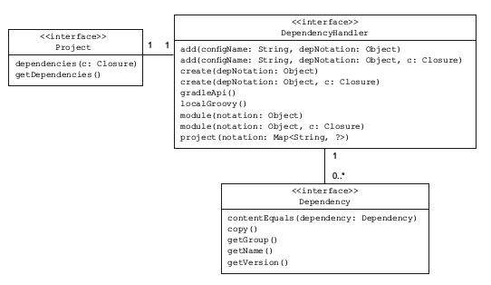
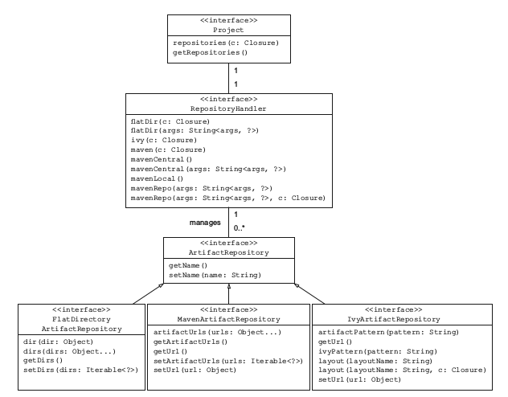
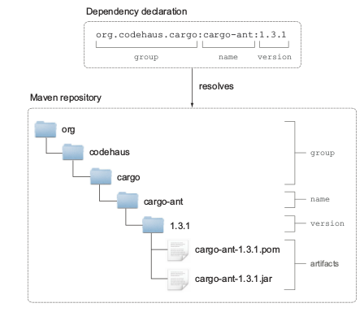
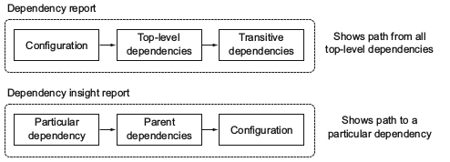

#### A quick overview of dependency management

> 几乎所有的基于jvm的软件项目都基于外部库来重新利用已有的功能，例如，你从事开发一个web项目，很有可能你基于一个开元流行框架，spring
> or play改善生产力， java类库以jar文件形式存在，jar文件规范不需要你指定版本，然而，最佳实践附加版本号到jar文件名上，

#### Imperfect dependency management techniques

>因为java本身没有提供任何版本管理工具，所以团队不得不相处自己的存储管理他们的方法，下面是你可能见过的常见方法

> 1 手动拷贝jar文件到开发机器，容易出错，不自动化
> 2 使用存储jar文件的网络硬盘，挂载到开发机器上， 或者是Ftp来检索，这种方式需要开发人员建立二进制仓库，后续手动添加依赖，
> 3 检查下载的jar文件，和项目源码中一致，这种不需要额外的设置，绑定源码和所有依赖最为一个整体

#### Importance of automated dependency management

> 尽管这些方案都能工作，但并不是最佳解决方案，因为没有提供标准化的命名和组织jar文件方式，至少你需要知道类库精确版本和传递性，

##### KNOWING THE EXACT VERSION OF A DEPENDENCY

> 使用项目工作时，不清楚依赖版本的话很快变成维护的噩梦，如果没有详细文档，你不会知道那些特殊功能由哪些版本来支持,升级新版本变成了
> 猜谜游戏，因为你不知道你更新了哪个版本

#### MANAGING TRANSITIVE DEPENDENCIES

> 传递依赖性是在开发初期遇到的问题，这些一级依赖库需要按顺序工作正常，java开发这通常喜欢spring和hiberant组合，很容易就带来至少
> 20个附加库在一开始，，一个单独类库需要许多其他类库按顺序才能工作正常， 尝试手动决定一个特殊库的传递依赖性是一个费时的工作，很多时候
> 这些信息在文档中找不到，最后徒劳无功，可能遇到编译错误或者类加载错误,我们应该用更完善的方案管理依赖，理想情况，能够声明你需要的依赖
> 和各自的版本作为项目元数据，作为自动化处理的一部分，他们从指定位置下载，安装到你的项目里， 让我们们那些已经有的开源方案能支持这些特性

#### Using automated dependency management

> java领域有两个最有优势的项目，可以支持声明和管理依赖， apache ivy 一个纯粹的依赖管理工具，被ant项目使用,以及maven工具，他包含一个依赖管理器
> 作为构建基础工具一部分
> ivy和maven管理依赖是通过xml描述文件，配置包含两部分组成，依赖标识符加上版本好，和二进制仓库位置，例如http地址，依赖管理器解析信息并且自动下载目标
> 到你的机器上，类库可以定义传递依赖性，作为元数据一部分，依赖管理器足够智能去解析信息解析依赖，如果发生冲突，依赖管理器或解决这个问题，下载后类库，被存储
> 在本地缓存， 配置的类库在你的开发机器上被使用，可以用于构建使用，后续构建先从本地仓库查找，避免了去远程仓库下载，
> 使用依赖管理器让你不用自己管理拷贝和组织jar文件，gradle提供了强大的开箱即用的依赖管理实现，简单的信息描述，通过gradle的dsl来描述这些依赖配置，
> 支持传递性依赖管理

#### Challenges of automated dependency management

> 尽管依赖管理有效的简化了外部库处理，但是有些时候你会发现有些缺点影响了你构建的可读性和可复用性

#### POTENTIAL UNAVAILABILITY OF CENTRALLY HOSTED REPOSITORIES

> 企业软件依赖开源库很常见，许多这样的软件发布版本到中央仓库，应用广泛的仓库就是maven central，如果maven仓库是你仅有的使用的构建仓库，你就自动的撞创建了一个单点故障，万一仓库不能下载
> 你就不能构建系统。
> 为了避免这个情况，你可以配置内部仓库， 你可以完全自己控制，

#### BAD METADATA AND MISSING DEPENDENCIES

> 前面你已经了解到，元数据用来描述传递依赖性， 一个依赖管理器分析这个信息，构建依赖图，解决嵌套依赖关系
> 不幸的是，元数据和仓库都不能保证，元数据中的人为声明一定存在，被正确定义，即使都需要，你或许遇到丢失依赖，尤其仓库质量无法保证，

> gradle允许在依赖图上的任何级别上忽略传递依赖性，或者你可以不提供元数据或者自己设置传递依赖性
> 你会发现流行库的不同版本都会出现在你的依赖图中， 通常例子是日志框架， 依赖管理器尝试找到一个智能方案解决这个问题，采取其中一个版本，防止版本冲突， 
>有时你需要调整策略，这样做，你首先想找出哪个依赖带来的哪些传递依赖性版本，gradle提供了有意义的依赖报告，解决这些问题，

#### Learning dependency management by example

> 开源项目cargo ，地址 https://codehaus-cargo.github.io,提供了多种方式部署程序到servlet容器和应用服务器，cargo支持两种实现方式，
> 1 使用java api进行细致的访问配置cargo，2 使用预配置的包装了java api的ant任务， 因为gradle提供了优秀的ant集成，我们的例子基于ant task
> 在前面知道对于一个项目的依赖管理配置需要两种DSL块，dependencies和repositories,配置块的名字直接对应porject的接口方法,我们使用Maven
> 仓库不需要任何附加设置，如下图

> 上图展示了 依赖定义通过build.gradle文件的dsl定义，依赖管理器将在运行时执行配置，下载需要的组件从制定的仓库，然后存储他们到本地，缓存起来，
> 你没有使用本地仓库，所以图里没有显示。

#### Dependency configurations

> 插件能够引入配置定义依赖的作用域，java插件带来很多标准的配置定义java构建生命周期的依赖，例如，加入编译配置加入编译产品需要的依赖， 在构建web
> 应用程序时，你使用编译配置声明一个依赖于apachhe commons lang 库，通过熟悉gradle api 我们了解这些配置

#### Understanding the configuration API representation

> 配置可以直接在项目的根级别添加访问，你可以决定使用哪个插件提供的配置，或者自己的配置声明，每个项目拥有自己的ConfigurationContainer类容器管理
> 对应的配置，配置在行为上很灵活，你可以决定传递依赖性是否包含在解析方案里，定义解析策略

> 另一种配置方式是逻辑分组，通过分组依赖类似java类的包概念，包结构提供了唯一的命名空间，也适用于配置，
> java插件提供了6中开箱即用配置，compile , runtime , testCompile , testRuntime , archives , 和default

#### Defining a custom configuration

> 明确定义cargo需要的依赖，你需要声明一个新的配置使用唯一名称cargo，例子如下

	configurations {
		cargo {
			description = 'Classpath for Cargo Ant tasks.'
			visible = false
		}
	}
	
	
#### Accessing a configuration

> 本质来说 ant任务就是扩展了ant的java类，用来自定义逻辑，如果添加一个自定义的ant task，例如cargo部署任务， 你需要使用taskdef声明ant task
> 下面代码展示了如何简单的访问配置，通过名字， 这个task使用了依赖很明确
	
	

#### Declaring dependencies

> dsl配制块dependencies 用于分配一个多个依赖， External dependencies 不是你唯一可以声明的依赖， 如下图各种类型依赖
	

	

#### Understanding the dependency API representation

> 每个gradle项目都有一个依赖管理器实例，由DependencyHandler接口来表现，你使用项目的getDependencies方法获得管理器引用，上图中显示的依赖类型，都可以通过使用项目配置块的依赖
>处理器的方法来声明，每个依赖都是Dependency类型的实例，group , name , version , 和 classifier标识一个依赖， 下图描述了项目，依赖处理器，实际依赖的关系

#### External module dependencies

> 在gralde的术语中，外部类库，通常以jar文件形式存在，被称为外部模块依赖，他们代表的依赖模块在项目结构之外，这种依赖可以在仓库中通过属性明确标识

#### DEPENDENCY ATTRIBUTES

> 当一个依赖管理器寻找依赖时，通过属性组合来查找，一个依赖至少需要提供名字，以hiberant核心库来作为例子介绍
	
> group: 这个属性用来定义一个，组织，公司或者项目，group属性可以使用点符号"."这个不是强制性的， 例如 org.hiberante
> name: 一个工件的唯一名字，用来描述依赖， 例如hibernate-bore
> version: 一个库可能有很多版本， 大部分使用主版本和次版本号， 例如，3.6.3-final
> classifier: 有时一个工件定义另一个属性 classifier，用来区别与有相同的group,name和version的工件，他需要进一步规范，例如运行环境， hiberante核心库没有提供这个

#### DEPENDENCY NOTATION

	dependencies {
		configurationName dependencyNotation1, dependencyNotation2, ...
	}

> 你首先给出配置的名字，你想分配依赖给他，依赖标记分为两种， 一种以map形式映射，另一种使用冒号分割
> 在配置定义后，你能够很容易使用它分配给cargo相关依赖， 使用cargo在你的项目里，你需要通过包含cargo api， 核心容器的实现，ant task的jar文件， cargo提供了一个uberjar
> 一个独立的打包的jar文件，包含所有功能， 让依赖管理更简单，下面代码展示了如何分配cargo依赖给cargo配置

	ext.cargoGroup = 'org.codehaus.cargo'
	ext.cargoVersion = '1.3.1'
	dependencies {
		//map形式
		cargo group: cargoGroup, name: 'cargo-core-uberjar',version: cargoVersion
		//字符串形式声明
		cargo "$cargoGroup:cargo-ant:$cargoVersion"
	}

> 如果你处理很多依赖在你的项目里，取出常用属性作为扩展属性是很有帮助的， 上面例子创建了cargo依赖的group和version属性
> gradle没有默认的仓库给你，让是运行没有使用仓库的deployToLocalTomcat任务会报错，

	repositories {
		mavenCentral()
	}

> 为了使例子通过，我们简单配置一下仓库，稍后详解

#### INSPECTING THE DEPENDENCY REPORT

> 当你运行 dependencies帮助任务时，会打印出完整的依赖树， 这个树展示给你脚本中顶层依赖和他们的传递性依赖
> 如果你认真检查依赖树，你会看到使用星号标记的依赖被忽略了，
	
	   commons-logging:commons-logging:1.0.4 (*)

> 例如上面代码所示，这意味着依赖管理器选择了一样或者另一个版本的库，因为他被声明为另一个顶层依赖的传递性依赖，gradle默认冲突策略是，最新的优先，如果依赖图包含两个一样名字的库，选择新的，
> xml-apis例子，gradle选择了 1.3.03而不是1.0.b2, 通过箭头来指示-> 
 
	xml-apis:xml-apis:1.0.b2 -> 1.3.03

#### EXCLUDING TRANSITIVE DEPENDENCIE

> 当使用一个公共maven仓库时候，像maven中央仓库，你获取遇到缺少维护的依赖元数据，gradle允许你完整的控制传递性依赖或者选择排除特殊的依赖，假设你想使用不同的版本的xml-api替代
>Uberjar的传递性依赖的xml-api版本，如下代码
	
	dependencies {
		cargo('org.codehaus.cargo:cargo-ant:1.3.1') {
			exclude group: 'xml-apis', module: 'xml-apis'
		}
		cargo 'xml-apis:xml-apis:2.0.2'
	}

> 注意上面， 排除属性和正规的依赖标识的轻微不同，你可以使用group和/或者module。gradle不允许你排除一个指定版本好的依赖，所以version不可用

> 有时，依赖的元数据声明的传递性依赖没有在仓库中，结果你编译失败，唯一的解决办法就是排除所有的传递性依赖使用transitive属性，如下图

	dependencies {
		cargo('org.codehaus.cargo:cargo-ant:1.3.1') {
		transitive = false
	}
	// Selectively declare required dependencies
	}

##### DYNAMIC VERSION DECLARATION

> 动态版本声明有自己的语法，如果你想使用一个依赖最后的版本，使用占位符号，lastest.integration 例如声明需要的cargo ant task 最后的版本 使用，
> codehaus.cargo:cargo-ant:latest-integration,或者另一个选项使用加号+
	
	dependencies {
		cargo 'org.codehaus.cargo:cargo-ant:1.+'
	}	

#### file dependcies

> 前面描述的,项目没有使用自动依赖挂你组织他们外部依赖库， 例如当你将项目迁移到gradle，你不想立刻改变项目的结构，gradle让你简单的配置依赖，你可以为你的项目引用本地系统的依赖库
> 下面示例，展示了从maven仓库拷贝到libs/cargo目录下 
	
	task copyDependenciesToLocalDir(type: Copy) {
		from configurations.cargo.asFileTree
		into "${System.properties['user.home']}/libs/cargo"
	}

> 然后你可以声明cargo库在你的依赖配置块里， 如下:
	
	dependencies {
		cargo fileTree(dir: "${System.properties['user.home']}/libs/cargo", include: '*.jar')
	}

#### Using and configuring repositories

> 使用单独的方法mavenCentral()，你可以使用最流行的java仓库，除了使用预配置的仓库，你还可以使用一个url路径，路径地址可以使maven
> 或者ivy仓库， 文件系统仓库也可以用来作为依赖。
> 仓库的种类
> maven repository : 本地文件系统或者远程服务器，或者预配置的maven仓库
> ivy repository: 本地文件系统，远程服务器，或者特殊的扁平结构
> flat directory respostory : 没有元数据支持的本地文件系统

#### Understanding the repository API representation

> 项目中定义仓库的核心接口是RepositoryHandler，这个接口提供了方法添加各种仓库，repositories配制块里调用这些方法，你可以声明
> 多个仓库，依赖管理器尝试下载依赖和元数据按照你定义仓库的顺序寻找，先找到依赖的仓库优先级高，剩下的仓库就不会再去查找，

#### Maven repositories

>maven仓库是java项目最常用的仓库之一，类库以jar文件形式存在，元数据通过xml在pom文件里描述相关信息和传递性依赖，两种工件都存储在
>仓库中预定义好的目录中， 当你在你的构建脚本中声明一个依赖，它的属性用于计算出在仓库中的精确位置，group属性中的“.”符号指出maven仓库
>中的子目录， 如下图，显示了cargo ant依赖属性映射仓库中jar文件和Pom文件h位置
	
	

> RepositoryHandler 提供了2种接口方法添加预定义maven仓库，一个是mavenCentral方法添加Maven Central到仓库列表， 另一个方法
> 就是mavenLocal方法添加一个本地仓库到你的文件系统 

#### ADDING THE PRECONFIGURED M AVEN C ENTRAL REPOSITORY

> maven central是构建常用的仓库， gradle想让构建者使用它更容易，提供了一个简化声明替代url,http://repo1.maven.org/maven2
> 使用mavenCentral()方法如下代码片段
	
	repositories {
		mavenCentral()
	}

#### ADDING THE PRECONFIGURED LOCAL MAVEN REPOSITORY

> 当gradle解析一个依赖的时候，在仓库中找到它，然后下载，存储在本地缓存， 缓存的位置是你本地的文件系统，与maven存储下载后的工件目录不同，
> 你或许想知道什么时候使用本地maven仓库，假设你使用maven构建一个库，另一个项目使用gradle并且引用了这个库， 在开发期间，防止发布到远程
> 仓库浪费时间，gradle提供了一个本地仓库

	repositories {
		mavenLocal()
	}

#### ADDING A CUSTOM MAVEN REPOSITORY

> 有很多原因你想设置一个仓库而不是使用maven中央仓库，或许一个特殊的依赖很简单但是不可用，或者你想确保构建可靠使用自己的企业仓库， 
>仓库管理器让你可以配置使用maven布局的仓库，这意味着它遵守我们前面讨论的工件存储模式，也可以通过提供验证信息访问仓库， gradle
> 提供两种方式配置仓库，maven和mavenRepo，下面展示了如果工件不在maven central仓库中的另一个仓库选择
	
	repositories {
		mavenCentral()
		maven {
		name 'Custom Maven Repository',
		url 'http://repository-gradle-in-action.forge.cloudbees.com/release/')
		}
	}

#### Ivy repositories

> maven仓库中的工件以一种固定方式存储，任何结构偏差导致依赖不可读，另一方面，ivy仓库提供了一个默认布局，并且可定制， 在ivy仓库中
> 仓库依赖元数据被存储在叫做ivy.xml文件中， gradle提供了一个灵活的方法配置ivy仓库和和布局， 假设你想让cargo依赖一个ivy仓库，
> 示例如下

	repositories {
		ivy {
			url 'http://repository.myenterprise.com/ivy/bundles/release'
			layout 'pattern', {
				artifact '[organisation]/[module]/[revision]/[artifact]-[revision].[ext]'
				ivy '[organisation]/[module]/[revision]/ivy-[revision].xml'
			}
		}
	}

#### Flat directory repositories

> 最简单和基本的就是扁平目录仓库，它是文件系统上的一个目录，只包含jar文件，没有元数据，如果你使用手动管理你的项目源码，并且计划迁移到
> 自动依赖管理，这种方案适你也许感兴趣
> 当你需要一个依赖时，你仅仅需要声明使用属性名字和版本， group属性导致不明确依赖关系，实例如下
	
	repositories {
		flatDir(dir: "${System.properties['user.home']}/libs/cargo", name: 'Local libs directory')
	}

	dependencies {
		cargo name: 'activation', version: '1.1'
		cargo ':jaxb-api:2.1', ':jaxb-impl:2.1.13', ':jaxen:1.0-FCS'
}

#### Analyzing the cache structure

> 你知道gradle下载部署任务运行时需要的jar文件放到哪里了么？ 如果搜索gradle论坛，你会发现很多用户也在寻找这个问题答案， 你可以使用gradle api找出答案，
>  下面代码展示如何找到依赖路径

	task printDependencies << {
		configurations.getByName('cargo').each { dependency ->
		println dependency
		}
	}

> 运行上面代码 打印结果之一 /Users/benjamin/.gradle/caches/artifacts-15/filestore :
> 上面的路径也许和你的机器上的不同，用来存储依赖的gradle根目录是<USER_HOME>/.gradle/caches，后面的路径artifact-15是一个标识符，指定gradle版本，
> 新版的gradle结构可能有所不同，实际上缓存被分为两个部分， filestore包含所有的下载的二进制库，还有一些二进制文件存储了工件元数据信息，你不需要查看这些，

#### Notable caching features

> 有这样一个场景，你脚本中声明一个依赖，然后运行构建，下载需要的库，然后存储在缓存中，后续构建也是用这个库，从缓存中，如果仓库结构变化，这个库重命名或者删除，的移动
> 许多依赖管理器会使用缓存中的依赖，同样构建很好，但是其他开发人员机器上运行构建，可能构建就会失败，这种情况，gradle采用不同方案，知道依赖源在哪里，

#### ARTIFACT CHANGE DETECTION

> gradle试图减少与远程仓库的通信，不全是因为依赖已经下载了，如果一个依赖不能够从仓库下载， 元数据会存储在缓存中，gradle使用这些信息避免检查远程仓库

#### REDUCED ARTIFACT DOWNLOADS AND IMPROVED CHANGE DETECTION

> gradle提供了与maven本地仓库的紧密集成避免下载已经存在的依赖库， 如果一个依赖在本地被发现，就会重用它
> 如果一个工件在仓库中发生改变，gralde使用比较本地和远程仓库的哈希值得知， 没改变的工件不会再下载，重复使用本地缓存的，假设工件改变了。但是和本地仓库中的仍然一样，
> 一个仓库的管理员替换了旧工件，但是使用一样的版本，就会发生这种情况，最终，构建使用一个过时的版本工件，gradle管理器试图解决这种问题通过外部的信息，例如http头信息中的
> 文件长度，最后时间，这些信息保证工件一致性，

#### OFFLINE MODE

> 如果构建中声明了远程仓库，grale或许在依赖变化时会检查他们，有时这个行为不可取，例如你在出差访问不了互联网，你能够使用命令告诉gradle避免访问互联网， --offline参数可以
> 达到这个目的，告诉gradle不要检查远程仓库，使用本地仓库中的，如果本地仓库依赖没有，就会构建失败

#### Troubleshooting dependency problems

#### Responding to version conflicts

> gradle不会自动告诉你，你的项目有冲突了，经常查看依赖报告不是一个好的解决方案，修改默认策略，让遇到冲突时失败，  查看下面代码

	configurations.cargo.resolutionStrategy {
		failOnVersionConflict()
	}

>失败对于调试很有帮助，特别是设置项目早期和修改依赖设置，运行项目的任何u任务都会发生版本冲突， 

#### Enforcing a specific version

> 你管理项目越多，你就越需要使用标准化的构建环境，你想共享通用的任务并指定一个制定的版本库，例如你想统一你的web项目使用cargo 1.3.0部署，尽管依赖声明需要不同版本
> 使用gradle很简单的实现这个企业策略，让你可以强制指定一个顶级依赖和传递性依赖,
> 下面代码演示了如何为cargo重新配置默认解析策略强制使用1.3.0版本

	configurations.cargo.resolutionStrategy {
		force 'org.codehaus.cargo:cargo-ant:1.3.0'
	}

> 现在你运行依赖测试报告，看到结果如下
	org.codehaus.cargo:cargo-ant:1.3.1 -> 1.3.0
	
#### Using the dependency insight report

> 配置解析策略的改变，如前所示，最好的地方时初始脚本中，可以全局级别强制实施， 构建用户或许不知道为什么实际运行的cargo ant任务被使用， 唯一的方式就是查看依赖报告观察
> 不同，有时你想知道为什么强制使用某个版本

> gradle提供了不同的报告类型，依赖观察报告，解释了一个依赖在图中如何和为什么， 运行这个报告，需要提供两个参数，配置名，默认是编译配置，依赖本身， 如下代码展示，
	
	gradle -q dependencyInsight --configuration cargo --dependency xml-apis:xml-apis

> 依赖报告从配置的顶层开始解析，观察报告展示依赖图从实际使用的依赖配置开始，如下图各种类型依赖
	

#### Refreshing the cache

> 为了避免为了某个库一遍又一遍的访问仓库，gradle提供了特定的缓存策略，这种策略用于一个依赖的快照版本和使用动态依赖模板的依赖,你可以手动刷新缓存中的依赖，通过
> 命令选项，--refresh-dependencies,这个标记强制检查配置仓库中的工件是否发生变化，如果发生变化，依赖将再被下载，替换缓存中的类库，你可以配置一个构建缓存的默认行为
> 你可以配置缓存动态依赖版本0秒超时
	
	configurations.cargo.resolutionStrategy {
		cacheDynamicVersionsFor 0, 'seconds'
	}

> 你或许有好的原因不想缓存snapshot版本， 下面配置；
	
	configurations.compile.resolutionStrategy {
		cacheChangingModulesFor 0, 'seconds'
		}
