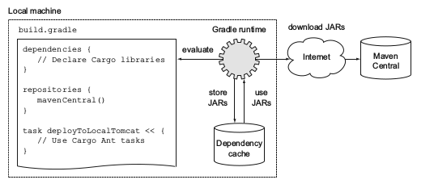
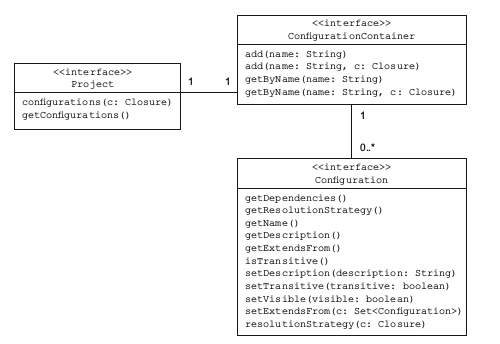
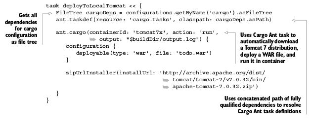
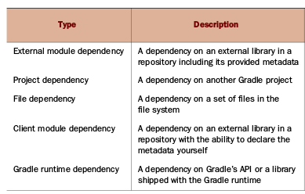

#### A quick overview of dependency management

> 几乎所有的基于jvm的软件项目都基于外部库来重新利用已有的功能，例如，你从事开发一个web项目，很有可能你基于一个开元流行框架，spring
> or play改善生产力， java类库以jar文件形式存在，jar文件规范不需要你指定版本，然而，最佳实践附加版本号到jar文件名上，

#### Imperfect dependency management techniques

>因为java本身没有提供任何版本管理工具，所以团队不得不相处自己的存储管理他们的方法，下面是你可能见过的常见方法

> 1 手动拷贝jar文件到开发机器，容易出错，不自动化
> 2 使用存储jar文件的网络硬盘，挂载到开发机器上， 或者是Ftp来检索，这种方式需要开发人员建立二进制仓库，后续手动添加依赖，
> 3 检查下载的jar文件，和项目源码中一致，这种不需要额外的设置，绑定源码和所有依赖最为一个整体

#### Importance of automated dependency management

> 尽管这些方案都能工作，但并不是最佳解决方案，因为没有提供标准化的命名和组织jar文件方式，至少你需要知道类库精确版本和传递性，

##### KNOWING THE EXACT VERSION OF A DEPENDENCY

> 使用项目工作时，不清楚依赖版本的话很快变成维护的噩梦，如果没有详细文档，你不会知道那些特殊功能由哪些版本来支持,升级新版本变成了
> 猜谜游戏，因为你不知道你更新了哪个版本

#### MANAGING TRANSITIVE DEPENDENCIES

> 传递依赖性是在开发初期遇到的问题，这些一级依赖库需要按顺序工作正常，java开发这通常喜欢spring和hiberant组合，很容易就带来至少
> 20个附加库在一开始，，一个单独类库需要许多其他类库按顺序才能工作正常， 尝试手动决定一个特殊库的传递依赖性是一个费时的工作，很多时候
> 这些信息在文档中找不到，最后徒劳无功，可能遇到编译错误或者类加载错误,我们应该用更完善的方案管理依赖，理想情况，能够声明你需要的依赖
> 和各自的版本作为项目元数据，作为自动化处理的一部分，他们从指定位置下载，安装到你的项目里， 让我们们那些已经有的开源方案能支持这些特性

#### Using automated dependency management

> java领域有两个最有优势的项目，可以支持声明和管理依赖， apache ivy 一个纯粹的依赖管理工具，被ant项目使用,以及maven工具，他包含一个依赖管理器
> 作为构建基础工具一部分
> ivy和maven管理依赖是通过xml描述文件，配置包含两部分组成，依赖标识符加上版本好，和二进制仓库位置，例如http地址，依赖管理器解析信息并且自动下载目标
> 到你的机器上，类库可以定义传递依赖性，作为元数据一部分，依赖管理器足够智能去解析信息解析依赖，如果发生冲突，依赖管理器或解决这个问题，下载后类库，被存储
> 在本地缓存， 配置的类库在你的开发机器上被使用，可以用于构建使用，后续构建先从本地仓库查找，避免了去远程仓库下载，
> 使用依赖管理器让你不用自己管理拷贝和组织jar文件，gradle提供了强大的开箱即用的依赖管理实现，简单的信息描述，通过gradle的dsl来描述这些依赖配置，
> 支持传递性依赖管理

#### Challenges of automated dependency management

> 尽管依赖管理有效的简化了外部库处理，但是有些时候你会发现有些缺点影响了你构建的可读性和可复用性

#### POTENTIAL UNAVAILABILITY OF CENTRALLY HOSTED REPOSITORIES

> 企业软件依赖开源库很常见，许多这样的软件发布版本到中央仓库，应用广泛的仓库就是maven central，如果maven仓库是你仅有的使用的构建仓库，你就自动的撞创建了一个单点故障，万一仓库不能下载
> 你就不能构建系统。
> 为了避免这个情况，你可以配置内部仓库， 你可以完全自己控制，

#### BAD METADATA AND MISSING DEPENDENCIES

> 前面你已经了解到，元数据用来描述传递依赖性， 一个依赖管理器分析这个信息，构建依赖图，解决嵌套依赖关系
> 不幸的是，元数据和仓库都不能保证，元数据中的人为声明一定存在，被正确定义，即使都需要，你或许遇到丢失依赖，尤其仓库质量无法保证，

> gradle允许在依赖图上的任何级别上忽略传递依赖性，或者你可以不提供元数据或者自己设置传递依赖性
> 你会发现流行库的不同版本都会出现在你的依赖图中， 通常例子是日志框架， 依赖管理器尝试找到一个智能方案解决这个问题，采取其中一个版本，防止版本冲突， 
>有时你需要调整策略，这样做，你首先想找出哪个依赖带来的哪些传递依赖性版本，gradle提供了有意义的依赖报告，解决这些问题，

#### Learning dependency management by example

> 开源项目cargo ，地址 https://codehaus-cargo.github.io,提供了多种方式部署程序到servlet容器和应用服务器，cargo支持两种实现方式，
> 1 使用java api进行细致的访问配置cargo，2 使用预配置的包装了java api的ant任务， 因为gradle提供了优秀的ant集成，我们的例子基于ant task
> 在前面知道对于一个项目的依赖管理配置需要两种DSL块，dependencies和repositories,配置块的名字直接对应porject的接口方法,我们使用Maven
> 仓库不需要任何附加设置，如下图

> 上图展示了 依赖定义通过build.gradle文件的dsl定义，依赖管理器将在运行时执行配置，下载需要的组件从制定的仓库，然后存储他们到本地，缓存起来，
> 你没有使用本地仓库，所以图里没有显示。

#### Dependency configurations

> 插件能够引入配置定义依赖的作用域，java插件带来很多标准的配置定义java构建生命周期的依赖，例如，加入编译配置加入编译产品需要的依赖， 在构建web
> 应用程序时，你使用编译配置声明一个依赖于apachhe commons lang 库，通过熟悉gradle api 我们了解这些配置

#### Understanding the configuration API representation

> 配置可以直接在项目的根级别添加访问，你可以决定使用哪个插件提供的配置，或者自己的配置声明，每个项目拥有自己的ConfigurationContainer类容器管理
> 对应的配置，配置在行为上很灵活，你可以决定传递依赖性是否包含在解析方案里，定义解析策略

> 另一种配置方式是逻辑分组，通过分组依赖类似java类的包概念，包结构提供了唯一的命名空间，也适用于配置，
> java插件提供了6中开箱即用配置，compile , runtime , testCompile , testRuntime , archives , 和default

#### Defining a custom configuration

> 明确定义cargo需要的依赖，你需要声明一个新的配置使用唯一名称cargo，例子如下

	configurations {
		cargo {
			description = 'Classpath for Cargo Ant tasks.'
			visible = false
		}
	}
	
	
#### Accessing a configuration

> 本质来说 ant任务就是扩展了ant的java类，用来自定义逻辑，如果添加一个自定义的ant task，例如cargo部署任务， 你需要使用taskdef声明ant task
> 下面代码展示了如何简单的访问配置，通过名字， 这个task使用了依赖很明确
	
	

#### Declaring dependencies

> dsl配制块dependencies 用于分配一个多个依赖， External dependencies 不是你唯一可以声明的依赖， 如下图各种类型依赖
	

	

#### Understanding the dependency API representation

