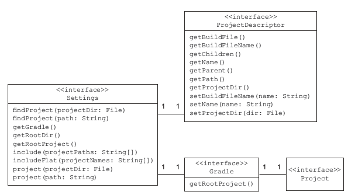
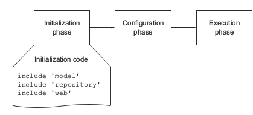
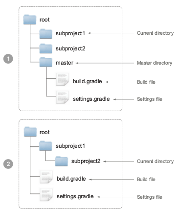
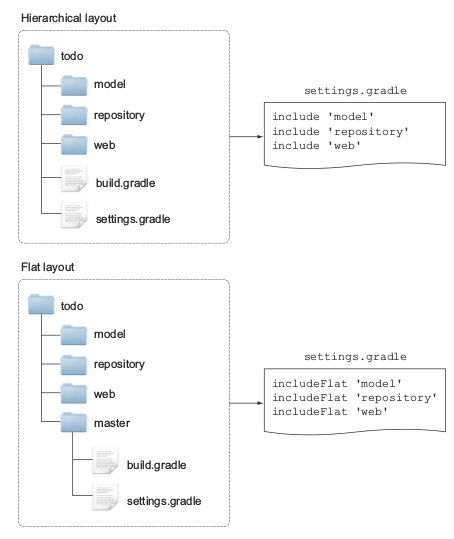

#### Modularizing a project

> 在企业项目中，包的层次结构和类之间的关系变得非常复杂，将代码分离成模块是一项艰巨的任务，因为它需要你能够清楚的识别功能边界，例如从数据层分离
> 出业务逻辑层

#### Coupling and cohesion

#### Identifying modules

> 我们看一下todo应用，找到他的自然边界，这些边界帮你将应用程序分解成相应的模块，如下展示了已经存在的项目结构树
	
！
！

> model: todo数据表现项
> repository： 存储检索todo项
> web: 处理http请求， 浏览器中渲染todo项的web组件

#### Refactoring to modules

> 重构现有的项目结构到模块很简单，对于每一个模块，你需要创建一个目录并命名，将相关的文件移动到其下面，src/main/java将在每个模块里
> 只有唯一的web模块需要 src/main/webapp目录， 下面展示了项目模块化结构

！
！

#### Assembling a multiproject build

> 一个多项目由一个根目录和几个子目录模块组成， 首先要强制性的在根目录有一个build.gradle文件，创建一个空的构建
> 脚本，通过运行gradle projects查看项目
	
	$ gradle projects
    :projects
    ------------------------------------------------------------
	Root project
    ------------------------------------------------------------
	Root project 'todo'
	No sub-projects

#### Introducing the settings file

> settings文件声明了配置需要的实例化项目结构，默认情况下，这个文件叫做settings.gradle，和跟项目的build.grade
> 文件在一起,下面展示了setting文件内容，你构建需要的子项目可以使用Include方法声明
	
	include 'model'
	include 'repository', 'web' //这里也可以传递string数组

> 上面代码里的项目是相对于根目录的位置，你也可以建模更深层次的结构，使用冒号分割子项目级别，例如你想映射Mode/todo/
> items， 可以通过model:todo:items声明

> 在添加setting file文件后，执行帮助任务projects，打印不同结果
	
	$ gradle projects
    :projects
    ------------------------------------------------------------
	Root project
    ------------------------------------------------------------
	Root project 'todo'
	+--- project ':model'
	+--- project ':repository'
	\--- project ':web'

>通过加入一个single文件，你创建了一个度项目构建，包含了一个root项目和三个子项目，不需要额外配置，

#### Understanding the Settings API representation

> 在gradle组装构建之前，它创建了一个setting类型实例，setting接口直接表示settings文件,主要目的是加入project
> 实例用来支持多项目构建，除了组装多项目构建，你可以在build.gradle中做任何事情，

> 这里有一个重要信息，你可以面向setting接口编码，在settings.gradle文件中，settings中任何方法都可以直接调用

#### Accessing Settings from the build file

> 如果在setting 已经被读取加载后，访问settings实例，在build.gradle文件中， 你能够注册一个生命周期或者监听器
> 一个适合的地方就是 gradle#settingsEvaluated(closure)方法，提供了Settings Object作为闭包参数

##### Settings execution

>我们前面学习了一个构建的三个阶段，setting文件在初始化阶段执行和计算如下图
	
	

#### Settings file resolution

> gradle允许你运行构建，可以在根目录或者任何子目录，只要目录中包含构建文件，gradle怎么知道一个子目录是多项目构建
> 的一部分，它需要找到setting文件，这个文件指示了子项目是否被包含在多项目构建里， 如下图
	

	
> 步骤1 gradle在当前同级目录下的叫做master目录里寻找setting文件,如果没找到setting文件， gradle在当前目录
> 的父目录下查找， 以subproject2为例，查找顺序是 suproject1 > root

> 如果找到了配置文件，并且定义中包含了这个项目， 那么该项目就是多项目构建一部分， 否则这个项目被作为一个单项目执行。

#### Controlling the settings file search behavior

> 有两个命令行参数用来控制settting文件查找方式

> -u,--no-search-upward,告诉gradle不要在父目录查找，这个参数对于你想避开搜寻所有的父目录很有用
> -c,--settings-file,指定setting文件位置，当setting配置文件没有按照规定命名时，你可以使用这个

#### Hierarchical versus flat layout

> gradle项目可以使用层级结构和平铺结构，如下图

> 我们讨论的多项目布局，参与的项目与根项目在同一级，嵌套的子项目只有一级，选择那种结构是你的自由，
> 上图中，比较了两种不同的todo应用结构，一个是层级结构，一个是平铺结构， 没有把build和setting文件放在根目录，
> 而是放在一个叫做master的目录里，和其他项目目录挨着，使用master目录，可以从子目录执行构建，可以再setting文件
> 中使用includeFloat方法
