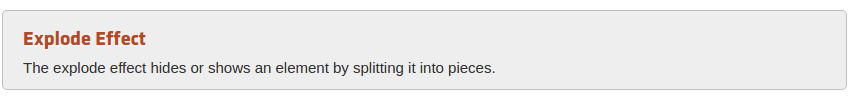
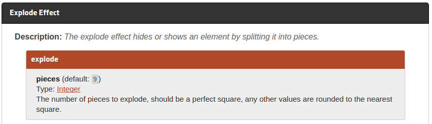

###以下是老版本结构，在官方网站下载1.9.2是以下结构

##### jquery ui压缩包结构
> 在jqueryui官方网站下载的标准版，包含源码,示例,文档,

> css目录，包含了jquery ui相关的css文件，特定的某个样式的css主题文件

> js 目录包含jquery ui的js文件， 包含所有压缩的和未压缩的jquery ui文件和jquer库文件

> development-bundle 目录，包含不同的子目录，demos ，docs, themes ，ui
> demos包含样例文件， docs是jquery文档，themes包含与jquery ui相关的css主题的每个文件

#### what is a css theme?

> 可以在下载jquery ui时选择主题样式，这样相关的css主题就在css目录存放,smoothness是默认样式

## 我们应该包含哪些文件，在使用的时候？

##### javascript files

> 位于development-bundle目录下的ui目录,jquery.ui.core.js包含了基本特性。必须inlcude， 其他文件需要就包含。

##### css files

> 位于development-bundle目录下的themes目录包含了css文件,包含了不同主题目录，例如base，smoothness，ui-lightness目录,每个主题包含images目录和其他css文件

> jquery.ui.core.css板件包含基本功能，需要include,其他文件根据需要引入，jquery.ui.hteme.css文件包含定义的主题需要引入

> jquery.ui.base.css包含了development-bundle 目录下的所有样式文件，除了except jquery.ui.theme.css
> jquery.ui.all.css包含了，所有文件(jquery.ui.base.css and jquery.ui.theme.css)

#####下面是简单的包含未压缩文件使用tab的示例

    
    
    
    

    <link rel=stylesheet type=text/css href=development-bundle/themes/smoothness/jquery.ui.core.css/>
    <link rel=stylesheet type=text/css href=development-bundle/themes/smoothness/jquery.ui.theme.css/>
    <link rel=stylesheet type=text/css href=development-bundle/themes/smoothness/jquery.ui.tabs.css/>

> jquery.js标准库文件需要引入

> core.js文件是必须引入的核心文件,tab.js依赖需要widget.js

> core.css文件必须引入,theme.css是主题文件， tabs.css包含自己特定样式

##### 下面包含压缩文件使用tab示例

    
    
    <link rel=stylesheet type=text/css href=jqueryui/css/smoothness/jquery-ui-1.8.16.custom.css />

> 除了jquery.js只有两个文件需要添加

##### 改变主题

> 我们使用ui-lightness替换smoothness,对于上面包含未压缩的示例，我们使用ui-lightness替换smoothness

     <link rel=stylesheet type=text/css href=development-bundle/themes/ui-lightness/jquery.ui.core.css/>
    <link rel=stylesheet type=text/css href=development-bundle/themes/ui-lightness/jquery.ui.theme.css/>
    <link rel=stylesheet type=text/css href=development-bundle/themes/ui-lightness/jquery.ui.tabs.css/>

> 对于上面包含压缩文件示例我们同样替换

      <link rel=stylesheet type=text/css href=jqueryui/css/ui-lightness/jquery-ui-1.8.16.custom.css />

###对于新版本，直接引入三个文件

    <link href="jquery-ui.css" rel="stylesheet">
    
    

##### effect函数

 > effect 第一个参数表示效果，可以去api查看每种效果属性,相应的属性需要在第二个参数option中设置

 >        第二个参数option用来设置属性,在Option中可以设置缓动效果

 >        第三个参数表示延时设置

 >        第四个参数表示执行完的效果后的回调方法

> 下面的爆炸效果

>code

     

> 一般情况不是会用effect,大部分时间使用show(),hide(),toggle(),addclass()