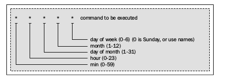

#### Introducing Rake's integration with Rails

> 我们首先安装rails ,然后使用它生成一个项目骨架
	
	$ gem install rails
	$ rails g test_app

>现在，我们进入test_app目录，你会看到一个Rakefile文件，或许你已经猜到了，这标志着这个程序也使用rake，
>虽然rails不是一个完全的rake程序，他使用它作为辅助工具，如果你打开Rakefile文件，你不或许不理解里面内容
>说实话，你根本不需要担心里面内容，这只是一个rake项目结构示例。这个文件或许仅仅包含两行代码，然后你使用rake -T命令后
>你或许看到很多raks任务， 这意味着所有任务被定义脱离于rails核心

> 定义自己的rake任务仅仅是创建在lib/raks目录下以.rake后缀名文件

> rails自带了很多有用功能，用来生成rails组件， 这些组件可能是migration ,model,controller,或者class
> 有趣的是，也有生成rake的功能， 你就可以手动或者使用生成器创建rake， 例如下面

	rails g task namescpace task1 task2

> 这个命令生成的文件lib/tasks/namespace.take，包含下面内容

	namespace :namespace do
		desc "TODO"
		task :task1 => :environment do
		end

		desc "TODO"
		task :task2 => :environment do
		end
	end

> 注意所有生成的task都有一个依赖，environment,这个任务用来读取rails环境，允许你使用rails的类在rake的action里， 
> 如果你忽略了依赖任务而尝试使用User类(app/models/user.rb)，你会得到一个异常说没有User类被定义，
>除了编写自定义的rake任务，rails允许我们编写核心任务，他们通过应用场景区分，他们中的一些用来处理数据库，资源和路由等等

#### Custom rake tasks in a Rails project

> 让我们弄清楚为什么在rails项目中自定义rake任务，首先，他们都是用来支持1一些重复的任务，例如生成 sitemap.xml文件，
> 清理旧数据，备份数据库文件,发送邮件，等等

>下面示例，自定义的rake任务没有特殊的步骤，假设我们有订单在系统里，如果他们状态是deleted，我们应该删除他们， 
> 我们没有任何特殊方式编写一个自定义任务来解决这个问题，仅仅是打开命令行生成一个rake任务
	
	$ rails g task orders cleanup
	         create  lib/tasks/orders.rake

> 打开生成的文件，编写如下代码
	
	namespace :orders do
		desc 'Remove old orders with the deleted status'
		task :cleanup => :environment do
			Order.where(:status => 'deleted').find_each(&:destroy)
		end
	end

> 然后运行这个任务
	
	rake orders :clearup

#### Recurrent running of tasks

> 目前为止，一切都很好，没有什么能影响到我们的，我们已经解决了我们的问题，我们可以手动运行它，明天，后天，或者未来任何一天
> 或者忘了， 主要问题是任务的计划运行，这有一个有用的工具 cron

>我们不打算深入了解cron，但是有一些基本常识，需要知道， cron的配置文件描述了cron按照下面格式运行
	
	

> 假设我们编写以当前日期编写文件并且，每天12:00运行， 解决这个问题，我们使用cron工具，他的配置如下
	
	0 12 * * * /bin/date > ~/tmpfile

> 你不必手动修改配置文件，你可以使用crontab这个工具， 测试前面的例子，使用 crontab -e命令， 一个编辑器会为你打开
> 然后编写这行代码，和行号没有关系， 编辑器保存，然后这个job会在每天12:00工作

>还有一个解决防范 whenever gem,在我们的例子里， 我们通过文档安装它，然后改变文件配置，
	
	1 加入一行代码到Gemfile里， 
		
		gem 'whenever', :require => false
	
	2 运行 bundle install 命令
	3 运行 wheneverize 命令， 然后会生成一个config/schedule.rb文件
	4 粘贴下面代码
		
		every :day, :at => '12:20pm' do
			rake 'orders:cleanup'
		end

	5 运行 whenever -w命令，将会设置合适的config文件到cron配置文件 ， 注意，不会删除已经在配置里的jobs， 
