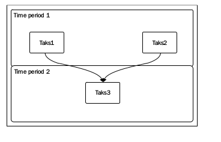

> 为了加速rake任务运行速度，你可以采取很多措施，重构，算法优化，然而最简单的方式就是并行运行，意味着你可以让很多代码在自己的线程里
> 同时进行运算，理论上这样可节省时间

#### Defining tasks with parallel prerequisites

> 声明一个任务依赖于其他任务，并且是应该以并行方式执行很简单直接，仅仅用一个multitask方法替代task方法，如下代码
	
	multitask :setup => [:install_ruby, :install_nginx, :install_rails] do
		puts "The build is completed"
	end

> 这个例子里，install_ruby , install_nginx , 和 install_rails 将会并行执行，在 setup任务之前，这意味着，每个任务创建一个
> ruby线程， steup任务在所有线程执行完后执行

> 执行下面例子可以验证上面描述
	
	task :task1 do
		puts 'Action of task 1'
	end
	task :task2 do
		puts 'Action of task 2'
	end
	multitask :task3 => [:task1, :task2] do
		puts 'Action of task 3'
	end

> 下面是输出
	
	$ rake task3
	Action of task 1
	Action of task 2
	Action of task 3
	$ rake task3
	Action of task 2
	Action of task 1
	Action of task 3

> 如上所示 task1和task2的执行顺序是不可测的，因为他们运行在各自的线程里， 当你涉及到线程时，他们的运行顺序总是不可预知的

	task :set_a do
		@a = 2
	end
	task :set_b do
		@b = 3 + @a
	end
	multitask :sum => [:set_a, :set_b] do
		puts "@b = #{@b}"
	end

> 当你运行sum任务时，你可能得到一个异常，并且任务中断，如果set_b任务运行在set_a之前， @a变量就不会被初始化，他的值就是nil,
> 所以表达式@b = 3+ @a就会失败， 你可以在ruby shell里自己实验
	
	$ irb --simple-prompt
	>> 3 + nil
	TypeError: nil can't be coerced into Fixnum

> 有时所有都正常工作，当set_a在set_b之前运行，就不会报错，如果set_b在set_a之前运行就会报错。 你可以自己在terminal里测试
	
	$ rake sum
	rake aborted!
	nil can't be coerced into Fixnum
	...
	$ rake sum
	@b = 5

> 在下面图标里。你能看到使用task方法定义的任务如何执行，运行流是有顺序的，任务一个挨着一个运行， 
	
	Time period 1 + Time period 2 + Time period 3
	

> 下图，你可以看到使用multitask方法定义是如何运行的， task1和task2同一时间运行，

	Time period 1 + Time period 2

> time period是同时执行两个任务的时间段
	
	

