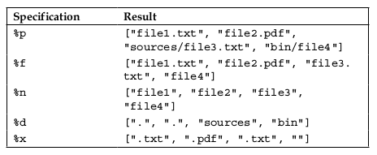
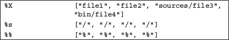

#### Using file tasks to work with files

>通常，你不得不将一种文件类型转换到另一种类型，例如，编译c或java源码到字节码文件,或者
>转换png文件到jpg文件，对于这种问题，rake有许多武器来解决
>假设我们有一个ruby项目，项目里有一个YAML格式的配置文件，以.yaml结尾，由于某种原因
>我们决定重命名这个文件，让它以.yml结尾，这个需求可能很常见也很重复，因此我们需要自动化这个过程
>我们可以手动更改
	
	$mv settings.yaml settings.yml

> Rake提供了一个特殊的task类型对着这种情况，file task
>使用file方法来定义一个file task，这个file task使用方式类似普通的task，它继承了所有普通的task行为， 
>在一个文件task里，我们可以设置依赖任务，编写action和描述，看下面使用file task如何重命名:
	
	file 'settings.yml' => 'settings.yaml' do
		mv 'settings.yaml', 'settings.yml'
	end

> 上面代码示例,我们定义settings.yml 文件task依赖于settings.yaml文件，如果settings.yaml文件不存在，这个file
>这个任务就会执行失败,下面是执行代码

	$ echo '' > settings.yml
	$ rake settings.yml
	mv settings.yaml settings.yml
	$ rake settings.yml
	rake aborted!
	Don't know how to build task 'settings.yml'
	Tasks: TOP => settings.yml
	(See full trace by running task with --trace)

>如你所看到的，settngs.yaml文件被修改成settings.yml并且，执行第二次的时候并没有成功，
>因为依赖的settings.yaml文件已经不存在了， 这个文件taskh和普通的rake任务一样

>除了拥有常规的task行为，文件task有一个非常有用的特性，如果source文件(依赖文件)没有改变，那么第二次
>尝试执行文件 task的action没有任何改变，文件task处理时间戳改变的source文件，如果没改变，file task不会
>执行

>下面是一个拷贝文件例子

	file 'settings.yml' => 'settings.yaml' do
		cp 'settings.yaml', 'settings.yml'
	end

> 创建一个空的settings.yaml文件，确保没有settings.yml文件存在于目录中，尝试运行几次这个文件task，
>看到rake并没有改变新生成的settings.yml文件的时间戳

	$ rake -f rakefile01 settings.yml
	cp settings.yaml settings.yml
	$ stat -f "%m%t%Sm %N" settings.yml
	1395252779
	Mar 19 21:12:59 2014 settings.yml
	$ rake -f rakefile01 settings.yml
	$ stat -f "%m%t%Sm %N" settings.yml
	1395252779
	Mar 19 21:12:59 2014 settings.yml

#### The characteristics of the file task dependencies

>我们使用pandoc转换markdown到html文件，如果没有安装pandoc
	
	sudo apt-get install pandoc
	
>下面是一个简单的 Rakefile文件实例
	
	    task :default => 'blog.html'
		file 'article1.html' => 'article1.md' do
			sh 'pandoc -s article1.md -o article1.html'
		end
		file 'article2.html' => 'article2.md' do
			sh 'pandoc -s article2.md -o article2.html'
		end
		file 'blog.html' => ['article1.html', 'article2.html'] do
			File.open('blog.html', 'w') do |f|
				html = <<-EOS
					                 <!DOCTYPE html>
									 <html>
										 <head>
											 <title>Rake essential</title>
										 </head>
										 <body>
											 <a href='article1.html'>Article 1</a>  
											 <a href='article2.html'>Article 2</a>
										 </body>
									 </html>
								 EOS
				f.write(html)
			end
		end

> 第一行我们定义了默认task，它链接到的任务会生成这个blog，下面两个任务用来生成html文章，最后一个任务
> book.html看起来很复杂，它基于两个文件任务，article.html和article2.html，意味着让运行这个blog.html task
>它会运行先运行这两个依赖的task,如果他们都完成了，然后这个blog.html task的代码才会运行，

> Rakefile里的代码有一些缺陷。如过我们想添加一篇新文章到blog里，我们不得不改变代码，最好是不改变
>Rakefile文件并且让rake自己找到所有文章， 下面是重构代码

	task :default => 'blog.html'

	articles = ['article1', 'article2']

	articles.each do |article|
		file "#{article}.html" => "#{article}.md" do
            sh "pandoc -s #{article}.md -o #{article}.html"
        end
	end

	 file 'blog.html' => articles.map { |a| "#{a}.html" } do
        File.open('blog.html', 'w') do |f|
            article_links = articles.map do |article|
                          <<-EOS
                            <a href='#{article}.html'>
                                Article #{article.match(/\d+$/)}
                           </a>
                          EOS
              end

            html = <<-EOS
                                <!DOCTYPE html> 
                                  <html>
                                    <head>
                                      <title>Rake essential</title>
                                  </head>
                                  <body>
                                      #{article_links.join(' ')}
                                  </body>
                                </html>
                    EOS
          f.write(html)
      end
    end

>上面代码现在更通用，如果你写了新文章，你不需要修改太多的代码，但是你不得不添加一个没有扩展名文件
>到articles数组里，然而，这有一个问题，对于生成blog.html 文件， 即使你添加一个新的文件名到数组里，也不会生，
>因为关联的文件时间戳没有改变， 仅有的解决方案就是删除blog.html文件，在你每次运行rake时
>FileUtils.rm方法帮助我们解决这个问题,file 方法有一个很有用的特性可以用来重构blog.html任务，提供了一个可选参数
> task对象，这个对象包含了任务名称，关联task等等，让我们看下面示例代码。
	
	require_relative 'blog_generator'
	articles = ['article1', 'article2']
	task :default => 'blog.html'
	
	articles.each do |article|
		file "#{article}.html" => "#{article}.md" do
			sh "pandoc -s #{article}.md -o #{article}.html"
		end
	end

	FileUtils.rm('blog.html', force: true)
	file 'blog.html' => articles.map { |a| "#{a}.html" } do |t|
		BlogGenerator.new(t).perform
	end

> 现在看新代码，第一个变化就是 FileUtils.rm(blog.html, force: true),每次rake执行的时候，移除blog.html文件， 这个:force选项，告诉rm方法如果文件不存在
>不要抛出异常，我们可能会遇到这种情况，第一次运行或者我们自己删除了blog.html文件，第二个改变就是在定义blog.html任务时得到的t参数，t参数用来得到
>用来生成文件的任务名，和使用prerequisites方法得到依赖任务，它返回一组依赖任务名字的字符串

>深入 blog.html文件task的代码，它不需要任何额外的信息，这样允许我们简单的移动代码到一个单独的文件里，我们下一步重构，创建一个BlogGenerator类，
>他的初始化方法

>下面是 blog_generator.rb的代码

	class BlogGenerator
		def initialize(task)
			@task = task
		end
		
		article_links = @task.prerequisites.map do |article|
			                     <<-EOS
									 <a href='#{article}'>
										 Article #{article.match(/\d+/)}
									 </a>
								 EOS
							 end
							 
	    html = <<-EOS
	                    <!DOCTYPE html>
						<html>
						<head>
							<title>Rake essential</title>
						</head>
						<body>
							#{article_links.join(' ')}
						</body>
						</html>
						EOS
	 File.write(@task.name, html)
    end

>下面是 Rakefile文件代码
	
	require_relative 'blog_generator'
	articles = ['article1', 'article2']
	task :default => 'blog.html'
		articles.each do |article|
			file "#{article}.html" => "#{article}.md" do
				sh "pandoc -s #{article}.md -o #{article}.html"
			end
		end
	FileUtils.rm('blog.html', force: true)
	file 'blog.html' => articles.map { |a| "#{a}.html" } do |t|
		BlogGenerator.new(t).perform
	end

>后面我们会学习rules，将我们的代码修改的更灵活

#### Creating a folder with the directory method

>有时你需要创建嵌套目录，你可以使用file task创建文件和目录，
>如果你需要创建目录树，你可以使用file task和依赖任务完成， 
> 下面就是一个例子

	file 'my_gem' do |t| mkdir t.name end
	file 'my_gem/tests" => ['my_gem'] do |t| mkdir t.name end
	file 'my_gem/tests/fixtures" => ['my_gem/tests/fixtures'] do |t|
		mkdir t.name
	end

>另一种方式是使用FileUtils#mkdir_p 方法，可以在task的action中和Rakefile上下面文里面使用
>但是这不是Rake的方式，这有一个专有方式定义folder task 使用directory方法，下面例子：

	directory 'my_gem/tests/fixtures'

>这个方法像FileUtils#mkdir_p的同义词，但是它定义的rake task可以被其他任务作为依赖

	directory 'my_gem/tests/fixtures'
	file 'README.md' => 'my_gem/tests/fixtures' do
		sh 'echo test > my_gem/tests/fixtures README.md'
	end

>当你执行README.md 任务的时候，为这个文件创建需要的目录 my_gem/tests/fixtures

>这个directory方法不允许接收任何参数，除了要创建的目录名，然而，如果你需要添加依赖任务或者
>actions给这个directory task， 你可以使用file方法 例子如下

	directory 'my_gem'
	file 'my_gem' => ['otherdata']
	file 'my_gem' do
		cp Dir['gem_template/**/*'], 'my_gem'
	end

#### Using Rake's file utilities

> Rake提供了很多有用的方法，帮助你处理rake files相关任务，如下
	
*	 The FileList module
*	 The FileUtils module
*	 The pathmap method

##### Using the FileList module functionality to collect the files

>这是在我们Rakefile文件里仅有的事情，需要摆脱掉，需要手动改变文章列表，幸运的是，rake提供了工具
>帮助我们解决这个问题， Rake::FileList ，它提供了灵活的方式来调整需要生成的文件列表， 选择性的
>过滤你需要的文件， 可以过滤临时文件，那些需要动态删除， 看下面实例

	require_relative 'blog_generator'
	
	articles = Rake::FileList.new('**/*.md', '**/*.markdown') do |files|
	                   files.exclude('~*')
					   files.exclude(/^temp.+\//)
					   files.exclude do |file|
						   File.zero?(file)
					   end
				   end

	task :default => 'blog.html'
	articles.ext.each do |article|
		file "#{article}.html" => "#{article}.md" do
			sh "pandoc -s #{article}.md -o #{article}.html"
		end
		file "#{article}.html" => "#{article}.markdown" do
			sh "pandoc -s #{article}.markdown -o #{article}.html"
		end
	end
	FileUtils.rm('blog.html', force: true)
	file 'blog.html' => articles.ext('.html') do |t|
		BlogGenerator.new(t).perform
	end

>我们看一下定义的文章列表，通过Rake::FileList创建，他初始化接收文件标记列表，我们得到素有
>.md和.markdown扩展名的文件，通过~*模式过滤一些文件(emacs临时文件),同时忽略了以temp开头文件
> 最后忽略了大小为0的文件，注意这个有用的方法.ext 用来构造文件名列表，如下

	$ irb -r rake --prompt=simple
	>> articles = Rake::FileList.new('**/*.md', '**/*.markdown')
	=> ["article1.md", "article2.md", "article3.md"]
	>> articles.ext
	=> ["article1", "article2", "article3"]
	>> articles.ext('.html')
	=> ["article1.html", "article2.html", "article3.html"]

>传递 -r rake 会自动引入需要的rake库给ruby的shell，使用 --prompt=simple 表示简化输出信息

##### Using pathmap to transform file lists

> 使用文件和目录列表工作时，我们经常不得不转换一组文件从一个类型到另一个类型，我们已经看到
> .ext方法的使用，在一些情况，这远远不够，Rake提供了更有意思的方法pathmap,
> 他可以被FileList对象上调用， 因为Rake扩展了String类， 允许接收2个参数，需要的说明和可选的
>代码块， #pathmap方法收集文件通过给定的说明，这个说明控制详细的映射细节，下面是合法的模式

* %p 完整文件名和目录
* %f 文件名包括扩展名，没有目录
* %n 只有文件名，没有扩展名
* %d 只收集目录
* %x 收集扩展名，如果是空字符表示没有扩展
* %X 除了扩展名，剩余其他都收集
* %s 收集分隔符
* %% 百分号标志

>下面演示了如何使用 #pathmap方法，示例文件列表如下
> file1.txt ,file2.pdf , sources/file3.txt , and bin/file4

	require 'rake'
	list = FileList['file1.txt', 'file2.pdf', 'sources/file3.txt', 'bin/file4']
	list.pathmap('%p')
	list.pathmap('%f')
	list.pathmap('%n')
	list.pathmap('%d')
	list.pathmap('%x')
	list.pathmap('%X')
	list.pathmap('%s')
	list.pathmap('%%')

> FileList对象不仅仅是用.new创建，也可以使用 .[]方法

	
	
	
>明确知道这些结果是有用的，让我们看看怎么使用他们，我们将转换所有的列表里的文件到html格式，使用#pathmap方法，pathmap(%X.html)可以很简单完成，
>结果变成 ["file1.html", "file2.html", "sources/file3.html", "bin/file4.html"] .

>下一个例子，我们将移动所有的文件到output目录下 下面代码实例
	
	>> list.pathmap('output/%f')
	=> ["output/file1.txt", "output/file2.pdf", "output/file3.txt","output/file4"]

> 如果需要扩展名
	
	>> list.pathmap('output/%X.html')
	=> ["output/file1.html", "output/file2.html", "output/sources/file3.html", "output/bin/file4.html"]

>使用下面代码组合你想组合的

	>> list.pathmap('output%s%n%s%f')
	=> ["output/file1/file1.txt", "output/file2/file2.pdf", "output/file3/Ifile3.txt", "output/file4/file4"]

>%d符号可以有一个数字前缀，例如（%2d)如果，数字是正数，从左边开始返回符合数字大小的目录，如果是负数从右边返回符合数字大小的目录
	
	>> 'a/b/c/d/file.txt'.pathmap("%2d")
	=> 'a/b'
	>> 'a/b/c/d/file.txt'.pathmap("%-2d")
	=> 'c/d'

>有时你不得不从给定的文件列表里生成传递给命令行的一组参数， 例如，ruby脚本运行时，你需要包含需要的lib， 例如下面

	$ ruby -Ilib/my_class -Ilib/common test/my_class_test.rb

> 使用 @pathmap方法，可以更简单

	require 'rake'
	list = FileList['lib/my_class', 'lib/common']
	ruby "#{list.pathmap('-I%p')} test/my_class_test.rb"

> 上面我们使用一个新的方法，叫做ruby 它被定义在FileUtils模块里，接收传递给命令行的参数，执行ruby命令，FileLIst定义了to_s方法用来进行字符串插值。
> 如果你想从FileList得到字符串形式文件列表，使用Array#to_s 方法示例如下

	require 'rake'
	list = FileList['lib/my_class', 'lib/common']

	list.to_s  # => "lib/my_class lib/common"
	
    list.to_a.to_s # => "[\"lib/my_class\", \"lib/common\"]"
    list.pathmap('-I%p').to_s  # => "-Ilib/my_class -Ilib/common"
	list.pathmap('-I%p').to_a.to_s # => "[\"-Ilib/my_class\", \"-Ilib common\"]"

>有一个更有用的特性用来从源目录到输出目录， %d , %p , %f , %n , %x , 和 %X 符号，
>可以使用 匹配/替换， 匹配模式和替换部分，在大括号里用逗号分隔,代替部分应该在%后面，操作符前面， 例如 
> %{in,out}d ,多个替换使用分好隔开 例如 %{in,out;old,new}d .

	>> "app/assets/js/app.coffee".pathmap("%{^app/assets/js,public}X.js")
	=> "public/app.js"

>记住 %X返回的文件没有扩展名， 正则表达式也可以使用
	
	>> "app/assets/js/app.coffee".pathmap("%{^app/assets/(js),public/new-\\1}X.js")
	=> "public/new-js/app.js"

>如果你觉得#pathname和#ext方法很有用，你可以使用他们在你的项目里，按照下面代码来引用
	
	require 'rake/ext/string'

> FileUtils模块的文档 [点击这里](http://goo.gl/ec4arH)

#### A practical example of automatically generating a config file

> 现在已经有了一些rake的知识储备，每个rails开发者都知道当他们有了一个rails新项目，第一步是创建database.yml文件， 不仅是繁琐操作，还包含很多大量
>手动处理的地方，如果项目里有一个config/database.yml那么很幸运，你需要拷贝它到新项目，如果没有，你可能需要到互联网上找，然后再拷贝到新项目里， 
>然后你需要修改配置，例如 username,password,adapter和database， 你不得不手动改变每个环境的变量， 我们决定自动化处理这些，代码如下
	
	require 'yaml'

	desc 'Generates database.yml, optional arguments: [adapter, user,password]'
	task :dbconfig => 'database.yml'

	file 'database.yml', [:adapter, :username, :password] do |t, args|
		Dir.chdir('config')
		args.with_defaults(:project_path => Dir.pwd)
		DBConfigGenerator.new(t, args).generate

	end

	class DBConfigGenerator
		ENVIRONMENTS = %w(production development test)
		DEFAULTS = {
			'adapter' => 'postgresql',
			'encoding' => 'unicode',
			'username' => Etc.getlogin,
			'pool' => 5,
			'password' => nil
		}
	def initialize(task, options = {})
    @database_pattern = "#{options[:project_path].pathmap('%-1d')}_%s"
    @template = {}
    @output_file = task.name
    @defaults = DEFAULTS.tap do |defaults|

      defaults.each_key do |k|
        defaults[k] = options[k] if options[k]
      end
    end
	end
	def generate
		ENVIRONMENTS.each do |env|
			@template[env] = @defaults.merge('database' => @database_pattern % env)
		end
			File.write(@output_file, @template.to_yaml)
	end
	end
	
