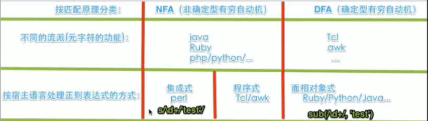
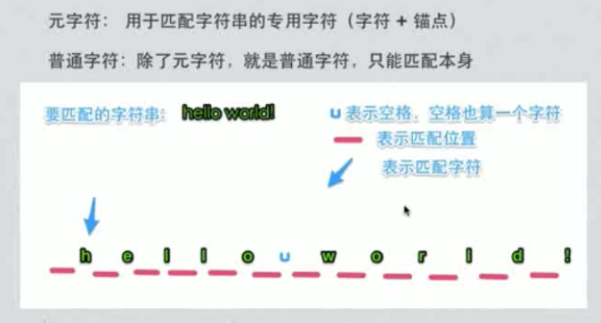
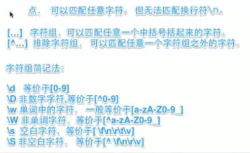
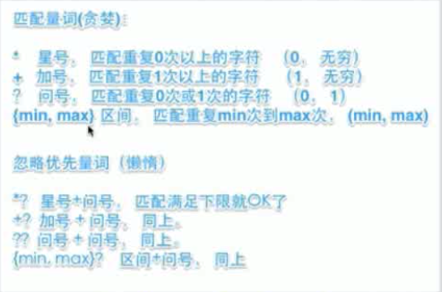
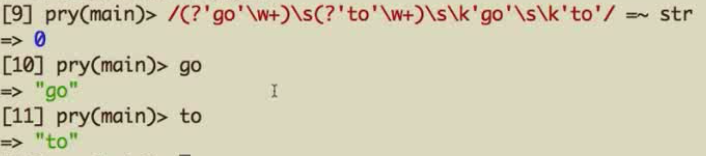
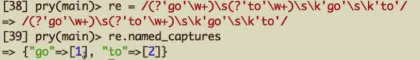

#### 正则表达式分类

#### 元字符和普通字符

#### 按字符匹配

##### match方法

	str = "Hello world! 123"
	str.match(/./) #<MatchData "h">
	str.match(/[elo]/) #<MatchData "e">
	str.match(/[^elo]/) #<MatchData "h">
	str.match(/[0-9]/) #<MatchData "1">
	str.match(/\d/) #<MatchData "1">
	str.match(/[a-z]/) #<MatchData "h">
	str.match(/\w/) #<MatchData "h">
	str.match(/[^0-9]/) #<MatchData "h">
	str.match(/\D/) #<MatchData "h">
	str.match(/\W/) #<MatchData " ">
	
	
##### =~运算符

	str = ~ /\s/  # 5 表示空格所在的位置
	str = ~ /\w/  # 0 表示空格所在的位置
	str = ~ /[elo]/  # 1 表示空格所在的位置

#### 量词

	
	str.match(/.*/) #<MatchData "Hello world! 123">
	str.match(/.*[^0-9]/) #<MatchData "Hello world! ">
	str.match(/.{1,12}/) #<MatchData "Hello world!">
	str.match(/\d+/) #<MatchData "123">

> 贪婪量词 *
	
	str.match(/\d*/) #<MatchData "">
	str.match(/\d+/) #<MatchData "123">
	str.match(/\d+/) #等价于str.match(/\d\d*/)

> 因为正则表达式默认是从左往右匹配，当匹配h时，虽然没有匹配到任何东西，匹配h失败，但是匹配位置成功,
> 因为匹配的是位置，然后匹配0次，这里*表示0次到多次，可以一次都不匹配字符成功，就意味着是0次是允许的，

> *表示能匹配的情况下匹配最多的,不匹配的时候停止匹配

> +表示至少得有1次字符匹配成功

	str.match(/\w*/) #<MatchData "Hello">
	str.match(/\w/) #<MatchData "H">

>匹配时是连续匹配，如果遇到\w不能匹配的就停止，例如空格

	str = "Hello_world"
	str.match(/\w*/) #<MatchData "Hello_world">

>  懒惰量词？,只匹配范围的下限例如＋？，表示１次到多次。这时有了"?",就只匹配"１次"这个下限 
	
	str = "hello world!"
	str.match(/\w+?/) #<MatchData "h">
	str.match(/\w??/) #<MatchData "">

	str.match(/\w{1,6}/) #<MatchData "hello">
	str.match(/\.{1,6}/) #<MatchData "hello ">
	str.match(/\.{1,6}?/) #<MatchData "h">

#### 分组

> 分组和捕获
	str = "hello world "

	str.match(/\w+ \w /) #<MatchData "hello world ">
	str.match(/(\w+ ){2}/) #<MatchData "hello world " 1:"world">
	#不想要分组捕获
	str.match(/(？：\w+ ){2}/) #<MatchData "hello world ">

> 多选分支

	str = "hello world"

	str.match(/h(e|o|0)llo/) #<MatchData "hello" 1: "e">
	#非捕获
	str.match(/h(?:e|o|0)llo/) #<MatchData "hello">

	str = "hollo"
	str.match(/h(?:e|o|0)llo/) #<MatchData "hollo">
	str = "h0llo"
	str.match(/h(?:e|o|0)llo/) #<MatchData "h0llo">

> 字符组

	str = "h0llo"
	str.match(/h[eo0]llo/) #<MatchData "h0llo">

> 多选分之与字符组区别是，字符组里不管长字符，只匹配一个字符，而多选分之可以是不同长度的字符串

	"hollo".match(/h(ol|el|0ll)lo/) #<MatchData "hollo" 1:"ol">
	"h0lllo".match(/h(ol|el|0ll)lo/) #<MatchData "h0lllo" 1:"0ll">

>后项引用捕获
	
	
	str = "go go"
	str.match(/(\w+)\s\1/) #<MatchData "go go" 1: "go">

	str = "go to go to"
	str.match(/(\w+)\s(\w+)\s\1\s\2/) #<MatchData "go to go to" 1: "go" 2: "to">

> 命名捕获

	str = "go to go to"
	str.match(/(?<go>\w+)\s(?<to>\w+)\s\k<go>\s\k<to>/) #<MatchData "go to go to" 1: "go" 2: "to">
	
	#或者用单引号

	str = "go to go to"
	str.match(/(?'go'\w+)\s(?'to'\w+)\s\k'go'\s\k'to'/) #<MatchData "go to go to" 1: "go" 2: "to">

> 使用=～可以直接使用引用名
	

> named_captures方法，查看命名捕获键值对

	
	

> names方法
	
	re.names
	["go","to"]
