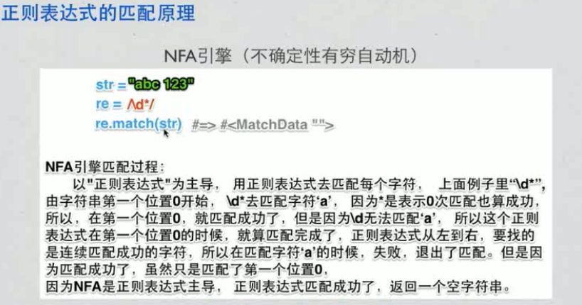
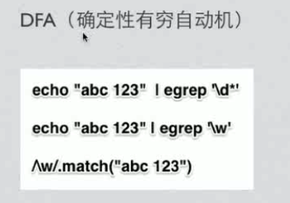
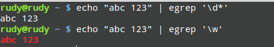
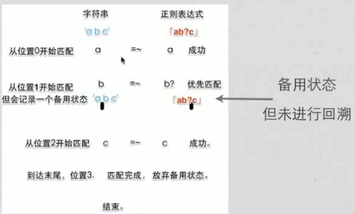
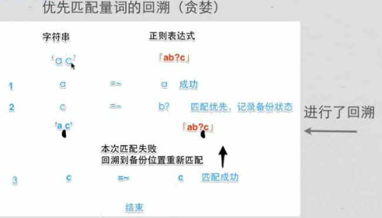
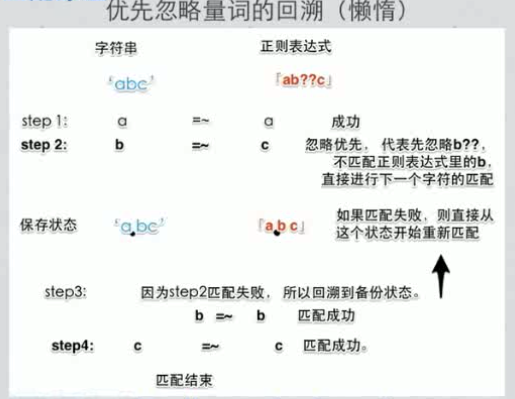
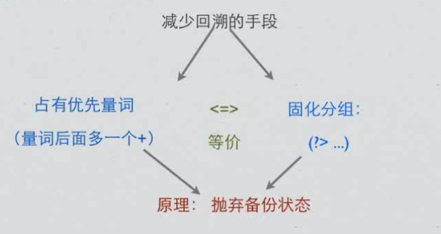

#### 正则表达式匹配原理

> 下面示例，使用egrep，如果匹配将会高亮红色匹配部分,grep是DFA ，\w匹配多个

	

> NFA以正则表达式为主导，一个子表达式匹配完就不会在继续匹配
>DFA以文本为主导。一个子文本匹配完，再用其他文本匹配正则表达式

#### 回溯 backtracing

##### * ? + 匹配优先

> 没使用回溯

> 遇到量词(? * + ?? +? *?)匹配将进行选择,是忽略还是匹配，但是会记录备用状态,但是备用状态不一定会调用,如果量词的正则匹配了就不会调用备用状态
> 上面图中，如果b匹配 b?失败，就会用b去匹配c

> 使用回溯

> 上图中 b? 是匹配失败了。而不是没匹配,因为?可以匹配0次，所以正则最后没有失败

>将b?换成b+ 最后结果就会失败

	re = /ab+c/ 等价于 /abb*c/

#### *? ?? +? 忽略优先

	str = "abbbbbbc"
	re = /ab+?c/
	str.match re #<MatchData "abbbbbbc">

> 匹配步骤 
>1 字符a与 a匹配  
>2 然后 b+? 因为是 +？ 忽略优先，所有不匹配，第二个字符b直接与c匹配 ，但是匹配失败，这时，再回溯b再与b+?匹配,
>3 第三个字符b也是通上面步骤2
>4 第四个字符b也是通上面步骤2
>5...
>6...
>7 最后字符c与c匹配。匹配完成

> 将正则改成 /ab+?/,
	
	str = "abbbbbbc"
	re = /ab+?/
	str.match re #<MatchData "ab">
	
> 如上所示，只有当正则表达式有多个路径时才选择 

> 1 a与正则a匹配
> 2 b与 b+? 匹配。这时正则没有其他选择了。就直接匹配不忽略,有没有回溯,所以到这就匹配完了

