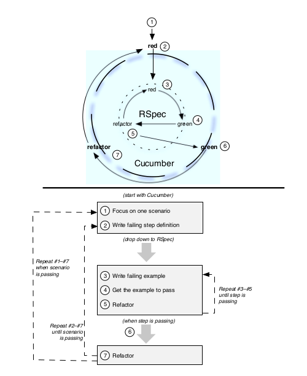

### Chapter 1

#### 1.1 Test-Driven Development: Where It All Started

> 测试驱动开发的开发实践是写代码实现之前编写测试代码，为还不存在的代码写一个非常小的测试代码。
> 运行测试，自然他会失败，然后编写代码实现保证测试可以通过

> 测试一旦通过。观察设计结果。重构任何你看到的重复代码,这时现有的代码设计对于处理所有业务太过简单，
> 文档化下一个业务，在下一个测试里，运行它，报错。写足够代码使他通过。重构设计移除重复。如此循环

> 在许多单元测试系统里，当测试失败。我们看到打印出红色，通过打印绿色，基于此例。我们叫红/绿/重构

##### Emergent Design
> 代码的数量不断增加，我们发现更多的精力消耗在重构上,设计不断发展和审查。虽然不能预先决定, Emergent 
> Design在颗粒级别并且是测试驱动开发最重要的副产品

> 不是把TDD作为一个测试实践，我们将其视为一种技术，用于向测试人员提供高质量的代码，这些测试人员负责正式的测试实践

> 在这TDD变成了一个问题。特别是单元测试的注意让新手Tdders去验证确保，一个注册方法存储了一个注册表在注册表集合里，集合是一个数组。

> 这种测试中的细节会对测试对象的内部结构产生依赖性。这种依赖性意味着如果其他需求引导我们将数组变为哈希，
> 这个测试将失败，即使对象的行为并没有改变。这种脆弱性使测试套件更难维护和测试套件被忽略的主要原因，
> 并最终放弃。因此，如果测试内部的对象是适得其反，长远来看，我们应该专注于当我们写这些测试？

#### 1.2 Behaviour-Driven Development: The Next Step

> 测试一个对象内部结构带来的问题是。我们测试对象是什么而不是对象做了什么,对象做了什么更重要

> 在应用程序级别也一样，雇主不关心数据是否存储在一个ansi-compliant的关联数据库，而是关心数据在哪，能不能随时拿回来

##### It’s All Behavior
>BDD关注行为而不是结构，在每个开发级别里，无论我们讨论一个对象计算两个城市间距离，还是一个对象搜索一个第三>方服务，或者一个用户面对屏幕提供反馈，当我们提供了无效输入，这都是行为。
> 一旦我们承认了这一点，他改变了我们开发代码的方式。我们开始更多思考，使用者和系统。对象和对象之间的关系，而不是对象的结构

##### Getting the Words Right

> 我们相信大多数软件开发团队面临的是沟通问题。BDD目的是帮助沟通，通过使用given上下文，when事件发生，then我期望，在软件开发中描述剧本
> given when then 是BDD的三个组合，三个简单的词，我们使用它讨论程序的行为和对象的行为，对于业务分析人员和测试人员和开发者，他们很容易理解，这些词被放到cucumber的正确的地方

#### 1.3 Rspec

> rspec是steven baker在2005年创造的。他从aslak hellesoy那里听说了bdd,aslak曾经和Dan North在一个项目里时萌生了这个想法，Steven很感兴趣，当dave提出使用smalltak和ruby，我们可以更自由的探索tdd框架，鼓励关注行为，所以Rspec就诞生了

> 虽然语法细节已经改变了，和早起的rspec相比，基本的思路还在，我们使用rspec编写一段代码在上下文控制器中的预期行为的例子

    describe MovieList do
        context "when first created" do
          it "is empty" do
            movie_list = MovieList.new
            movie_list.should be_empty
          end
        end
    end

> it方法创建了一个movieList行为的例子，同时使用context 时MovidList被创建.表达式movie_list.should be_empty不言自明。
> 在终端下运行这个代码使用rspec命令，然后看到下面输出
    
    MovieList when first created
      is empt

>再加入更多上下文和例子，输出结果看起来像movielist对象的说明书

  MovieList when first created
    is empty
  MovieList with 1 item
    is not empty
    includes that item

> 当然我们谈论的是一个对象的说明不是一个系统的，你能够计划一个应用的行为使用rspec，对于应用程序的行为。我们使用cucumber

#### 1.4 Cucumber

> 关于cucumber详细将在11章看到，编写软件内容在138页，BDD是一个全栈的敏捷技术，从极限编程得到一些启发，> 包括了验收测试驱动开发被叫做验收测试驱动计划的变化

> 在atdp中。我们使用客户来验收测试，来驱动代码的开发，理想情况下这是交付团队和客户协作的结果，优势是他们被交付团队编写，并且被客户监察或者验收。在任何情况下，他们是客户面对的，必须用语言表达的，cucumber给了我们格式

> cucumber读取程序特性文本描述，使用scenarios和secnario steps定义步骤，自动的整合开发代码

    Feature: pay bill on-line

      In order to reduce the time I spend paying bills
      As a bank customer with a checking account
      I want to pay my bills on-line

   7  Scenario: pay a bill
        Given checking account with $50
        And a payee named Acme
        And an Acme bill for $37
        When I pay the Acme bill
        Then I should have $13 remaining in my checking account
        And the payment of $37 to Acme should be listed in Recent Payments

> 一切都被包含进去，第7行被当做文本不会执行，下面的是场景中的步骤
> 在chapter 4，automatting feature with cucumber ,53页，将会学习写step 用ruby，这些step定义和开发代码之间交互 ,通过cucumber读取scenario时调用。

> 不用担心现在是否已经理解，对于现在最重要的是理解rspec和cucumber，帮主我们描述行为驱动代码的例子
>我们使用cucumber来描述应用程序的行为，使用rspec描述对象的行为，如果你使用过tdd以前，你很熟悉red/green/reafcotr的循环。使用cucumber这样的工具我们有两个生命周期如图

> 两个循环包含了我们讨论的small steps 和使用工具得到的反馈。我们开始一个红色的step 在cumber中（外层循环）为了使他通过。我们进入rspec循环，开发部署代码，

#### 1.5 The BDD Cycle

>  在rspec循环的绿色的point上，我们检查cucumber的循环。如果他让仍然是红色，我们检查反馈结果，结果告诉我们下一个rspec循环，如果是绿色，我们跳出cucumber循环，然后重构，依次重复编写cucumber step

> 操作过程就是，编写cucumber实例，然后失败，然后编写rspec 如果，绿色，就回头检查cucumber,如果运行没通过，再检查rspec直到rspec通过，然后检查cucumber是否绿色通过，如此反复