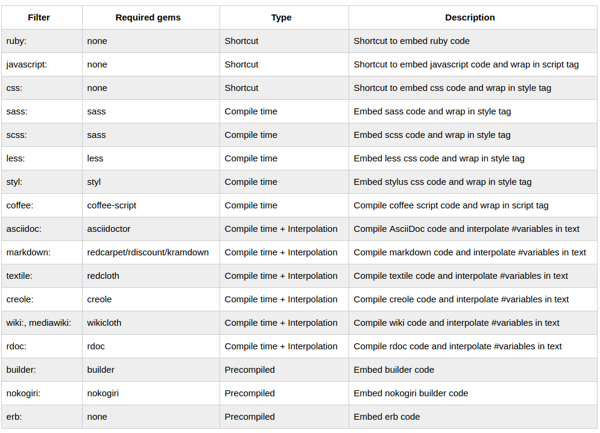
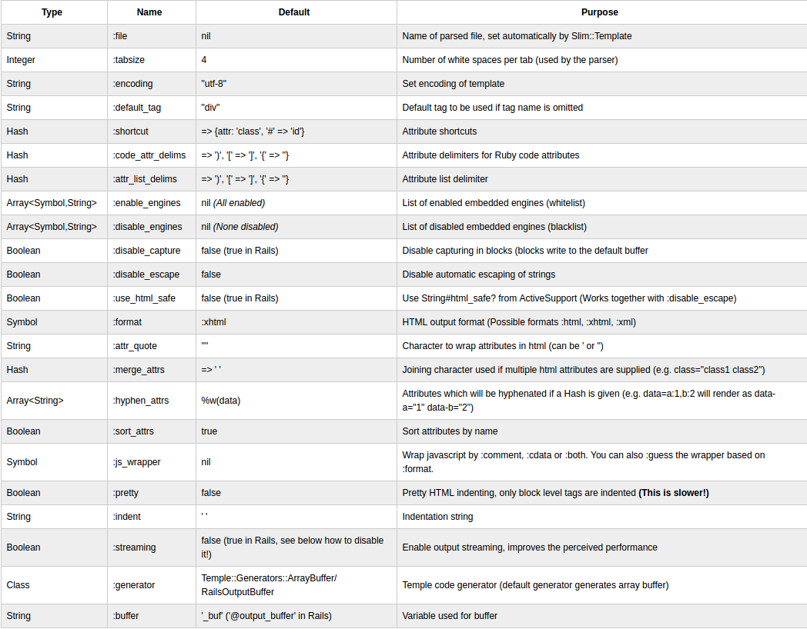

## Syntax example

> 这有一个事例, 一个Slim模板像下面这样

    doctype html
    html
      head
        title Slim Examples
        meta name="keywords" content="template language"
        meta name="author" content=author
        link rel="icon" type="image/png" href=file_path("favicon.png")
        javascript:
          alert('Slim supports embedded javascript!')

      body
        h1 Markup examples

        #content
          p This example shows you how a basic Slim file looks.

        == yield

        - if items.any?
          table#items
            - for item in items
              tr
                td.name = item.name
                td.price = item.price
        - else
          p No items found. Please add some inventory.
            Thank you!

        div id="footer"
          == render 'footer'
          | Copyright &copy; #{@year} #{@author}

> 缩进是很重要,但是你可以自己选择喜欢的缩进深度.你想一次缩进2个 然后5个,是你的选择 ,嵌套你只需要缩进一个就可以

#### Line indicators 行指示器

##### Verbatim text |
> 这个| 管道 符号告诉 Slim仅仅拷贝这一行  ,本质上是避开所有处理,  比管道符号多缩进的每一行都被拷贝

    body
      p
        |
          This is a test of the text block.
> 上面的结果如下

    <body>
This is a test of the text block.
</body>

> 看下面例子

    body
    p
      | 
        This line is on the left margin.
        This is a test of the text block.
        This is a test of the text block.
        This is a test of the text block.
        This is a test of the text block.

> 被编译成
    <body>
This is a test of the text block.
      This is a test of the text block.
      This is a test of the text block.
      This is a test of the text block.
</body>

> 如果管道符号与文本在同一行 , 文本左边与管道符号有一个空格 . 后面任何额外的空格将被复制.

> 例子1 在一行,|管道符号后面有空格,ccck前面空格被保留
    body
      p
        |              ccck       aat         ch
          This is a test of the text block.
          This is a test of the text block.
          This is a test of the text block.

> 被编译成

    <body>
             ccck       aat         ch
     This is a test of the text block.
     This is a test of the text block.
     This is a test of the text block.
</body>

> 例子2 不在一行管道符号后面没有空格

    body
      p
        |
                  ccck       aat         ch
          This is a test of the text block.
          This is a test of the text block.
          This is a test of the text block.
> 被编译成

    <body>
ccck       aat         ch
    This is a test of the text block.
    This is a test of the text block.
    This is a test of the text block.
</body>

> 你也可以嵌入html文本内容
    - articles.each do |a|
      | <tr><td>#{a.name}</td><td>#{a.description}</td></tr>

##### Verbatim text with trailing white space '

> 这个单引号告诉Slim 拷贝这一行(类似 | 符号用法) 但是会自动插入空格,确保单引号后面有个空格

##### Inline html <

> 你可以编写html标记直接在Slim里 ,允许你使用闭合标签编写模板，以一个html风格或者混合Html 和silm的风格，这个 
> 开头的< 符号工作方式像| 管道符号

    <html>
      head
        title Example
      <body>
        - if articles.empty?
        - else
          table
            - articles.each do |a|
              <tr><td>#{a.name}</td><td>#{a.description}</td></tr>
      </body>
    </html>

##### Control code -

> 这个链接符号 - 表示控制代码, 控制代码,例如循环和条件判断  ,end符号禁止出现在-后面,块定义通过缩进形式
> 如果你的ruby代码块需要多行,行末尾加入一个反斜杠\,表示没有结束
> 若果你在行末尾加一个逗号，你不需要附加反斜杠

    body
      - if articles.empty?
        | No inventory

##### Output =

> 这个等号 告诉 Slim 这是一个 ruby代码调用, 产生输出到buffer里, 如果你的ruby代码需要使用多行 使用反斜杠在行尾 

    = javascript_include_tag \
      "jquery",
      "application"

如果你行尾使用逗号,就不需要在断行前添加一个反斜杠. 对于开头和结尾的空格 修改 >和< 来支持

输出使用结尾空白符 =>. 除了结尾添加一个空格　作用等同于单独的等号(=) ,

输出使用开头空白符 =<. 除了开头添加一个空格，作用等同于单独的等号(=)

> Output without HTML escaping ==
> 一般像这种单独等号,是不会经过 escape_html 方法. 语句的尾部和头部加空格通过添加 >和< 来支持

> 输出不会经过html转义 and 尾部加空格使用 ==>,除了尾部附加空格,作用和两个等号==一样
> 输出不会经过html转义 and 头部添加空格使用 ==<,除了头部添加空格,作用和两个等号==一样

##### Code comment /
> 使用向前斜杠 / 的代码注释 不会被渲染到最后的结果里, 使用/!的注释属于html注释会在最后渲染的文档里出现

    body
      p
        / This line won't get displayed.
          Neither does this line.
        /! This will get displayed as html comments.

    The parsed result of the above:

    <body>
<!--This will get displayed as html comments.-->
</body>

##### HTML comment /!

> 向前斜杠紧跟着惊叹号表示html注释

##### IE conditional comment /[...]

    /[if IE]
        p Get a better browser.

> 显示结果:

    <!--[if IE]>
Get a better browser.
<![endif]-->

## HTML tags

##### <!DOCTYPE> declaration

      XML VERSION

      doctype xml
        <?xml version="1.0" encoding="utf-8" ?>

      doctype xml ISO-8859-1
        <?xml version="1.0" encoding="iso-8859-1" ?>

      XHTML DOCTYPES

      doctype html
        <!DOCTYPE html>

      doctype 5
        <!DOCTYPE html>

      doctype 1.1
        <!DOCTYPE html PUBLIC "-//W3C//DTD XHTML 1.1//EN"
          "http://www.w3.org/TR/xhtml11/DTD/xhtml11.dtd">

      doctype strict
        <!DOCTYPE html PUBLIC "-//W3C//DTD XHTML 1.0 Strict//EN"
          "http://www.w3.org/TR/xhtml1/DTD/xhtml1-strict.dtd">

      doctype frameset
        <!DOCTYPE html PUBLIC "-//W3C//DTD XHTML 1.0 Frameset//EN"
          "http://www.w3.org/TR/xhtml1/DTD/xhtml1-frameset.dtd">

      doctype mobile
        <!DOCTYPE html PUBLIC "-//WAPFORUM//DTD XHTML Mobile 1.2//EN"
          "http://www.openmobilealliance.org/tech/DTD/xhtml-mobile12.dtd">

      doctype basic
        <!DOCTYPE html PUBLIC "-//W3C//DTD XHTML Basic 1.1//EN"
          "http://www.w3.org/TR/xhtml-basic/xhtml-basic11.dtd">

      doctype transitional
        <!DOCTYPE html PUBLIC "-//W3C//DTD XHTML 1.0 Transitional//EN"
          "http://www.w3.org/TR/xhtml1/DTD/xhtml1-transitional.dtd">
      HTML 4 DOCTYPES

      doctype strict
        <!DOCTYPE html PUBLIC "-//W3C//DTD HTML 4.01//EN"
          "http://www.w3.org/TR/html4/strict.dtd">

      doctype frameset
        <!DOCTYPE html PUBLIC "-//W3C//DTD HTML 4.01 Frameset//EN"
          "http://www.w3.org/TR/html4/frameset.dtd">

      doctype transitional
        <!DOCTYPE html PUBLIC "-//W3C//DTD HTML 4.01 Transitional//EN"
          "http://www.w3.org/TR/html4/loose.dtd">

##### Closed tags (trailing /)

> 你可以关闭标签直接在尾部附加 /

    img src="image.png"/

> 这个通常不需要自己添加 / ,标准的HTML标签会自动关闭

##### Trailing and leading whitespace (<, >)

> 通过a标签后加入一个 >， 你可以强制Slim添加一个尾部空格在一个标签后面

    a> href='url1' Link1
    a> href='url2' Link2

> 编译成

    a href="url1">Link1</a>这里有空格<a href="url2">Link2</a> 

    a href='url1' Link1
    a> href='url2' Link2

> 编译成

  <a href="url1">Link1</a><a href="url2">Link2</a>  两个a之间没空格

> 你也可以开头添加空格通过使用<

    a< href='url1' Link1
    a< href='url2' Link2

> 也可以两边都添加

  a<> href='url1' Link1

##### Inline tags

> 有时你或许想要更紧凑和内联标签
    ul
      li.first: a href="/a" A link
      li: a href="/b" B link

> 为了可读性,不要忘记你可以包装属性

    ul
      li.first: a[href="/a"] A link
      li: a[href="/b"] B link

##### Text content

> 文本内容与任意一标签在同一行 

    body
      h1 id="headline" Welcome to my site.

> 或者内嵌 你必须使用一哥管道符号 | 或者 单引号来转义处理

    body
      h1 id="headline"
        | Welcome to my site.

> 或者能够 激活 依靠文本缩进

    body
      h1 id="headline"
        Welcome to my site.

##### Dynamic content (= and ==)

> 调用可以与标签在同一行

    body
      h1 id="headline" = page_headline

> 或者嵌套

    body
      h1 id="headline"
        = page_headline

##### Attributes

> 可以在标前后直接写属性 对于普通的文本属性使用双引号或者单引号 

    a href="http://slim-lang.com" title='Slim Homepage' Goto the Slim homepage

> 你可以使用文本插入在引号里

##### Attributes wrapper

> 如果界定符号可以使得可读性更好,你能使用字符 {...}, (...), [...] 去包裹属性 你可以配置这些符号 看选项(:attr_list_delims)

    body
      h1(id="logo") = page_logo
      h2[id="tagline" class="small tagline"] = page_tagline

> 也可以放在多行

    h2[id="tagline"
      class="small tagline"] = page_tagline

>也可以使用空格

    h1 id = "logo" = page_logo
    h2 [ id = "tagline" ] = page_tagline

##### Quoted attributes

    Example:

    a href="http://slim-lang.com" title='Slim Homepage' Goto the Slim homepage

> 可以使用文本插入

    a href="http://#{url}" Goto the #{url}

> 属性值会被默认转义 ,如果你想关闭转义使用两个等号==

    a href=="&amp;" 这就不会转义原样输出

>可以使用反斜杠\ 来分割引号包裹的属性

    a data-title="help" data-content="extremely long help text that goes on\
      and one and one and then starts over...."

##### Ruby attributes

> 在等号=后面直接写ruby代码 . 如果代码包含空白间隔,你需要使用()包裹代码,你也可以直接编写hash{} 和数组[]

    body
      table
        - for user in users
          td id="user_#{user.id}" class=user.role
            a href=user_action(user, :edit) Edit #{user.name}
            a href=(path_to_user user) = user.name

>属性值会被默认转义 ,如果你想关闭转义使用两个等号==

    a href==action_path(:start) 这样就不会被转义

> 你也可以断开ruby属性 使用反斜杠\或者  trailing , 描述控制部分.

##### Boolean attributes

> 属性值是 true false nil被解释成 布尔值,如果你使用属性包裹,你可以忽略这些值的分配

    input type="text" disabled="disabled"
    input type="text" disabled=true
    input(type="text" disabled)

    input type="text"
    input type="text" disabled=false
    input type="text" disabled=nil

> Attribute merging

> 如果给定多个属性,你可以配置属性合并 (See option :merge_attrs) 在默认配置里,当使用空白符分割的时候 class属性会自动合并 

    a.menu class="highlight" href="http://slim-lang.com/" Slim-lang.com

> 被渲染成 

    <a class="menu highlight" href="http://slim-lang.com/">Slim-lang.com</a>

> 你也可以使用 一个数组形式的属性值,数组元素使用其限定符合并

    a class=["menu","highlight"]
    a class=:menu,:highlight

##### Splat attributes *

> 这个* 简写方式 允许你将一个hash变成 属性/值 对儿

    .card*{'data-url'=>place_path(place), 'data-id'=>place.id} = place.name

> This renders as:

    
Slim's house

> 你可以使用方法或者实例变量 返回一个hash,返回的hash接上前面*符号

    .card *method_which_returns_hash = place.name
    .card *@hash_instance_variable = place.name

> 这个hash属性支持 属性合并  将给定的数组合并

    .first *{class: [:second, :third]} Text

> This renders as:

    div class="first second third"

##### Dynamic tags *

> 你可以创建一个动态标签 使用 *符号操作属性 仅仅是创建一个方法返回一个 使用:tag的hash

      ruby:
        def a_unless_current
          @page_current ? {tag: 'span'} : {tag: 'a', href: 'http://slim-lang.com/'}
        end
      - @page_current = true
      *a_unless_current Link
      - @page_current = false
      *a_unless_current Link
>解析结果:

      Link
      <a href="http://slim-lang.com/">Link</a>

## Shortcuts

##### Tag shortcuts

> 你可以自定义一个标签缩写 通过设置 :shortcut ,

> 在rails apps里,你需要将你的简写设置代码放到 config/initializers/slim.rb里,

> 在Sinatra 里 你可以简单加入一样的配置在放置require 'slim'的地方

    Slim::Engine.set_options shortcut: {'c' => {tag: 'container'}, '#' => {attr: 'id'}, '.' => {attr: 'class'} }

> 在slim模板里可以这样使用 

    c.content Text

> 被渲染成下面形式

        <container class="content">Text</container>

##### Attribute shortcuts

> 你能够自定义标签 类似 #表示id，.表示class

> 下面例子我们使用&代表input元素的type属性

    Slim::Engine.set_options shortcut: {'&' => {tag: 'input', attr: 'type'}, '#' => {attr: 'id'}, '.' => {attr: 'class'}}

>我们可以在slim里这样使用

    &text name="user"
    &password name="pw"
    &submit

> 被渲染成下面

    <input type="text" name="user" />
    <input type="password" name="pw" />
    <input type="submit" />

>另一个使用@简写形式 

    Slim::Engine.set_options shortcut: {'@' => {attr: 'role'}, '#' => {attr: 'id'}, '.' => {attr: 'class'}}

>我们可以在slim里这样使用

    .person@admin = person.name

> 被渲染成下面

    
Daniel

> 你也可以设置多个属性使用同一个值 

    Slim::Engine.set_options shortcut: {'@' => {attr: %w(data-role role)}}

>我们可以在slim里这样使用

    .person@admin = person.name

> 被渲染成下面

    
Daniel

> 你也可以设置附加固定值属性

    Slim::Engine.set_options shortcut: {'^' => {tag: 'script', attr: 'data-binding', 
additional_attrs: { type: "text/javascript" }}}

> 然后

    ^products
      == @products.to_json
    which renders to

> 被渲染成下面

    

##### ID shortcut # and class shortcut .

> 你可以按照下面的短写形式进行id 和class属性指定

    body
      h1#headline
        = page_headline
      h2#tagline.small.tagline
        = page_tagline
      .content
        = show_content
    This is the same as
> 与下面形式一样

    body
      h1 id="headline"
        = page_headline
      h2 id="tagline" class="small tagline"
        = page_tagline
      div class="content"
        = show_content

## Helpers, capturing and includes

> 如果你使用slim你或许想使用帮助方法扩展模板，假设你有如下代码

    module Helpers
      def headline(&block)
        if defined?(::Rails)
          # In Rails we have to use capture!
          "<h1>#{capture(&block)}</h1>"
        else
          # If we are using Slim without a framework (Plain Tilt),
          # this works directly.
          "<h1>#{yield}</h1>"
        end
      end
    end

> 上面代码被包含在slim模板执行环境中，按照下面方式使用

    p
      = headline do
       ' Hello
       = user.name

> 代码快的内容被自动获取 ,然后传递到 helper方法里,通过yield, 由于语法糖 你可以忽略do关键字 只写下面这样

    p
      = headline
        ' Hello
        = user.name

## Capturing to local variables

> 使用Binding 你可以捕获本地变量

    module Helpers
      def capture_to_local(var, &block)
        set_var = block.binding.eval("lambda {|x| #{var} = x }")
        # In Rails we have to use capture!
        # If we are using Slim without a framework (Plain Tilt),
        # you can just yield to get the captured block.
        set_var.call(defined?(::Rails) ? capture(&block) : yield)
      end
    end

> helper方法按照下面形式调用

    / The captured_content variable must be known by the Binding beforehand.
    = capture_to_local captured_content=:captured_content
      p This will be captured in the variable captured_content
    = captured_content

> 另一个有趣的案例是使用一个枚举对象，获取每个对象,

    module Capture
      def capture(var, enumerable = nil, &block)
        value = enumerable ? enumerable.map(&block) : yield
        block.binding.eval("lambda {|x| #{var} = x }").call(value)
        nil
      end
    end

> 可以按照下面方式使用

    - links = { 'http://slim-lang.com' => 'The Slim Template Language' }
      = capture link_list=:link_list, links do |url, text|
        a href=url = text

## Include helper

> 如果你想includes 在编译时被处理,你可以看一下 http://www.rubydoc.info/gems/slim/doc/include.md  然而你能够在运行时执行子模板
> 类似 rails的 #render你需要写你自己的include helper方法

    module Helpers
      def include_slim(name, options = {}, &block)
        Slim::Template.new("#{name}.slim", options).render(self, &block)
      end
    end

> 按照下面方式调用

    nav = include_slim 'menu'
    section = include_slim 'content'

> 然而这个帮助方法不做任何缓存，所以你需要实现一个更智能的版本来满足你的需求，你应该知道大多数框架
> 实现了自己的include helper,例如 rails的render

## Text interpolation

> 使用标准ruby插入字符串, 这个text会默认被转义

    body
      h1 Welcome #{current_user.name} to the show.
      | Unescaped #{{content}} is also possible.
    To escape the interpolation (i.e. render as is)

    body
      h1 Welcome \#{current_user.name} to the show.

## Embedded engines (Markdown, ...)

> 感谢 tilt，slim已经广泛支持各种内嵌模板引擎

    coffee:
      square = (x) -> x * x

    markdown:
      #Header
        Hello from #{"Markdown!"}
        Second Line!

    p: markdown: Tag with **inline** markdown!

> 支持的引擎

 通过Slim::Embedded过滤器设置option来配置引擎

    Slim::Embedded.options[:markdown] = {auto_ids: false}

## Configuring Slim

> Slim和底层Temple框架是高度可配置的,配置方式基于编译机制，

#### Default options

> 缩进html得到漂亮的代码形式,属性没有顺序

    Slim::Engine.set_options pretty: true, sort_attrs: false

> 你可以直接访问属性使用hash方法

    Slim::Engine.options[:pretty] = true
  
#### Setting options at runtime

> 这有两种方式在运行时设置 对于 Tilt模板,(Slim::Template)你能在你实例化模板的时候设置
  
    Slim::Template.new('template.slim', optional_option_hash).render(scope)

> 另一种可能设置每一个线程选项

    Slim::Engine.with_options(option_hash) do
      # Any Slim engines which are created here use the option_hash
      # For example in Rails:
      render :page, layout: true
    end

> 你需要小心这个编译引擎代码 选项被每个模板缓存在rails中, 设置之后你就不能改变

    # First render call
    Slim::Engine.with_options(pretty: true) do
      render :page, layout: true
    end

    # Second render call
    Slim::Engine.with_options(pretty: false) do
      render :page, layout: true # :pretty 仍然是true ,因为已经被缓存
    end

> 下面选项是 Slim::Engine提供的,可以使用Slim::Engine.set_options来设置,如果你使用一个无效的选项配置key,Slim会检查配置key并报告这个错误,

> 这有更多的选型通过Temple过滤器支持,但是不是官方推荐,你可以看Slim和Temple代码

#### Option priority and inheritance

> 对于了解Slim和Temple的开发者来说 可以在任何不同位置重写默认选项 ,Temple使用继承机制允许子类重写父类选项. 选项优先级按照下面

    1 Slim::Template options passed at engine instantiation
    2 Slim::Template.options
    3 Slim::Engine.thread_options, Slim::Engine.options
    4 Parser/Filter/Generator thread_options, options (e.g Slim::Parser, Slim::Compiler)

> 可以为超类(基类)设置选项 ,但是会影响所有模板引擎

    Slim::Engine < Temple::Engine
    Slim::Compiler < Temple::Filter

## Framework support

> Slim使用Tilt 来编译生成代码 如果你想使用Slim模板,你可以使用Tilt 接口

    Tilt.new['template.slim'].render(scope)
    Slim::Template.new('template.slim', optional_option_hash).render(scope)
    Slim::Template.new(optional_option_hash) { source }.render(scope)

> scope是模板代码执行的对象或者叫上下文
> optional option hash 里面包含上面提到的选项

## Rails

>rails生成器通过slim-rails 支持,slim-rails 不是必须也的，要使用Slim在rails里,仅仅安装 SLIm 然后在你的Gemfile文件里 增加gem 'slim-rails' 
使用.slim扩展你就可以开始使用了

## Streaming

> http stream 默认被激活，如果你的rails版本支持这个功能，但仅仅是感觉性能提高了，
> 渲染总时间会增加， 如果你想关闭它，使用

    Slim::RailsTemplate.set_options streaming: false

## Slim Command 'slimrb'

> 这个slim gem安装后，同时安装了一个工具，slimrb用来在命令行测试slim

    $ slimrb --help
    Usage: slimrb [options]
        -s, --stdin                      Read input from standard input  instead of an input file
            --trace                      Show a full traceback on error
        -c, --compile                    Compile only but do not run
        -e, --erb                        Convert to ERB
            --rails                      Generate rails compatible code (Implies --compile)
        -r, --require library            Load library or plugin with -r slim/plugin
        -p, --pretty                     Produce pretty html
        -o, --option name=code           Set slim option
        -l, --locals Hash|YAML|JSON      Set local variables
        -h, --help                       Show this message
        -v, --version                    Print version

> 启动 slimrb， 输入你的代码 然后安ctrl-d结束 

    $ slimrb
    markdown:
      First paragraph.

      Second paragraph.

      * one
      * two
      * three

    //Enter Ctrl-d
    
First paragraph 

    
Second paragraph 

    <ul>
    <li>one</li>
    <li>two</li>
    <li>three</li>
    </ul>